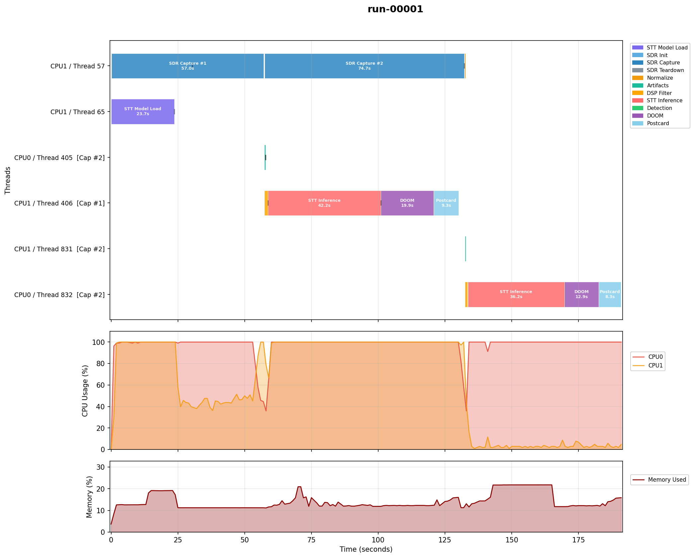
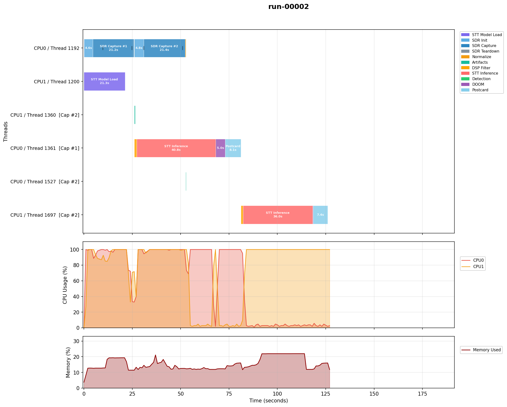
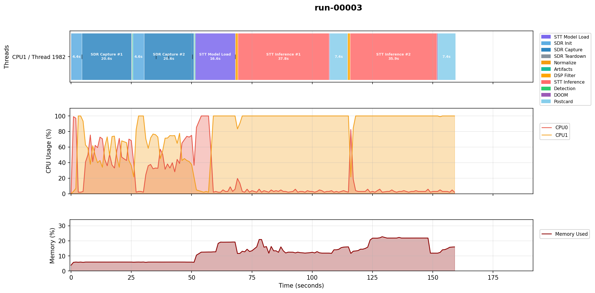

# v4 EM Test Results

Results from the v4 experiment run on the OPS-SAT Engineering Model (EM), ARM32 dual-core SEPP. Data from SMILE artifact `pack-4023_1774937270`. See [TESTING.md](TESTING.md) for test environment details.

For v3 EM results, see [changelog/data/em-v3/](changelog/data/em-v3/). Source data for v4 is in [data/em-v4/](data/em-v4/). For the v4 changes (hardware FIR decimation), see [changelog/V3_TO_V4.md](changelog/V3_TO_V4.md).

## Run Configuration

| | Run 1 (baseline) | Run 2 (hw FIR, background) | Run 3 (hw FIR, sequential) |
|---|---|---|---|
| Decimation | Software only (2.4 MSPS, 12x) | Hardware FIR (600 kSPS, 3x) | Hardware FIR (600 kSPS, 3x) |
| Process mode | background | background | sequential |
| Captures | 2 x 20s | 2 x 20s | 2 x 20s |
| stt_concurrent_load | true | true | false |
| doom_force_trigger | true | true | true |

All runs: 1296 MHz, 200 kHz effective sample rate, 16 kHz audio output.

## Timing Summary

| Metric | Run 1 (baseline) | Run 2 (hw FIR bg) | Run 3 (hw FIR seq) |
|---|---|---|---|
| STT model load | 23,725 ms | 21,271 ms | 16,631 ms |
| HW FIR config (cap 1) | n/a | 4.6s | 4.4s |
| HW FIR config (cap 2) | n/a | 4.8s | 4.5s |
| Capture 1 wall time | 56s | 20s | 20s |
| Capture 2 wall time | 74s | 20s | 20s |
| LPF taps | 385 | 97 | 97 |
| Cap 1 DSP filter | 1.4s | 1.2s | 1.0s |
| Cap 1 STT inference | 42.1s | 40.8s | 37.8s |
| Cap 2 DSP filter | 1.0s | 1.0s | 1.0s |
| Cap 2 STT inference | 36.2s | 36.0s | 35.9s |
| **Total time** | **191.0s** | **126.1s** | **159.5s** |

## Key Result: Capture Wall Time

The hardware FIR reduced capture wall time from 56-74s (baseline) to 20s (hw FIR). This matches the configured `sdr_duration=20`, suggesting that the ARM can process the DMA stream in real-time at 600 kSPS.

| Capture | Baseline (Run 1) | HW FIR (Run 2) | HW FIR (Run 3) |
|---|---|---|---|
| Cap 1 | 56s | 20s | 20s |
| Cap 2 | 74s | 20s | 20s |

In the baseline, capture 2 took 74s (vs 56s for cap 1), likely due to concurrent STT inference consuming CPU (consistent with the v3 EM observations). With hardware FIR, both captures complete in 20s regardless of concurrent activity, suggesting the DMA throughput is no longer the limiting factor.

## Hardware FIR Readback

The AD9361 hardware FIR configuration was verified via readback on each capture:

```
AD9361 hardware FIR readback: enabled
AD9361 FIR config readback: FIR Rx: 128,4 Tx: 128,4
AD9361 sample rate readback: 599999 Hz (within +/-10 Hz of requested 600000 Hz)
AD9361 RX RF bandwidth readback: 350000 Hz
```

This confirms: 128 FIR taps, 4x hardware decimation, output rate 600 kSPS (quantized to 599999 Hz), analog bandwidth 350 kHz.

## HW FIR Init Overhead

The `ad9361_set_bb_rate_custom_filter_manual()` call takes ~4.5s per capture on ARM32. Based on source code analysis of libad9361-iio, this call generates FIR taps, loads coefficients, reconfigures the clock chain, and recalibrates the analog filters (the relative cost of each sub-step on ARM32 has not been profiled). The init runs per-capture (not once per run) as a defensive measure. For a 2-capture run, the total overhead is ~9s.

Despite this overhead, the net time saving is substantial: each capture saves ~34-54s of wall time, far exceeding the 4.5s init cost.

## Software FIR Taps

With hardware FIR, the software LPF uses 97 taps (vs 385 in the baseline). The `firdes` function automatically generates fewer taps because the input rate is 600 kSPS instead of 2.4 MSPS. Fewer taps should reduce CPU load per sample during the software decimation stage, though this has not been independently measured.

## Run 1: Baseline (software decimation, background)



Software decimation only (2.4 MSPS, 12x). Captures take 56s and 74s, consistent with the v3 EM results.

## Run 2: Hardware FIR (background)



Hardware FIR at 600 kSPS with 3x software decimation. Both captures complete in 20s. The SDR Init phase is visibly longer (~4.5s for FIR configuration) but the capture phase itself matches the configured duration.

Total time: 126.1s (vs 191.0s baseline), a 64.9s reduction. The primary contributor is the shorter capture wall times (36s + 54s = 90s saved), partially offset by the FIR init overhead (~9s). A direct subtraction of these factors does not account for the full difference because background mode overlaps capture with processing, and other per-run variables differ (STT load time: 23.7s vs 21.3s, DOOM demos: gl-e1m2b + e1m7-607 totaling 32.8s vs gl-e1m2 + impfight totaling 5.3s).

## Run 3: Hardware FIR (sequential)



Hardware FIR with sequential processing. Both captures complete in 20s, same as Run 2. Since Run 3 has no concurrent processing during capture, the consistent 20s wall time across both runs suggests the improvement is attributable to the hardware FIR rather than reduced CPU contention.

The DOOM phase is not visible in this plot because the demos (m1-fast at 0.2s, m1-normal at 0.3s) are too short to render at this timescale.

Total time: 159.5s. Longer than Run 2 (126.1s) because sequential mode processes each capture after all captures are done, with no overlap.

## Regenerating Plots

The source data (logs and resource CSVs) is committed in `docs/data/`. To regenerate the plots:

```bash
python3 scripts/plots/plot_resource.py --batch \
  --input-dir docs/data/em-v4/pack-4023_1774937270 \
  --output-dir docs/data/em-v4/pack-4023_1774937270
```

Requires `matplotlib` and `numpy` (`pip install matplotlib numpy`). The `plot_resource.py` script generates combined timeline + CPU + memory plots. The standalone `plot_log_timeline.py` script is still available for timeline-only plots if needed.
