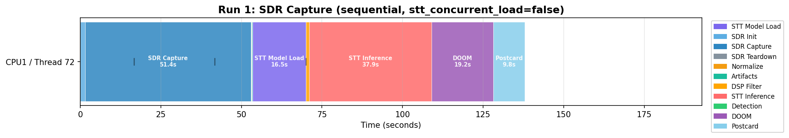
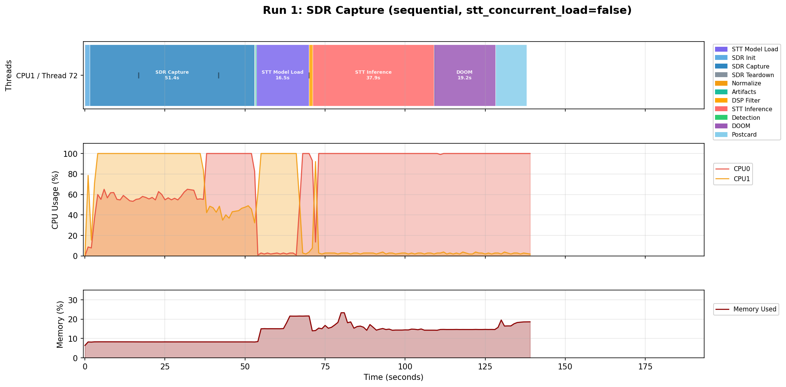
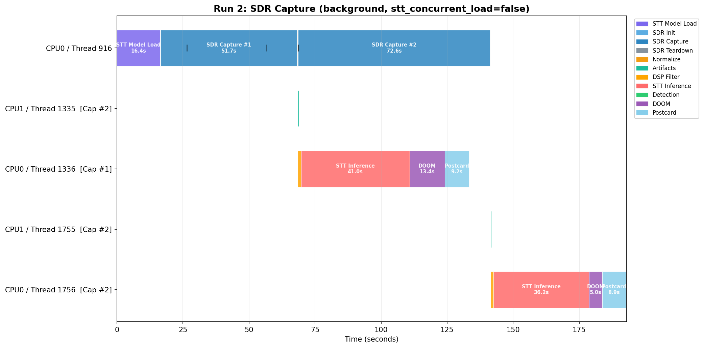
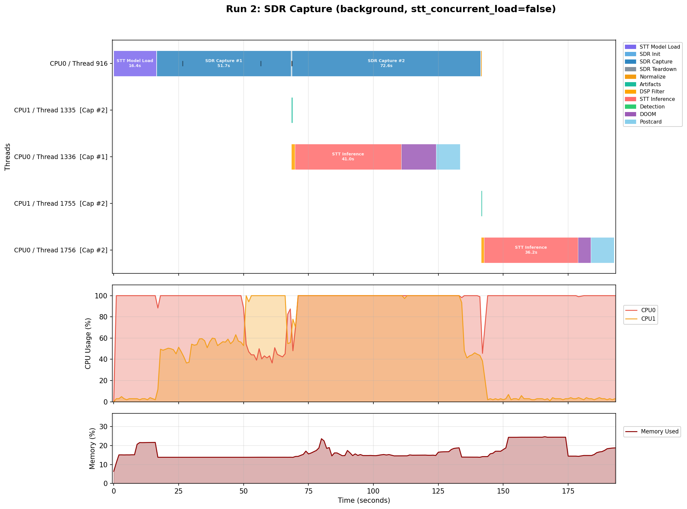
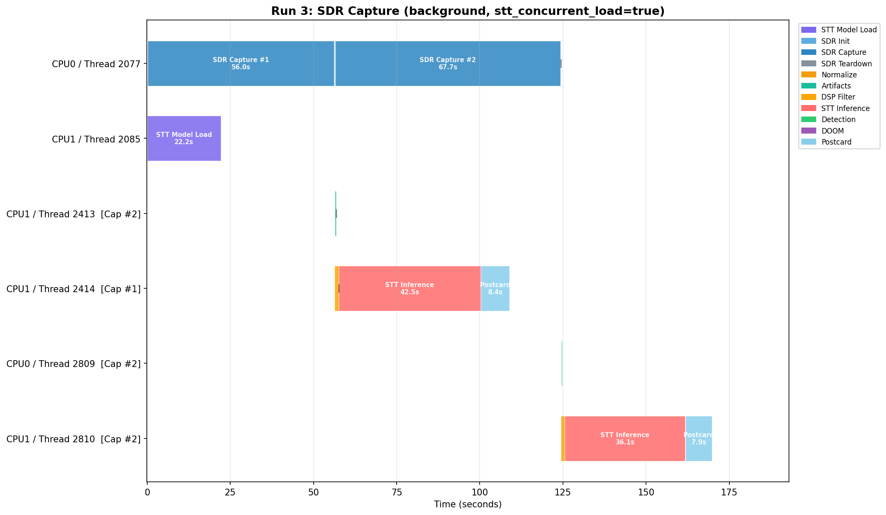
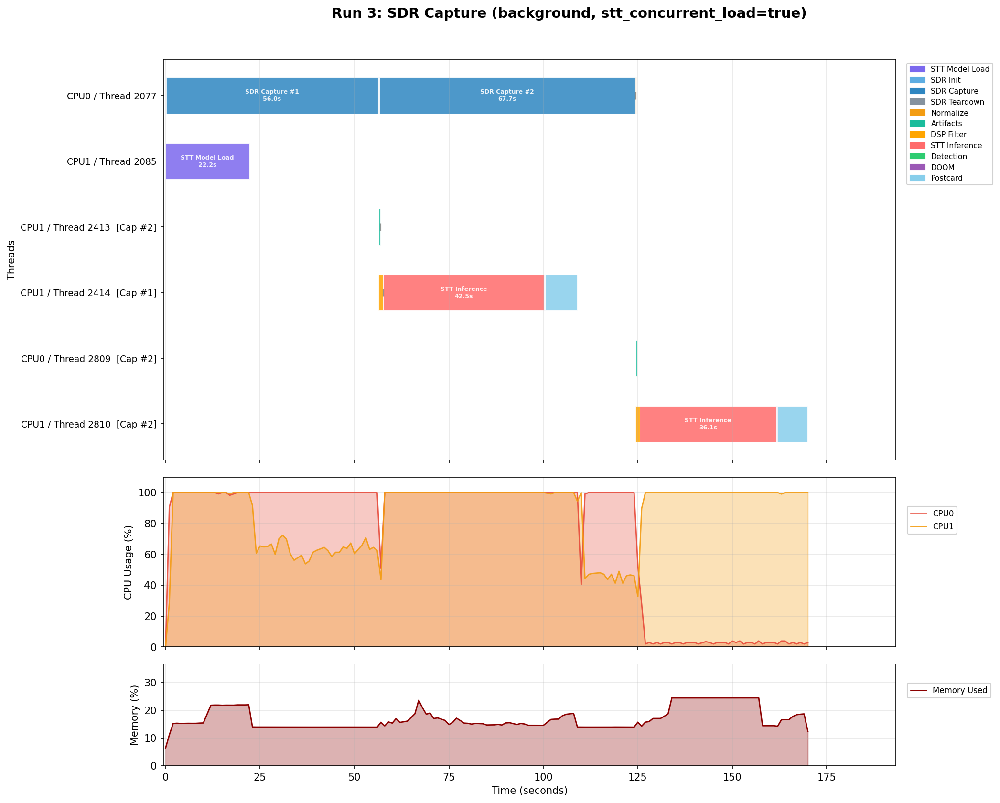

# v3 EM Test Results

Results from the v3 experiment run on the OPS-SAT Engineering Model (EM), ARM32 dual-core SEPP. Data from SMILE artifact `pack-4023_1774447112`. See [TESTING.md](TESTING.md) for test environment details.

For the v2 EM results that motivated v3, see [changelog/V1_TO_V2.md](changelog/V1_TO_V2.md#em-resource-utilization-v2-run). For the v3 changes, see [changelog/V2_TO_V3.md](changelog/V2_TO_V3.md).

## Run Configuration

| | Run 1 | Run 2 | Run 3 |
|---|---|---|---|
| Process mode | sequential | background | background |
| Captures | 1 x 20s | 2 x 20s | 2 x 20s |
| stt_concurrent_load | false | false | true |
| doom_force_trigger | true | true | true |

All runs: 1296 MHz, 2.4 MSPS SDR rate, 12x decimation, 200 kHz effective sample rate.

## Timing Summary

All values from log timestamps. Capture wall times are self-reported by the application. DOOM demo durations vary by demo -- not comparable across runs.

| Metric | Run 1 | Run 2 | Run 3 |
|---|---|---|---|
| STT model load | 16,490 ms | 16,363 ms | 22,158 ms |
| Capture 1 wall time | 50s | 51s | 55s |
| Capture 2 wall time | -- | 72s | 67s |
| Cap 1 DSP filter | 1.0s | 1.3s | 1.2s |
| Cap 1 STT inference | 37.9s | 41.0s | 42.5s |
| Cap 1 DOOM demo | gl-e1m2b (19.2s) | e1m7-607 (13.4s) | impfight (0.3s) |
| Cap 1 postcard | 9.8s | 9.2s | 8.4s |
| Cap 2 DSP filter | -- | 1.1s | 1.1s |
| Cap 2 STT inference | -- | 36.1s | 36.1s |
| Cap 2 DOOM demo | -- | gl-e1m2 (5.0s) | m1-fast (0.2s) |
| Cap 2 postcard | -- | 8.9s | 7.9s |
| **Total time** | **138.1s** | **192.8s** | **170.0s** |

## Run 1: SDR Capture, sequential

Single-thread execution. All phases run on Thread 72.

Log: `SDR Capture mode: 1 capture(s) of 20s, processing=sequential`

Phase order: SDR Init, SDR Capture, SDR Teardown, Normalize, Artifacts, STT Model Load, DSP Filter, STT Inference, Detection, DOOM, Postcard.

### Timeline



### Timeline + Resource Utilization



CPU observations from the resource plot:
- During SDR capture (~0-52s): both cores active (CPU0 ~50-65%, CPU1 ~40-60%). GNU Radio runs internal worker threads for the flowgraph.
- STT model load (~53-69s): CPU0 at ~100%, CPU1 drops to near idle.
- STT inference (~70-108s): CPU0 sustained at ~100%, CPU1 near idle.
- DOOM (~109-128s): CPU0 at ~100%.
- Postcard (~128-138s): CPU0 at ~100%.

Memory rises from ~7% at baseline to ~20% after STT model load, peaks at ~23% during STT inference, and settles around 15-18% during DOOM and postcard generation.

## Run 2: SDR Capture, background (stt_concurrent_load=false)

Log: `SDR Capture mode: 2 capture(s) of 20s, processing=background`

STT model load (16.4s) blocks the main thread before the first capture starts. Five threads visible in the timeline:
- **Thread 916** (main): STT Model Load, SDR Init, Capture 1, Teardown, Normalize, SDR Init, Capture 2, Teardown, Normalize
- **Thread 1335** (artifacts, cap 1): IQ Diag, Spectrogram, Constellation
- **Thread 1336** (processing, cap 1): DSP Filter, STT Inference, Detection, DOOM, Postcard
- **Thread 1755** (artifacts, cap 2): IQ Diag, Spectrogram, Constellation
- **Thread 1756** (processing, cap 2): DSP Filter, STT Inference, Detection, DOOM, Postcard

### Timeline



### Timeline + Resource Utilization



CPU observations from the resource plot:
- STT model load (0-16s): CPU0 at ~100%, CPU1 near idle.
- Capture 1 (~16-68s): both cores active (~50-60%).
- Capture 2 concurrent with cap 1 processing (~68-141s): both cores high (~80-100%). Capture 2 took 72s wall time vs capture 1's 51s -- I/Q throughput dropped during concurrent processing (see I/Q throughput section below).
- Cap 2 processing only (~141-192s): CPU0 at ~100%, CPU1 near idle (single-thread STT inference).

Memory starts at ~8%, rises to ~15% after STT model load, and fluctuates between 15-24% during processing.

Capture 1 processing (Thread 1336) ran concurrently with capture 2 (Thread 916): the artifact thread generated spectrogram and constellation BMPs from the sc16 file while the processing thread ran DSP and STT on the WAV file. Capture 1 processing completed (64.9s) before capture 2 finished (72s).

## Run 3: SDR Capture, background (stt_concurrent_load=true)

Log: `SDR Capture mode: 2 capture(s) of 20s, processing=background`

STT model load runs on a background thread concurrently with the first SDR capture. Six threads visible in the timeline:
- **Thread 2077** (main): SDR Init, Capture 1, Teardown, Normalize, SDR Init, Capture 2, Teardown, Normalize
- **Thread 2085** (STT load): STT Model Load -- runs concurrently with capture 1
- **Thread 2413** (artifacts, cap 1): IQ Diag, Spectrogram, Constellation
- **Thread 2414** (processing, cap 1): DSP Filter, STT Inference, Detection, DOOM, Postcard
- **Thread 2809** (artifacts, cap 2): IQ Diag, Spectrogram, Constellation
- **Thread 2810** (processing, cap 2): DSP Filter, STT Inference, Detection, DOOM, Postcard

### Timeline



### Timeline + Resource Utilization



CPU observations from the resource plot:
- Concurrent STT load + capture 1 (0-22s): both cores near 100% from the start. CPU0 handles STT model loading, CPU1 handles SDR capture.
- After STT finishes, capture 1 continues (~22-56s): CPU load drops to single-core capture pattern (~50-60%).
- Capture 2 concurrent with cap 1 processing (~56-124s): both cores high.
- Cap 2 processing only (~124-170s): CPU0 at ~100%, CPU1 near idle.

Memory rises from ~6% at baseline to ~18-20% within the first few seconds (STT model loading + capture buffers allocated simultaneously), and peaks at ~24%.

STT model loaded in 22.2s. Capture 1 took 55s. The model was ready ~34s before capture 1 completed, so no waiting occurred before processing could start.

Capture 1 delivered 319,976 of 320,000 audio samples (24 short, 0.0075%). All I/Q samples were complete (4,000,000/4,000,000). All other captures across all three runs delivered full audio sample counts.

## I/Q Capture Throughput

The configured 20s SDR captures take longer than 20s of wall time on the EM due to ARM DMA throughput limitations (see [TESTING.md](TESTING.md#capture-duration-vs-wall-time)). Wall time varies depending on concurrent CPU load. The Progress log lines report I/Q sample counts at 5-second intervals.

| Capture | Wall time | Avg I/Q throughput | Concurrent activity |
|---|---|---|---|
| Run 1, cap 1 | 50s | ~80,000 samples/s | None |
| Run 2, cap 1 | 51s | ~78,400 samples/s | None (STT already loaded) |
| Run 2, cap 2 | 72s | ~55,600 samples/s | Cap 1 STT inference (Thread 1336) |
| Run 3, cap 1 | 55s | ~72,700 samples/s | STT model load (Thread 2085) |
| Run 3, cap 2 | 67s | ~59,700 samples/s | Cap 1 STT inference (Thread 2414) |

Run 3 capture 1 shows a throughput shift visible in the Progress lines. During the first ~22s while STT was loading concurrently, I/Q throughput averaged ~55,000 samples/s. After STT loading completed at the 22s mark, throughput for the remainder of the capture rose to ~83,000 samples/s.

## Concurrent STT Load: Run 2 vs Run 3

Run 2 and Run 3 differ only in `stt_concurrent_load`. Comparing the interval from program start to first capture complete:

| Metric | Run 2 | Run 3 |
|---|---|---|
| Time to first capture complete | 68.2s | 56.2s |
| Breakdown | 16.4s STT block + 51.8s capture | 55s capture (STT concurrent) |
| STT load duration | 16,363 ms | 22,158 ms |

Run 3 reached first-capture-complete 12.0s sooner. The STT load took 5.8s longer when running concurrently (22.2s vs 16.4s), and capture 1 took 4s longer (55s vs 51s). Despite these overheads, overlapping the two phases saved 12.0s of wall time.

The 22.8s total time difference between Run 2 (192.8s) and Run 3 (170.0s) reflects multiple factors beyond the concurrent STT overlap, including different DOOM demo durations (Run 2: 13.4s + 5.0s = 18.4s, Run 3: 0.3s + 0.2s = 0.5s) and different capture 2 wall times (72s vs 67s).

## Key Observations

1. **Background mode shows concurrent execution.** The Run 2 and Run 3 timelines show artifact and processing threads active during SDR captures. This contrasts with the v2 EM run where background mode was effectively serialized due to a log mutex (see [changelog/V1_TO_V2.md](changelog/V1_TO_V2.md#em-resource-utilization-v2-run)).

2. **Concurrent SDR capture and processing share the dual-core CPU.** When capture and STT inference run simultaneously (Run 2 capture 2, Run 3 capture 2), I/Q throughput drops to ~56-60K samples/s vs ~78-80K samples/s with no concurrent work. This extends capture wall time (67-72s vs 50-51s).

3. **Concurrent STT loading also reduces capture throughput.** In Run 3, I/Q throughput during the first 22s of capture 1 (while STT loaded concurrently) was ~55K samples/s, rising to ~83K samples/s after STT loading finished. The net effect: capture 1 took 55s in Run 3 vs 51s in Run 2.

4. **STT model loading is slower under CPU contention.** The model took 22.2s to load in Run 3 (concurrent with capture) vs 16.4-16.5s in Run 1 and Run 2 (no contention). This is a 35% increase in load time.

5. **All captures completed without retry.** No IIO device initialization failures occurred across all runs. The capture retry mechanism was not triggered.

6. **Per-run config copy works.** Each run's `config.cfg` in its output directory contains the correct overrides. This fixes the v2 EM bug where appends to the read-only config failed silently.

7. **Results log works.** `toGround/results.txt` contains entries for all DOOM executions across all three runs.

## Regenerating Plots

The source data (logs and resource CSVs) is committed in `docs/data/`. To regenerate the plots:

```bash
python3 scripts/plots/plot_log_timeline.py --batch \
  --input-dir docs/data/em-v3/pack-4023_1774447112 \
  --output-dir docs/data/em-v3/pack-4023_1774447112

python3 scripts/plots/plot_resource.py --batch --standalone \
  --input-dir docs/data/em-v3/pack-4023_1774447112 \
  --output-dir docs/data/em-v3/pack-4023_1774447112
```

Requires `matplotlib` and `numpy` (`pip install matplotlib numpy`).
