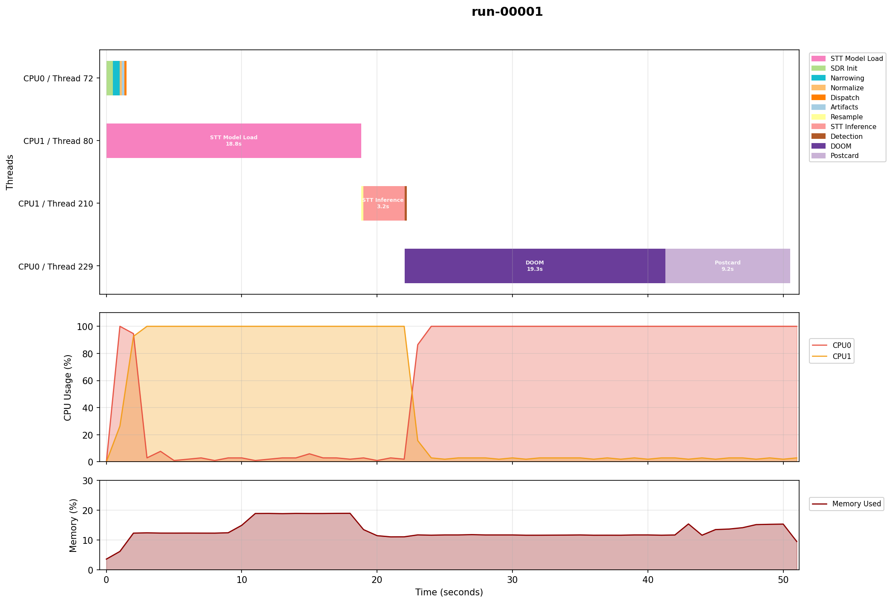
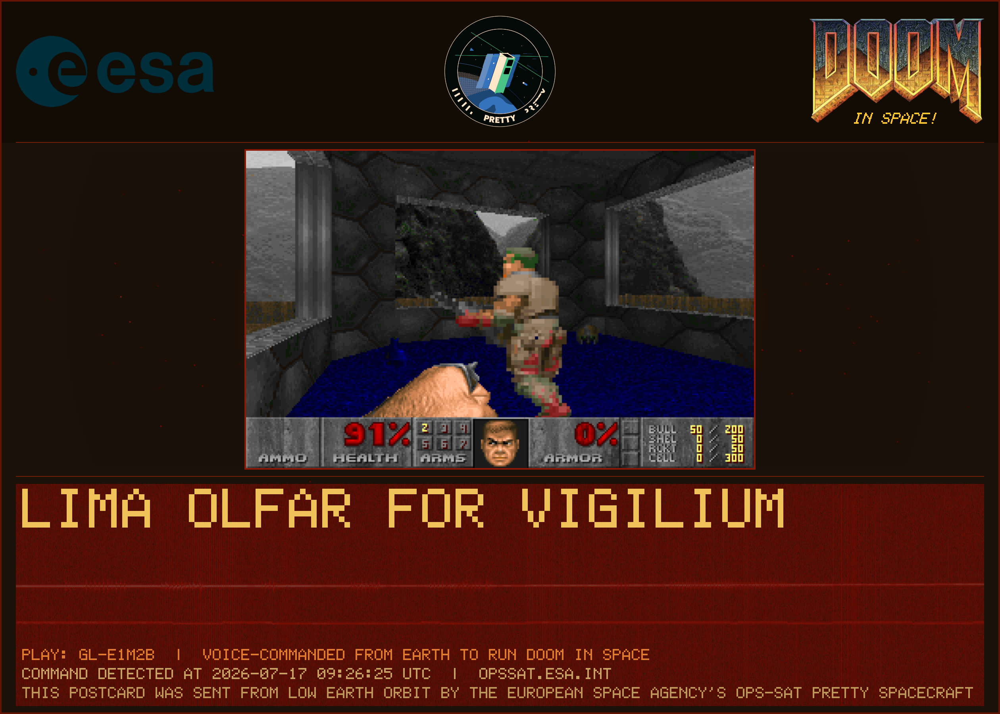
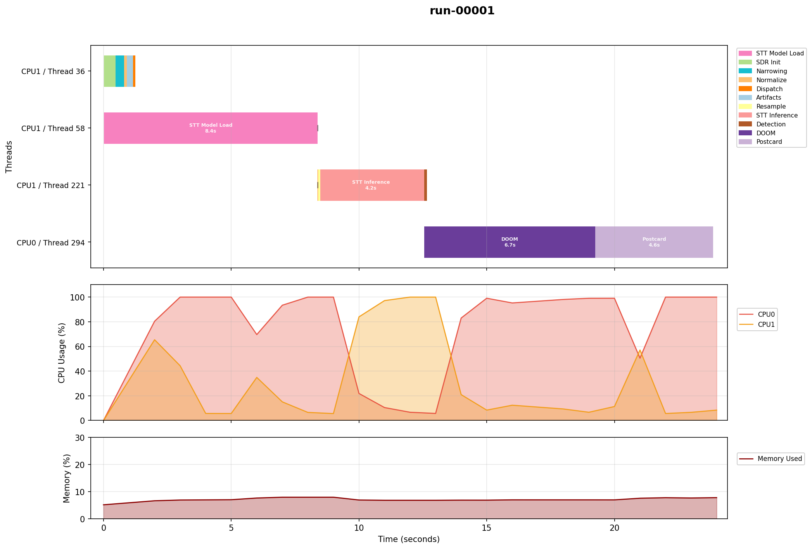
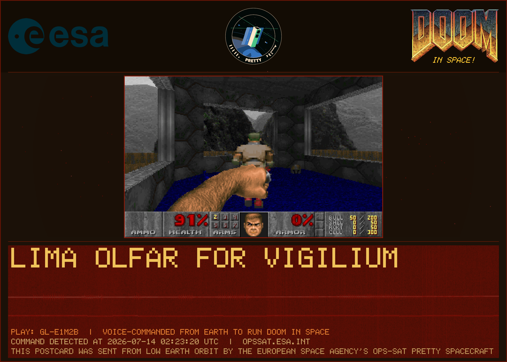
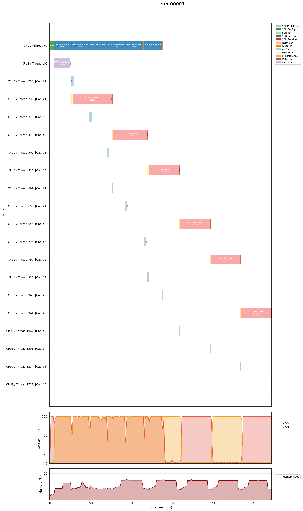
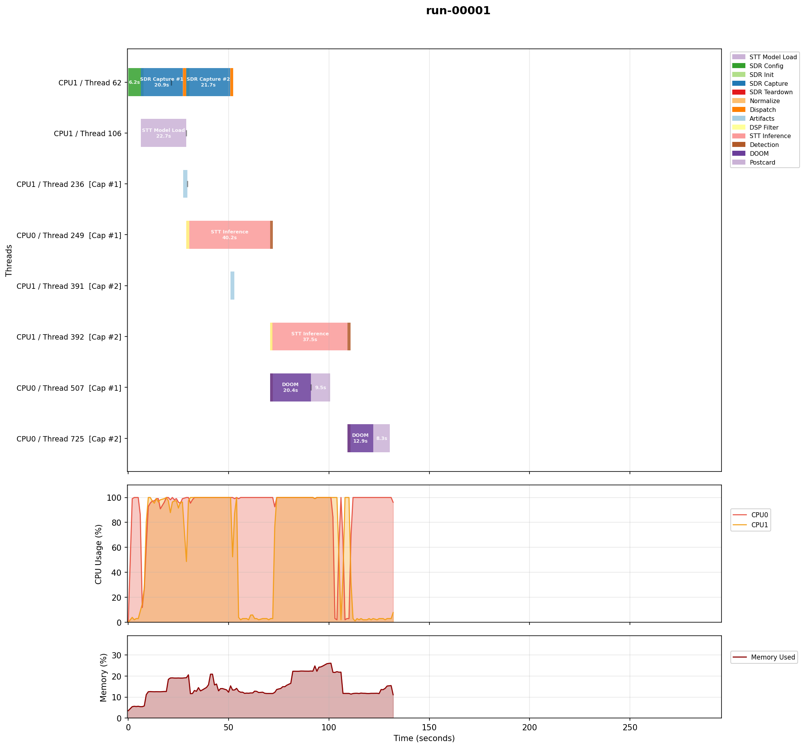
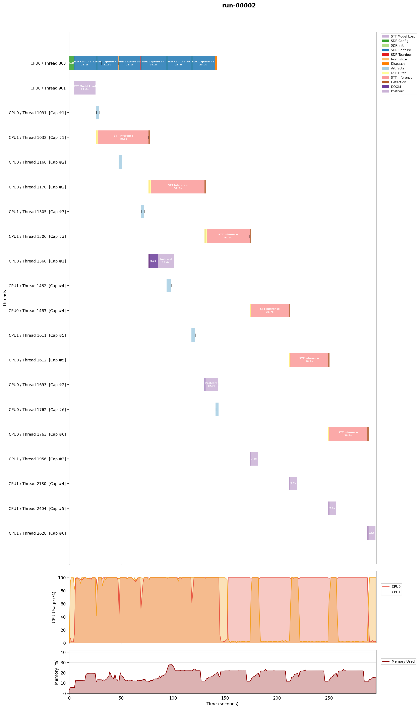

# EM Verification Results

Verification results from experiment runs on the OPS-SAT Engineering Model (EM), ARM32 dual-core SEPP. See [TESTING.md](../TESTING.md) for the test environment. On-orbit flight results live separately in [`flight/`](../flight/).

For previous EM results, see [V3_TO_V4.md](V3_TO_V4.md) (v4) and [V2_TO_V3.md](V2_TO_V3.md) (v3). For the v5 changes, see [V4_TO_V5.md](V4_TO_V5.md). For the v6 changes (postcard scatter fix, flight run script), see [V5_TO_V6.md](V5_TO_V6.md). For the v7 changes (narrowing stage, second-stage filtering removal, sc16 replay input), see [V6_TO_V7.md](V6_TO_V7.md).

## v7 Validation

Data from SMILE artifact [`pack-4023_1784280414`](data/em-v7/pack-4023_1784280414/). The `exp4023-pretty-DOOMed-v6-to-v7.tar.gz` patch (8.7 MB: `pretty-doomed`, `run`, `VERSION`, `config.cfg`, `input/replay.cs16`) was extracted over the intact v6 installation, models and libraries picked up in place. Single run via SMILE with the EM configuration (`doom_force_trigger=true`, narrowing armed); the `run` script detected `input/replay.cs16` (the Run 5 pass 2 recording `sdr_20260703_205825` in flight `capture.sc16` form, archived byte-identical as [data/em-v7/replay.cs16](data/em-v7/replay.cs16)) and replayed it instead of live capture, so the SDR stayed off.

The EM reproduced the ground reference (the QEMU dress rehearsal below, which ran the same package on the same input):

| Stage | EM result | Ground reference (QEMU) |
|---|---|---|
| Narrowing | peak at -8.27637 kHz, 0.5 s scan+regeneration for the 2 s capture | -8.27637 kHz, identical to the last logged digit |
| Normalization | rms=0.136517, scale=0.73251 | identical to the logged digit |
| Transcription | `LIMA OLFAR FOR VIGILIUM`, call sign token match (`LIMA`), 3.2 s inference | word-identical (the x86 build differs only in the noise tail: `LIMA ALPHAGIUM`) |
| Detection | no command (expected; the recording carries no command phrase) | identical |
| DOOM | force-triggered, `gl-e1m2b` completed (19.3 s) | identical demo |
| Postcard | 2520x1800, 9.2 s | identical |

Total 50.6 s, of which STT model load 18.8 s. This is the first on-hardware measurement of the v7 narrowing phase and it is negligible against the STT stages, as designed. The systemd `status=127` at service exit is identical in all archived EM packs back to April 2026 (pre-existing wrapper behavior, not v7).





**Verdict: v7 is validated for flight.** The flight patch is the same build with `doom_force_trigger=false` and no `input/replay.cs16` (see the packaging section of [V6_TO_V7.md](V6_TO_V7.md)).

## v7 Local Validation (pre-EM)

Data in [data/local-v7/](data/local-v7/). This run was the ground dress rehearsal of exactly what the EM executed: the `exp4023-pretty-DOOMed-v6-to-v7.tar.gz` patch extracted over a v6-style installation (models and libraries provided by the existing deployment), run as-shipped via `./run` on the ARM32 binary, under QEMU user-mode emulation. The run was repeated against the archived v6 `libs/` exactly as deployed on the EM (the patch ships no libraries; see the packaging section of [V6_TO_V7.md](V6_TO_V7.md)) with identical results.

The package's `input/replay.cs16` (Run 5 pass 2 recording `sdr_20260703_205825`, converted to flight `capture.sc16` form) switched the run to sc16 replay mode automatically. Full sequence in 23.9 s:

| Stage | Result |
|---|---|
| Replay | `input/replay.cs16`, 2 s at 200 kHz effective |
| Narrowing | peak at -8.27637 kHz (injected -8 kHz plus Doppler residual), audio regenerated |
| Transcription | `LIMA OLFAR FOR VIGILIUM`, call sign token match (`LIMA`) |
| Detection | no command (expected; the recording carries no command phrase) |
| DOOM | force-triggered (`doom_force_trigger=true`), demo `gl-e1m2b` completed |
| Postcard | 2520x1800 generated from the replay's I/Q |

The narrowing peak is identical to the x86 reference run of the same input, and the transcription is in the same phonetic-alphabet family (the trailing words differ across runs because GNU Radio scheduling is not bit-deterministic, which shifts the beam search on the noise tail; the leading call-sign token is stable).



The timeline shows the first ARM32 measurement of the narrowing phase (teal, 0.35 s for a 2 s capture including the sc16 scan and audio regeneration, on QEMU-emulated cores; 0.5 s on the real EM). STT model load 8.4 s, inference 4.2 s, DOOM 6.7 s, postcard 4.6 s.



A second leg (live capture from the SDR emulator into the deployed package, exercising the IIO streaming path on ARM32) was attempted three times and each attempt died at a different point with the documented intermittent QEMU SIGFPE (see [TESTING.md](../TESTING.md)); the streaming flowgraph is unchanged since v6, was validated on the real EM then, and was validated end-to-end against the same emulator on x86 with the Run 5 replays. The live path will be confirmed on the real EM by leaving `input/replay.cs16` out, or on the next flight pass.

## v6 Validation

Data from SMILE artifact [`pack-4023_1775579267`](data/em-v6/pack-4023_1775579267/). The v6 patch fixed a postcard I/Q scatter rendering bug and simplified the run script for flight. The v6 EM run validated both execution paths:

- **Run 1** (3 x 20s, listen-only): all captures, diagnostics, and SC16 cleanup confirmed. Total: 147.3s.
- **Run 2** (3 x 20s, DOOM force-triggered): all 3 DOOM demos ran, postcards generated with smooth I/Q scatter (no stripes). Total: 164.9s.

Capture wall times (20-22s), STT inference (36-45s), and I/Q metrics are consistent with v5. Full v6 EM analysis in [changelog/V5_TO_V6.md](V5_TO_V6.md#v6-results).

## v6 Full Package Verification

Data from SMILE artifact [`pack-4023_1775661470`](data/em-v6/pack-4023_1775661470/). Full v6 SEPP package installed and run with the flight configuration: single run, 6 x 20s captures, `doom_force_trigger=false`.

All 6 captures completed successfully (20-21s each). No command detected (expected). STT inference: 47.0s, 42.3s, 37.2s, 36.2s, 36.0s, 36.2s. SC16 files deleted after diagnostics. Total: 270.0s (~4.5 min). I/Q metrics consistent with previous runs.



## v5 Detailed Results

Data from SMILE artifact [`pack-4023_1775155417`](data/em-v5/pack-4023_1775155417/).

## Run Configuration

| | Run 1 (sc16 preserved) | Run 2 (sc16 deleted) |
|---|---|---|
| Captures | 2 x 20s | 6 x 20s |
| sdr_keep_sc16 | true | false |
| Decimation | Hardware FIR (600 kSPS, 3x) | Hardware FIR (600 kSPS, 3x) |
| Process mode | background | background |
| sdr_init_per_capture | false (init once) | false (init once) |
| stt_concurrent_load | true | true |
| doom_force_trigger | true | true |

All runs: 1296 MHz, 200 kHz effective sample rate, 16 kHz audio output, sdr_timeout_multiplier=2.

## Timing Summary

### Run 1 (2 captures, sc16 preserved)

| Metric | Value |
|---|---|
| SDR Config (once) | 6.2s |
| Capture 1 wall time | 20s |
| Capture 2 wall time | 21s |
| STT 1 inference | 40.1s |
| STT 2 inference | 37.4s |
| LPF taps | 97 |
| **Total time** | **130.7s** |

### Run 2 (6 captures, sc16 deleted)

| Metric | Cap 1 | Cap 2 | Cap 3 | Cap 4 | Cap 5 | Cap 6 |
|---|---|---|---|---|---|---|
| Capture wall time | 20s | 20s | 20s | 23s | 23s | 22s |
| STT inference | 48.5s | 51.2s | 41.1s | 36.7s | 36.3s | 36.4s |

SDR Config (once): 4.4s. LPF taps: 97. **Total time: 295.0s.**

## Key Findings

### Once-per-run SDR init

The AD9361 configuration (FIR tap generation, clock chain, analog filter calibration) runs once before the capture loop. Run 2 shows a single 4.4s SDR Config phase, then 6 captures back-to-back with no re-initialization gaps. This saves ~26s compared to v4's per-capture init for 6 captures.

### Near-continuous capture

Captures 1-3 complete in 20s (matching configured duration). Captures 4-6 take 22-23s, likely due to CPU contention from concurrent STT inference. The flowgraph rebuild between captures takes ~17ms (not visible at this scale).

### Two-stage background processing

The STT chain processes captures sequentially (Transcriber is not thread-safe), while DOOM + Postcard fire async on separate threads. The timeline shows STT for capture N+1 starting immediately after STT for capture N completes, with DOOM/Postcard running concurrently.

STT times range from 36-51s. The first two captures (48.5s, 51.2s) are slower, likely due to concurrent SDR capture activity on the other core. Once all captures finish, STT times stabilize at 36-41s.

### sc16 cleanup

Run 2 confirms sc16 files are deleted after each capture's artifacts and postcard are generated. All 6 sc16 deletions logged. Run 1 confirms sc16 preservation with `sdr_keep_sc16=true`.

### Onboard diagnostics

All new v5 artifacts generated successfully for all captures:
- `capture-metrics.csv`: I/Q diagnostics (RMS, peak, PAPR, DC offset, imbalance, zero fraction)
- `capture-psd.csv` + `capture-psd.bmp`: PSD with 7811 Welch segments per capture
- `psd-comparison.bmp`: cross-capture PSD overlay (Run 2)
- Spectrogram and constellation BMPs with axis labels

### Downlink size

| | Uncompressed | tar.gz |
|---|---|---|
| Run 1 (2 captures, sc16 preserved) | 45 MB | ~26 MB |
| Run 2 (6 captures, sc16 deleted) | 33 MB | 23 MB |
| Full toGround (both runs) | 78 MB | 49 MB |

The 6-capture run without sc16 (23 MB compressed) is smaller than v4's 2-capture run with sc16 (~70 MB compressed).

## Run 1: 2 captures, sc16 preserved



Two captures back-to-back. SDR Config (4.4s, teal) visible at start. Two-stage pipeline: STT 1 (40.2s) completes, DOOM 1 (20.4s) + Postcard fires async, STT 2 (37.5s) starts immediately. sc16 files preserved (used in postcard blood splatter overlay).

## Run 2: 6 captures, sc16 deleted



Six captures on the main thread, near-continuous. STT chain processes sequentially across background threads. DOOM + Postcard exec stages fire async after each STT completes. sc16 deleted after each capture's postcard is generated.

## Regenerating Plots

```bash
python3 scripts/plots/plot_resource.py --batch \
  --input-dir docs/changelog/data/em-v5/pack-4023_1775155417 \
  --output-dir docs/changelog/data/em-v5/pack-4023_1775155417
```

Requires `matplotlib` and `numpy` (`pip install matplotlib numpy`).

Source data: [changelog/data/em-v5/](data/em-v5/).
