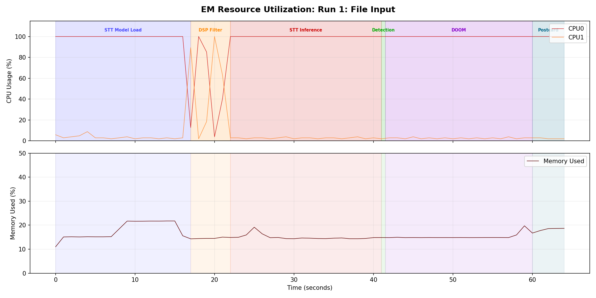
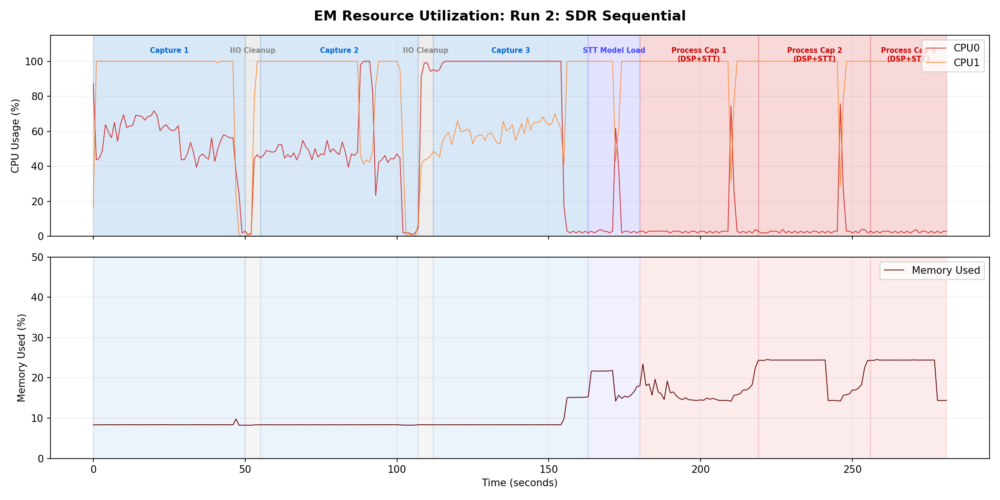
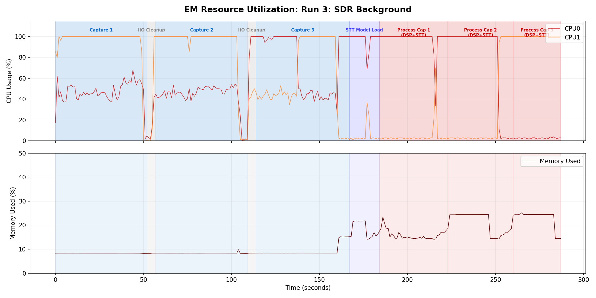

# Changelog: v1 to v2

Changes derived from observing the v1 experiment run on the OPS-SAT Engineering Model (EM).

**PR**: [#76](https://github.com/georgeslabreche/opssat-pretty-doomed/pull/76) (v2 fixes from v1 EM run).

## Deferred STT Model Loading (Sequential Mode)

**Observation**: In v1, the STT model (~27 MB) was loaded unconditionally before the first SDR capture. On the EM, model loading took ~16 seconds, during which the SDR hardware sat idle.

**Change**: In sequential mode, STT model loading is deferred until after all captures complete. The model is not needed until processing begins, so loading it during the capture phase wastes time and increases peak memory usage for no benefit. In background mode, the model is still loaded before captures because processing must start as soon as a capture finishes.

**Impact**: First capture starts ~16 seconds sooner in sequential mode.

## Resource Monitor

**Observation**: The v1 run produced log files but no structured resource utilization data. It was unclear how CPU cores and memory were utilized during different pipeline phases.

**Change**: The `run` script now embeds a background resource monitor that writes `resource.csv` to each run's output directory. It samples `/proc/stat` (per-core CPU counters: user, nice, system, idle, iowait) and `/proc/meminfo` (total, available, free) every second.

The monitor includes:
- **Orphan guard**: exits if the parent process dies (prevents zombie monitors)
- **Timeout safety net**: stops after a configurable maximum (default 3600s)
- **Clean shutdown**: `stop_monitor` sends SIGTERM and waits

**Impact**: Provides per-core CPU and memory time series for post-experiment analysis, enabling the v2-to-v3 optimizations.

### EM Resource Utilization (v2 run)

The following plots were generated from the v2 EM run's `resource.csv` data. They show per-core CPU usage and memory utilization over time, with phase boundaries overlaid.

**Run 1: File Input** (source: EM v2 run)

Key observations:
- CPU0 runs at 100% during STT Model Load and STT Inference. CPU1 is nearly idle throughout -- the file input pipeline is single-core.
- Memory peaks at ~22% during STT model loading, drops after model is released.
- DSP Filter briefly spikes both cores (GNU Radio uses worker threads internally).

**Run 2: SDR Sequential** (source: EM v2 run)

Key observations:
- Both cores are active during SDR captures (GNU Radio + libiio DMA). Between captures, both cores drop to near-idle during IIO Cleanup delays.
- STT Model Load at ~150s causes a memory jump. Processing phases (DSP+STT) then run single-core at 100%.
- The IIO Cleanup gaps (~10s each) are wasted time -- addressed in v3 by removing the hardcoded inter-capture sleep.

**Run 3: SDR Background** (source: EM v2 run)

Key observations:
- Nearly identical to Run 2 despite being in background mode. The background processing was blocked by the log mutex and stdout redirection race, preventing true concurrency. This is addressed in v3.
- Same IIO Cleanup gaps as Run 2.

## DOOM Demo Index Cycling Fix

**Observation**: In v1, the same DOOM demo level was being played across different runs and captures. The demo index was not persisting correctly.

**Change**: The demo index file (`doom_demo_index.txt`) now cycles correctly across runs and captures, ensuring each execution plays a different demo.

## Postcard Logo Path Fix

**Observation**: In v1, postcards generated during SDR capture runs were missing the ESA, DOOM, and OPS-SAT PRETTY logos. The logo path derivation (walking up from the config file path) failed when the config file was in a different location than expected.

**Change**: Added explicit `doom_assets_dir` config key. The assets path is now configured directly rather than inferred from the config file path.

## Single Config File

**Observation**: The v1 `run` script copied `config.cfg` into each run directory and appended per-phase overrides. This created multiple config files and made it unclear which config was active.

**Change**: The `run` script appends overrides directly to the single `config.cfg` (last value wins in the config parser). No per-run copies.

## Updated Game Stats References

**Change**: Updated `gl-e1m2.txt` and `gl-e1m2b.txt` reference stats. The v1 reference files were carried over from the previous DOOM experiment on OPS-SAT-1, which had modifications to the DOOM source code that produced different gameplay outcomes.
