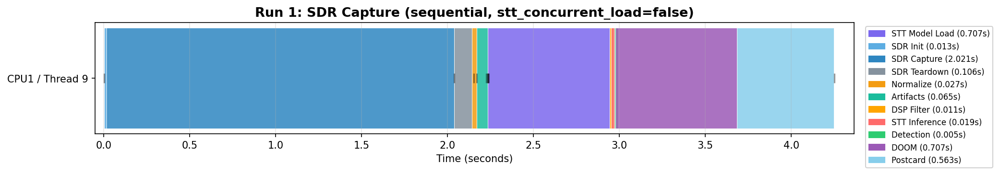
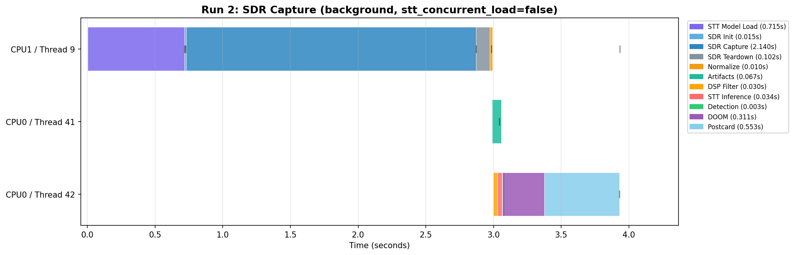
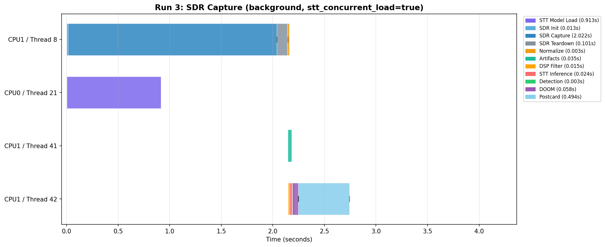

# Changelog: v2 to v3

Changes derived from analyzing the v2 experiment run on the OPS-SAT Engineering Model (EM), using the resource monitor and log data introduced in v2 (see [V1_TO_V2.md](V1_TO_V2.md)).

**PR**: [#78](https://github.com/georgeslabreche/opssat-pretty-doomed/pull/78) (v3 optimizations from v2 EM run)

## Per-Core CPU and Thread Tagging

**Observation**: The v2 resource.csv showed per-core CPU utilization but could not attribute specific phases to specific cores or threads. Log lines had timestamps but no thread identity, making it impossible to determine which phases could overlap.

**Change**: Every log line now includes a `[cN/tM]` tag (CPU core and thread ID via `sched_getcpu()` and `gettid()`, Linux only). This enables:

1. **Thread attribution**: In background mode, interleaved log lines from concurrent threads are unambiguous.
2. **Timeline reconstruction**: `scripts/plot_log_timeline.py` parses these tags to generate Gantt-style plots showing which phase runs on which CPU core and thread over time. The plots are the primary tool for identifying serialization bottlenecks.

## Concurrent STT Model Loading (Background Mode)

**Observation**: The v2 EM resource plots showed STT model loading pinning CPU0 at 100% for ~16 seconds before the first SDR capture could start. The model is not used until after the first capture finishes and processing begins.

**Change**: In background mode, when `stt_concurrent_load=true`, the STT model loads on a background thread (`std::async`) while the first capture runs concurrently on the main thread. The model just needs to be ready before the first `do_process()` call. Since captures take ~20s on the EM and STT loading takes ~16s, the model is ready before the first capture finishes.

```
Before (background mode):
  Thread 1: [STT Load ~~~~16s~~~~][Capture 1][Capture 2]...

After (stt_concurrent_load=true):
  Thread 1:          [Capture 1     ][Capture 2     ]...
  STT thread: [STT Load ~~~~16s~~~~]
                                    wait if needed
                                     [Process 1    ]...
```

**Config**: `stt_concurrent_load=true` (default `false` in code, `true` in config). Can be set to `false` if concurrent loading causes SDR buffer overruns due to CPU contention on the dual-core SEPP.

**Risk**: STT loading saturates one core. If SDR capture also saturates both cores, the overlap could cause DMA buffer overruns. This needs to be validated on the EM. The emulator test does not model real DMA timing.

## Log Mutex Removal

**Observation**: The v2 codebase used `std::mutex` around every `log_info()` call and `stdout` redirection in background mode. The v2 EM resource plots (see [V1_TO_V2.md](V1_TO_V2.md#em-resource-utilization-v2-run)) showed Run 2 (sequential) and Run 3 (background) had nearly identical CPU utilization patterns -- background mode was not achieving concurrency. The mutex serialized output across threads and the `stdout` redirection raced between capture and processing threads.

**Change**: The mutex is removed entirely. In background mode, all output goes to the single `pretty-doomed.log` with no per-capture log redirection (which is unsafe with concurrent threads sharing `stdout`). The `[cN/tM]` tags provide thread attribution without synchronization. Per-capture `run.log` redirection is only used in sequential mode where there is no concurrency.

## Async I/Q Artifact Generation (Background Mode)

**Observation**: After each SDR capture, artifact generation (I/Q diagnostics, spectrogram BMP, constellation BMP) ran on the main thread and blocked the start of pipeline processing (DSP filter). Artifacts operate on the sc16 file while DSP operates on the WAV file -- they are independent.

**Change**: In background mode, artifact generation runs in an async thread (`std::async`) via a `shared_future<void>` stored in `CaptureResult`. DSP filtering on the processing thread starts immediately:

```
Background mode (after capture):
  Main thread:     [Normalize WAV] --> returns to caller
  Artifact thread:             [IQ Diag][Spectrogram][Constellation]
  Process thread:              [DSP Filter][STT][Detect][DOOM][Postcard]
```

In sequential mode, artifacts run inline on the main thread since there is no concurrent processing to overlap with:

```
Sequential mode (after capture):
  Main thread:     [Normalize WAV][IQ Diag][Spectrogram][Constellation] --> returns
```

The artifact lambda captures file paths, sample rates, and config flags by value so the async thread safely outlives `run_capture()`. Outstanding artifact futures are joined before program exit.

## Phase Boundary Log Messages

**Observation**: The v2 logs lacked explicit markers for several phases, making timeline reconstruction imprecise. Spectrogram and constellation generation only logged on failure. DOOM execution used manual timestamp formatting without `[cN/tM]` tags.

**Change**:
- Added `"Configuring SDR..."` -- marks SDR Init phase start
- Added `"Stopping flowgraph..."` -- marks SDR Teardown phase start
- Added `"Spectrogram: <path>"` and `"Constellation: <path>"` -- marks Artifact phase entries
- Switched DOOM `"Running DOOM demo: ..."` and `"Completed demo: ..."` from manual `std::cout` with hand-formatted timestamps to `pretty_log.h` (adds `[cN/tM]` tags)

## Capture Retry

**Observation**: On the EM, the IIO device occasionally failed to initialize after a previous capture due to kernel driver cleanup latency. The v2 workaround was a hardcoded 5-second `sleep` between captures.

**Change**: The inter-capture sleep is removed. Instead, `run_capture()` is retried once with a 2-second delay on failure. The flowgraph build itself already retries up to 3 times with 5-second delays if the IIO device is unavailable, so the outer retry handles non-IIO failures.

## Per-Run Config Copy (run script)

**Observation**: The v2 run script appended overrides directly to the original `config.cfg` in place (`cat >> "$CONFIG"`). On the EM, `config.cfg` was read-only after extraction from the deployment tarball, causing the appends to fail silently. This meant `doom_force_trigger=true` and `sdr_captures=2` were never applied -- the v2 EM SDR runs used code defaults (3 captures, no force trigger) and DOOM was never launched for SDR captures.

**Change**: Reverted to the v1 approach: each run gets a fresh copy of `config.cfg` in its run directory (`cp -f "$CONFIG" "$RUN_DIR/config.cfg"`), with overrides appended to the copy. The original `config.cfg` is never modified. The per-run copy is passed to pretty-doomed via `-c "$RUN_DIR/config.cfg"`. This is safe because `doom_assets_dir` (added in v2) provides an explicit assets path, so postcard logo resolution no longer depends on the config file's location.

## DOOM Execution Results Log

**Change**: After each successful DOOM execution, a line is appended to `toGround/results.txt` with timestamp, output directory, demo name, trigger type (detected/force), failure count, and transcription. The file is append-only across all runs.

## VERSION File

**Change**: A `VERSION` file at the project root is the single source of truth for the version number. The Makefile reads it to set `PACKAGE_VERSION` (used for package naming: `exp4023-pretty-DOOMed-v3`) and passes it to `main.cpp` via `-DAPP_VERSION` at compile time. The startup banner now shows `=== PRETTY DOOMed v3 ===`.

## Timeline Visualization Script

**Change**: New script `scripts/plot_log_timeline.py` generates per-run Gantt charts from log files. It parses `[cN/tM]` tags and phase-detection regex patterns to render:

- Per-thread phase blocks (color-coded by phase type)
- Phase durations in the legend
- Capture boundaries (dashed vertical lines)
- CPU migration markers (when a thread switches cores)

Batch mode (`--batch`) processes all runs under `toGround/` with a shared x-axis scale for cross-run comparison.

**Limitation**: The DOOM phase shows wall time between the `"Running DOOM demo:"` and `"Completed demo:"` log messages, both emitted by the thread that called `run_doom()`. Since DOOM runs as a separate process via `fork()+exec()`, the `[cN/tM]` tags reflect the waiting thread, not DOOM's actual CPU/thread utilization. For accurate DOOM core attribution, cross-reference with the `resource.csv` per-core CPU data during the DOOM time window.

### v3 Timeline Plots (Local Emulator Test)

The following plots were generated from a local Docker emulator test of the v3 code. Timings differ from the EM (emulator runs on x86, not ARM) but thread/phase structure is representative.

**Run 1: SDR Capture, sequential, stt_concurrent_load=false** (source: local emulator test)



Single-thread execution. All phases (SDR Init, Capture, Teardown, Normalize, Artifacts, STT Load, DSP, STT, Detection, DOOM, Postcard) run on Thread 1.

**Run 2: SDR Capture, background, stt_concurrent_load=false** (source: local emulator test)



Three threads. STT Model Load (purple) blocks Thread 1 at the start -- the first capture cannot begin until the model is fully loaded:
- **Thread 1** (main): STT Model Load, SDR Init, Capture, Teardown, Normalize
- **Thread 38** (artifacts): IQ Diag, Spectrogram, Constellation -- runs concurrently after capture
- **Thread 39** (processing): DSP Filter, STT Inference, Detection, DOOM, Postcard

**Run 3: SDR Capture, background, stt_concurrent_load=true** (source: local emulator test)



Four threads. STT Model Load (purple) runs on a background thread concurrently with SDR capture on Thread 1 -- no blocking:
- **Thread 1** (main): SDR Init, Capture, Teardown, Normalize -- starts immediately
- **STT thread**: STT Model Load -- overlaps with capture
- **Artifacts thread**: IQ Diag, Spectrogram, Constellation
- **Processing thread**: DSP Filter, STT Inference, Detection, DOOM, Postcard

On the EM where STT loading takes ~16s and captures take ~20s, this overlap saves ~16s of wall time per experiment.
