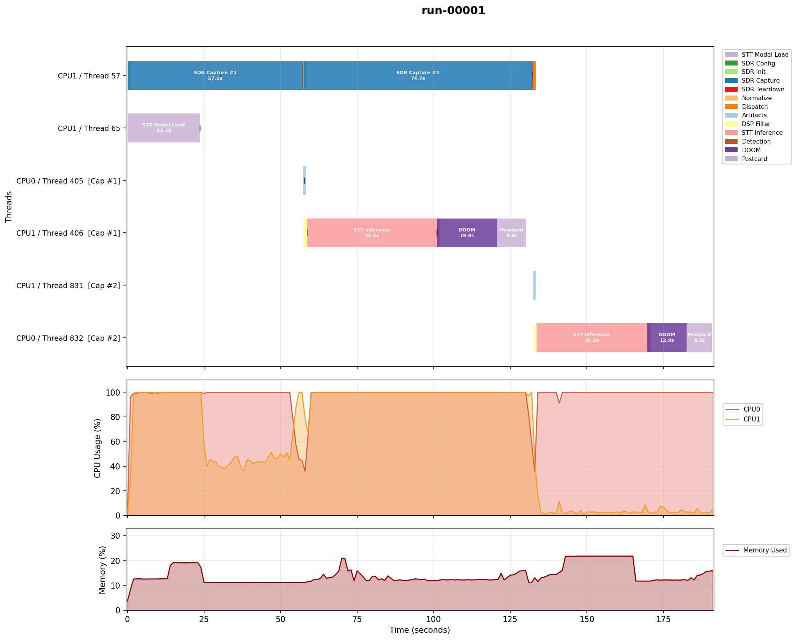
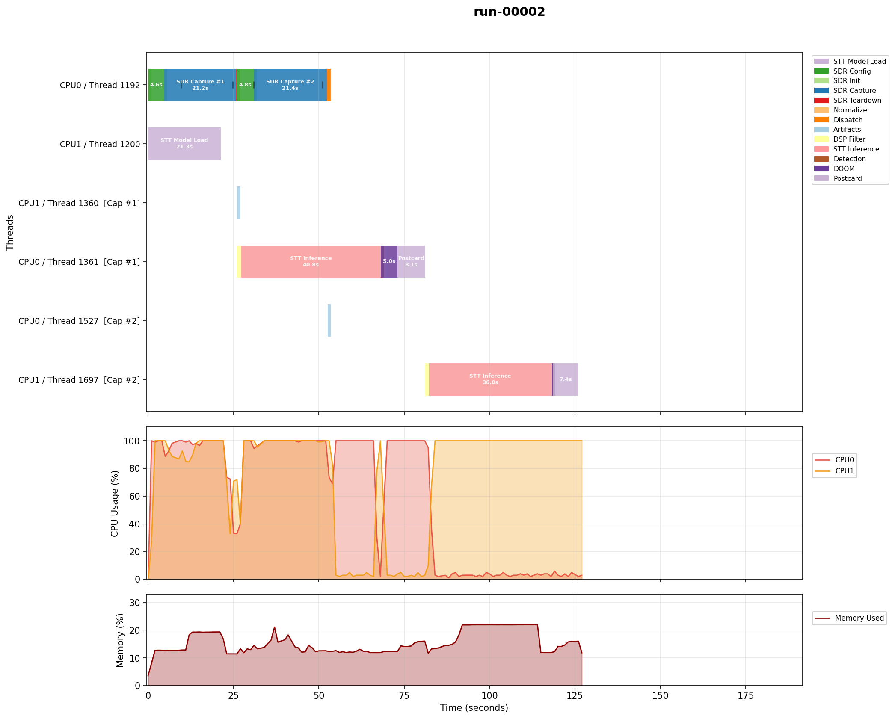
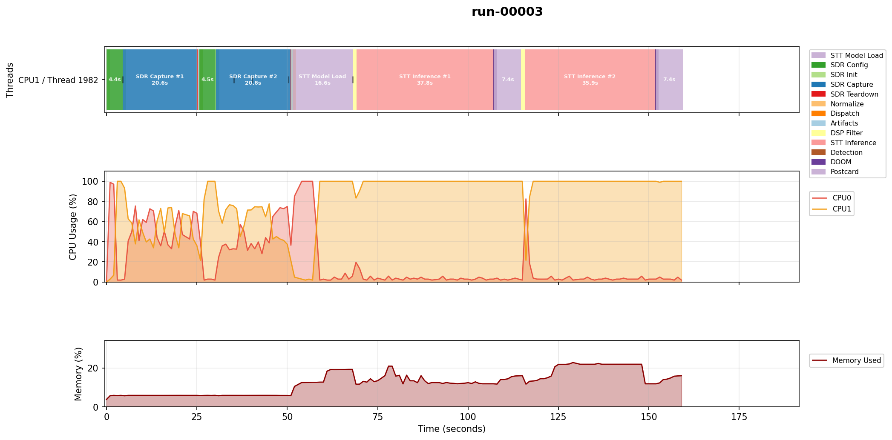

# Changelog: v3 to v4

Changes derived from analyzing the v3 experiment run on the OPS-SAT Engineering Model (EM). The v3 EM results (see [V2_TO_V3.md](V2_TO_V3.md#engineering-model-em)) showed 20-second SDR captures taking 50-72 seconds of wall time due to the ARM cores being unable to process 2.4 MSPS DMA buffers in real-time.

**PR**: [#83](https://github.com/georgeslabreche/opssat-pretty-doomed/pull/83) (configurable AD9361 hardware FIR decimation)

## Hardware FIR Decimation

**Observation**: The GNU Radio FIR decimation filter was the bottleneck. All 12x decimation happened in software at the full 2.4 MSPS input rate, requiring 385 filter taps per sample. The ARM could only sustain about 40% of real-time throughput, stretching 20s captures to 50s (no contention) or 72s (with concurrent STT processing).

**Constraint**: The AD9361 minimum baseband rate without the hardware FIR is 2.083 MSPS (25 MSPS / 12). Simply lowering `sdr_rate` below this is not supported. Dropping from 2.4 to 2.083 MSPS would only reduce DMA load by 13%, not enough to reach real-time. Source: [AD9361 Linux Device Driver](https://wiki.analog.com/resources/tools-software/linux-drivers/iio-transceiver/ad9361).

**Change**: The AD9361's programmable FIR filter can now be enabled via `sdr_hw_fir_enable=true` to decimate in hardware before DMA. This uses `ad9361_set_bb_rate_custom_filter_manual()` from `libad9361-iio` (already linked as a dependency of `gr-iio`), which designs filter taps at runtime from configurable Fpass/Fstop parameters, loads them into the AD9361, enables the FIR, and sets the sampling frequency and RF bandwidth.

With the FIR providing up to 4x additional decimation, the minimum baseband rate drops to 520.83 kSPS (25 MSPS / 48). At 600 kSPS with 3x software decimation, the effective rate remains exactly 200 kHz (matching v3), while the DMA load drops to 25% of the original 2.4 MSPS. `firdes` automatically generates fewer taps for the lower input rate.

**Config**: Six new keys control the hardware FIR. All default to off/zero, preserving v3 behavior:

```
sdr_hw_fir_enable=true
sdr_hw_fir_rate=600000
sdr_hw_fir_fpass=200000
sdr_hw_fir_fstop=250000
sdr_hw_fir_wnom_tx=400000
sdr_hw_fir_wnom_rx=350000
```

When enabled, `sdr_rate` remains the ADC rate (2.4 MSPS) and `sdr_hw_fir_rate` is the post-FIR rate entering GNU Radio. `sdr_decimation` should be adjusted accordingly (e.g. 2-3x instead of 12x).

**Alternative considered**: Pre-made `.ftr` filter coefficient files from [Analog Devices](https://github.com/analogdevicesinc/iio-oscilloscope/tree/main/filters). Using the programmatic API instead allows tuning Fpass/Fstop via config without rebuilding or shipping filter files.

## SDR Init: Two-Path Configuration

**Change**: The AD9361 configuration in `capture.cpp` now has two paths based on `sdr_hw_fir_enable`:

- **Hardware FIR path**: Writes LO frequency, gain control mode, and hardware gain manually (the library does not touch these), then calls `ad9361_set_bb_rate_custom_filter_manual()` which sets sampling frequency, RF bandwidth, and enables the FIR. Readback verifies against the post-FIR rate and `wnom_rx`.

- **Software-only path** (default, v3 behavior): Disables the hardware FIR via `ad9361_set_trx_fir_enable(phy, 0)` as cleanup in case a previous run left it enabled, then proceeds with `write_iio_rx_config()` as before. Readback verifies against `sdr_rate` and `sdr_rf_bandwidth`.

Both paths include FIR enable/disable readback verification via `ad9361_get_trx_fir_enable()`.

All AD9361 configuration (including the hardware FIR) runs per-capture, not once per run. `run_capture()` re-configures the AD9361 from scratch each time as a defensive measure against IIO driver state issues. For the software-only path the overhead is negligible (a few ms of IIO writes). With hardware FIR enabled, the `ad9361_set_bb_rate_custom_filter_manual()` call adds ~4.5s per capture on ARM32, but this is still a net win given the 36-54s saved per capture on wall time.

## End-of-Run FIR Cleanup

**Change**: When hardware FIR is enabled, the FIR is disabled at the end of the run (in `main.cpp`, after all captures and processing complete) so subsequent experiments are not affected. The disable is verified via readback.

## Emulator Compatibility

**Limitation**: The hardware FIR cannot be used with the IIO emulator. `ad9361_set_bb_rate_custom_filter_manual()` internally looks up TX channels (`iio_device_find_channel(dev, "voltage0", true)`) which the emulator does not expose. `config.emu.cfg` has `sdr_hw_fir_enable=false` with a comment explaining this.

## libad9361 Version Alignment

**Change**: The Debian local build (`Dockerfile`) now builds `libad9361-iio` v0.3 from source instead of using the Debian bookworm package (v0.2). This matches the version used in the SEPP ARM32 build (`build-libs-armv7`).

## v4 EM Results

Data from SMILE artifact `pack-4023_1774937270`. Three runs on the OPS-SAT EM (ARM32 dual-core SEPP):

1. **Run 1**: Baseline, software decimation only (2.4 MSPS, 12x), 2 x 20s, background
2. **Run 2**: Hardware FIR (600 kSPS, 3x), 2 x 20s, background
3. **Run 3**: Hardware FIR (600 kSPS, 3x), 2 x 20s, sequential

| Metric | Run 1 (baseline) | Run 2 (hw FIR bg) | Run 3 (hw FIR seq) |
|---|---|---|---|
| Capture 1 wall time | 56s | 20s | 20s |
| Capture 2 wall time | 74s | 20s | 20s |
| HW FIR config (per capture) | n/a | ~4.5s | ~4.5s |
| LPF taps | 385 | 97 | 97 |
| Total time | 191.0s | 126.1s | 159.5s |

Key findings:
- Hardware FIR reduced capture wall time from 56-74s to 20s, matching the configured `sdr_duration`
- The AD9361 readback confirmed: FIR Rx 128 taps with 4x decimation, output rate 599999 Hz, analog bandwidth 350 kHz
- `ad9361_set_bb_rate_custom_filter_manual()` takes ~4.5s per capture on ARM32 (total ~9s overhead for 2 captures)
- Software FIR taps dropped from 385 to 97 due to the lower input rate (600 kSPS vs 2.4 MSPS)
- Run 3 (sequential, no concurrent processing) also achieved 20s captures, suggesting the improvement is from the hardware FIR rather than reduced CPU contention







Note: the DOOM phase is not visible in Run 3 because the demos (m1-fast at 0.2s, m1-normal at 0.3s) are too short to render at this timescale. The DOOM phase is visible in Runs 1 and 2 which ran longer demos.

Source data: [data/em-v4/](data/em-v4/).
