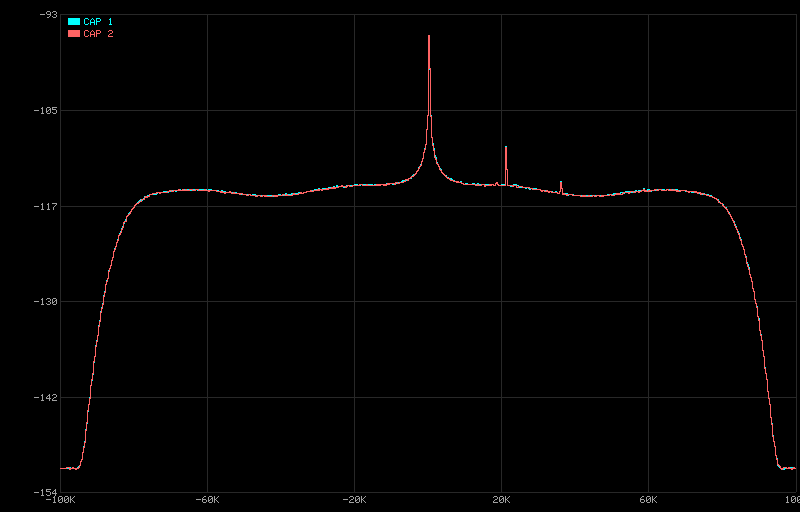
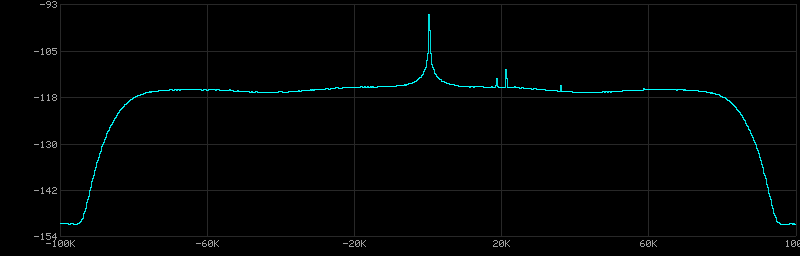
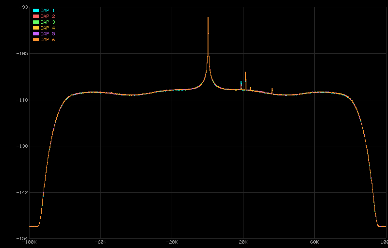

# Changelog: v4 to v5

Changes derived from the v4 EM results and operational readiness review.

**PRs**: [#85](https://github.com/georgeslabreche/opssat-pretty-doomed/pull/85) (configurable per-capture vs once-per-run SDR init), [#86](https://github.com/georgeslabreche/opssat-pretty-doomed/pull/86) (ssize_t fix for IIO write return values), [#88](https://github.com/georgeslabreche/opssat-pretty-doomed/pull/88) (two-stage background processing pipeline), [#92](https://github.com/georgeslabreche/opssat-pretty-doomed/pull/92) (onboard I/Q metrics, PSD plots, sc16 cleanup, axis labels)

## Once-Per-Run SDR Init (Default)

**Observation**: In v4, the AD9361 was re-configured from scratch at the beginning of every capture iteration as a defensive measure against IIO driver state issues. With hardware FIR enabled, this added ~4.5s overhead per capture on ARM32 (tap generation, coefficient loading, clock chain reconfiguration, analog filter recalibration via `ad9361_set_bb_rate_custom_filter_manual()`). Across 4 EM runs (v1 through v4) with multiple captures each, no AD9361 state issue was ever observed.

**Change**: The AD9361 configuration (`ad9361_configure()`) now runs once before the capture loop by default. A new config flag `sdr_init_per_capture` controls the behavior:

- `false` (default): init once before the capture loop. Saves ~4.5s per capture with hardware FIR.
- `true` (robust mode): re-init at the beginning of each capture. Use if captures fail due to AD9361 state issues.

AD9361 lifecycle functions were extracted into `sdr.cpp`/`sdr.h`, separating SDR hardware management from capture logic. `ad9361_configure()` handles the full AD9361 setup (hardware FIR or software-only path, with readback verification). `ad9361_cleanup_fir()` disables the hardware FIR after captures. Both are called from `main.cpp`; `capture.cpp` no longer includes `iio.h` or `ad9361.h` directly.

## FIR Cleanup Moved Earlier

**Observation**: In v4, the hardware FIR was disabled at the very end of the run (after all processing, postcards, etc.). Processing uses WAV files, not the AD9361, so the hardware was held longer than necessary.

**Change**: FIR cleanup now runs right after the capture loop completes, before STT/DOOM/postcard processing. This frees the AD9361 hardware state sooner for subsequent experiments.

## Simplified Run Script

**Observation**: The v4 `run` script executed 3 diagnostic runs with per-run config overrides to compare baseline vs hardware FIR. Now that hardware FIR is validated, the run script no longer needs multiple diagnostic configurations.

**Change**: The `run` script now executes a single run using `config.cfg` directly with no per-run overrides. All operational parameters (6x20s captures, background mode, hardware FIR, concurrent STT loading) are set explicitly in `config.cfg`.

## Explicit Config Values

**Change**: All SDR parameters in `config.cfg` are now uncommented and set explicitly rather than relying on code defaults. Every value has a comment on the line above describing its purpose and unit. Note: the config parser does not support inline comments (only lines starting with `#` are treated as comments).

## Two-Stage Background Processing Pipeline

**Observation**: In v4 background mode, processing of capture N+1 could not start until the entire pipeline for capture N (DSP + STT + Detection + DOOM + Postcard) completed. On the EM, STT inference takes ~40s while DOOM + Postcard takes ~12-41s. Capture N+1's STT was blocked by capture N's DOOM and Postcard even though they have no dependency on the Transcriber.

**Change**: Split `process_wav()` into two stages:

- **Stage 1** (`process_wav_stt`): Read audio, DSP filtering, STT inference, command detection, write scores/summary. Runs serially across captures (Transcriber is not thread-safe).
- **Stage 2** (`process_wav_exec`): DOOM execution, postcard generation, results.txt append. Fires async after each STT stage completes.

STT inference for capture N+1 starts immediately after STT for capture N finishes, while DOOM and Postcard for capture N run concurrently on a separate thread. Sequential mode is unaffected (uses the combined `process_wav()` which calls both stages inline).

**Threading approach**: Each STT task and each exec task is launched via `std::async`, creating a new thread per task. With 6 captures, this spawns 12 threads over the run (6 STT + 6 exec). Three alternatives were considered:

1. **Single processing thread with queue**: STT and exec run sequentially on one thread. Eliminates thread creation overhead and the concurrent exec race, but loses the DOOM+Postcard / STT overlap. On the EM, DOOM takes 5-33s and Postcard takes 7-8s. Serializing this with STT (~40s) would add 12-41s per capture to the total run time.

2. **Two persistent threads (STT + exec)**: A dedicated STT thread and a dedicated exec thread, communicating via a queue. Same overlap benefit as the current approach, no thread churn, and exec tasks are naturally serialized (eliminating the race). More complex to implement (queue, condition variable, shutdown signaling).

3. **Chained `std::async` futures (chosen)**: Each STT task captures the previous future and waits on it internally. Exec tasks fire independently. Simple to implement (no queue, no mutex, no dedicated thread lifecycle), and the overlap between DOOM+Postcard and the next STT is preserved. The thread creation cost (~1ms per pthread on ARM32) is negligible relative to the 40s STT inference.

Option 3 was chosen for simplicity. The two-persistent-thread approach (option 2) would be the right choice if thread churn becomes a problem or if the exec race on `doom_demo_index.txt` causes issues in practice.

**Known limitation**: Exec stages can run concurrently if DOOM + Postcard for capture N takes longer than STT for capture N+1. This creates a potential race on `doom_demo_index.txt` (demo cycling state). On the EM this is unlikely (~40s STT vs ~13-41s exec) but not impossible.

## ssize_t for IIO Write Return Values

**Observation**: `iio_channel_attr_write()` (the string variant) returns `ssize_t` but was stored in `int` in `pretty_iio.h` and `sdr.cpp`. On ARM32 this was harmless (`ssize_t` is 32-bit), but it's a narrowing conversion on 64-bit platforms. The `_longlong` and `_double` variants correctly return `int` per the libiio API.

**Change**: Use `ssize_t` for `iio_channel_attr_write()` return values in `pretty_iio.h` (shared by all apps) and `sdr.cpp`. Verified all three projects (`pretty-doomed`, `sdr-capture`, `sdr-loopback`) build with zero warnings.

## Onboard I/Q Metrics and PSD

**Observation**: The raw I/Q file (`capture.sc16`) is 15 MB per 20s capture. With 6 captures per run, that is 90 MB of raw data. The sc16 is only useful for ground re-analysis; all visualization artifacts (spectrogram, constellation, postcard) are already generated onboard.

**Change**: New onboard diagnostics generated per capture as part of the artifact future:

- `capture-metrics.csv`: single-row CSV with RMS (dBFS), peak, PAPR, DC offset, I/Q imbalance, zero fraction
- `capture-psd.bmp`: PSD line plot (Welch-averaged, FFTW) with axis labels (frequency in kHz, power in dB/Hz)
- `capture-psd.csv`: PSD frequency bins + power values for ground re-plotting

After all captures complete, a cross-capture `psd-comparison.bmp` overlays each capture's PSD curve with color-coded legend.

## sc16 Cleanup

**Change**: Each `capture.sc16` is deleted after all its consumers finish (spectrogram, constellation, PSD, metrics, postcard). Config flag `sdr_keep_sc16=true` retains the files for debugging. Reduces per-run downlink from ~120 MB to ~30 MB for 6 captures.

## Axis Labels on Visualization BMPs

**Change**: All onboard BMP visualizations now include axis labels using a shared 5x7 bitmap font (`pretty_font.h`):

- Spectrogram: time (seconds) and frequency (kHz) labels with dark background for contrast
- Constellation: I and Q axis labels
- PSD: dB/Hz y-axis ticks and frequency kHz x-axis ticks with margins
- PSD comparison: same axes plus color-coded capture legend

## v5 Results

### Local Emulator

The following timeline was generated from a local Docker emulator test with a 2.5s artificial sleep injected before STT inference to simulate ARM32 latency (x86 STT is near-instant).

**2x1s captures, background, 2.5s simulated STT latency**

The two-stage pipeline overlap is visible: DOOM #1 + Postcard #1 (Thread 64) runs concurrently with STT Inference #2 (Thread 63). Without the two-stage split, STT #2 would have waited for DOOM #1 and Postcard #1 to complete before starting.

Source data: [data/local-v5/](data/local-v5/).

### Engineering Model (EM)

Data from SMILE artifact `pack-4023_1775155417`. Two runs on the OPS-SAT EM (ARM32 dual-core SEPP):

1. **Run 1**: 2 x 20s captures, background, `sdr_keep_sc16=true`
2. **Run 2**: 6 x 20s captures, background, `sdr_keep_sc16=false`

Both runs: hardware FIR at 600 kSPS, once-per-run SDR init, two-stage processing pipeline.

**Run 1: 2 captures, sc16 preserved**

SDR Config (6.2s, once) then 2 captures back-to-back. Two-stage pipeline: STT 1 (40.1s) completes, DOOM + Postcard fires async, STT 2 (37.4s) starts immediately. Total: 130.7s.

PSD comparison (2 captures):

**Run 2: 6 captures, sc16 deleted**

Six captures near-continuous on the main thread. STT chain processes sequentially (36-51s per capture). DOOM + Postcard exec stages fire async. sc16 deleted after each capture's postcard. Total: 295.0s. Downlink: 23 MB compressed (vs ~70 MB for v4's 2-capture run with sc16).

Per-capture PSD (Run 2 Capture 1):

PSD comparison (6 captures):

Source data: [data/em-v5/](data/em-v5/).
