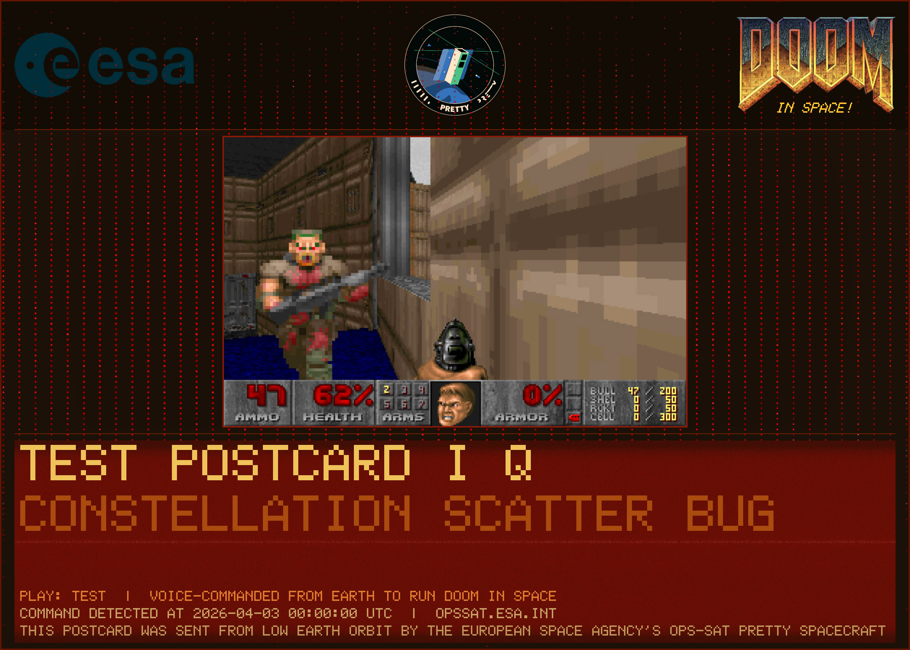
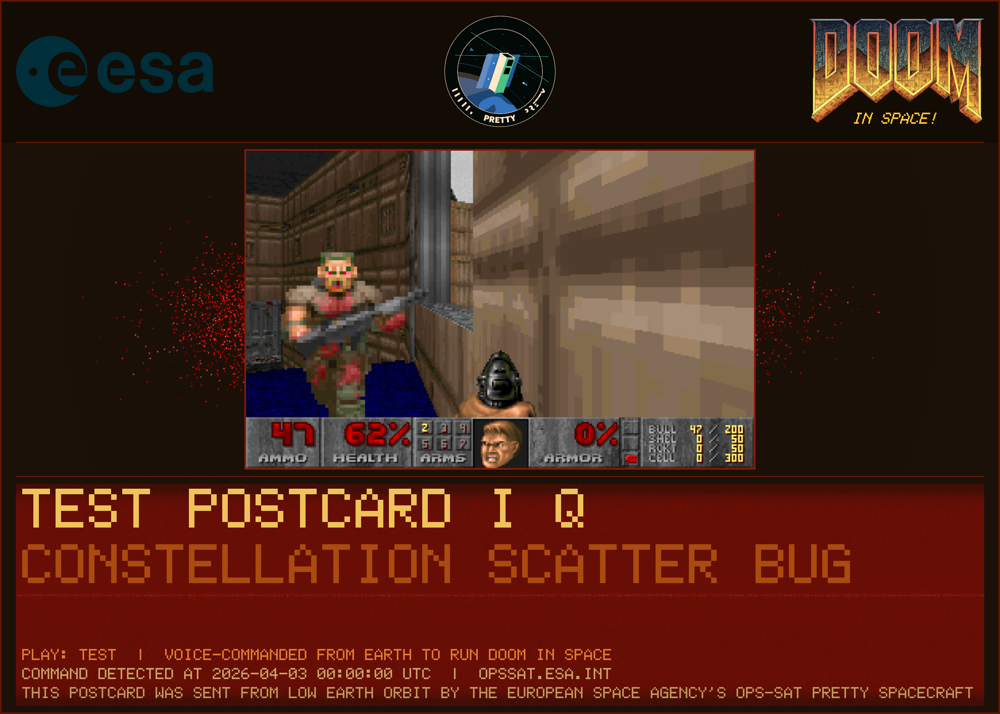
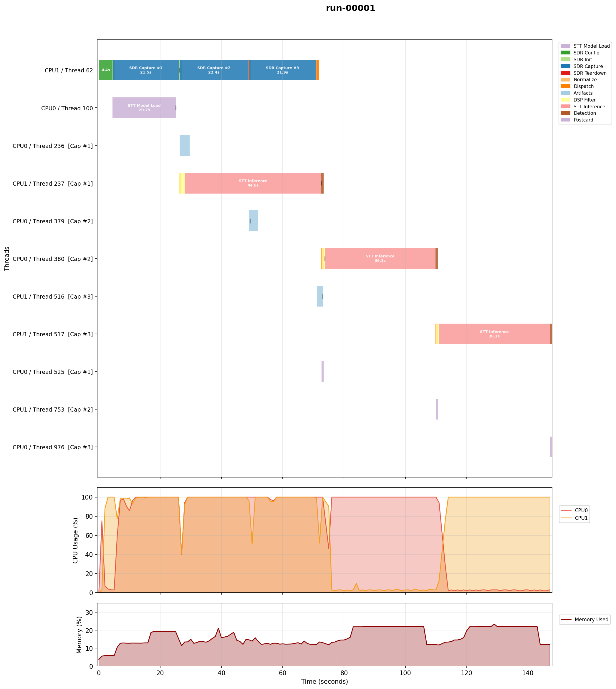
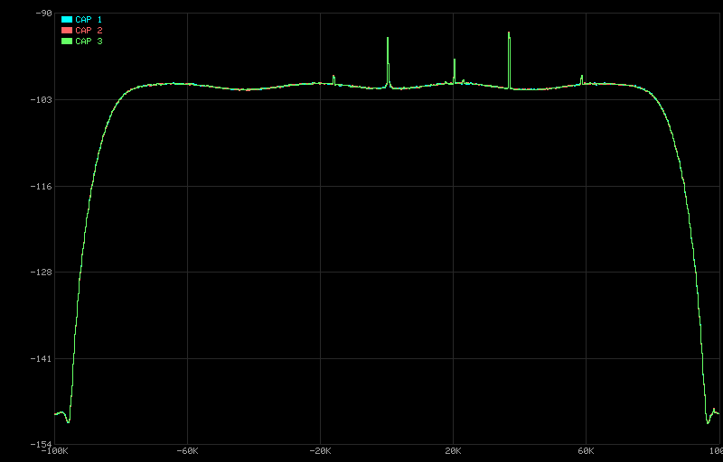
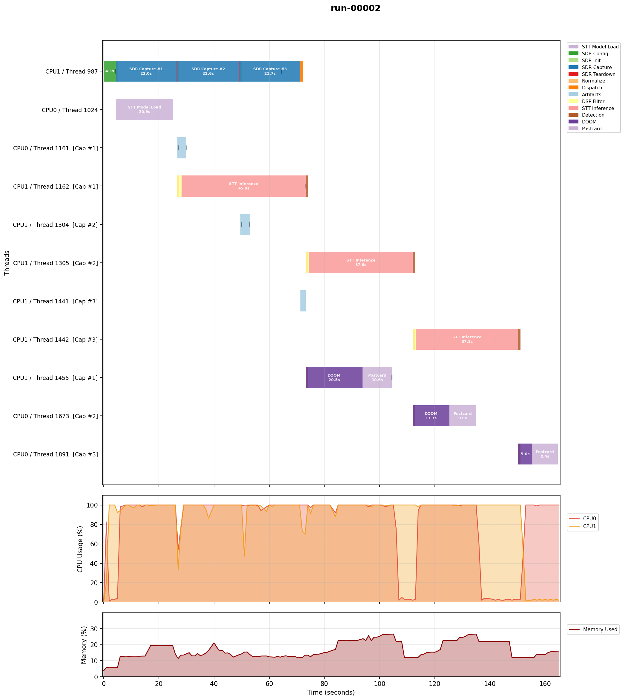
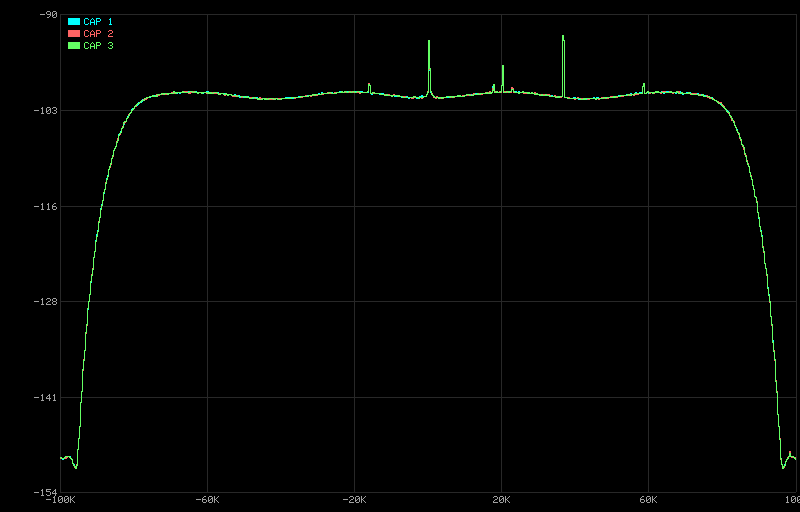
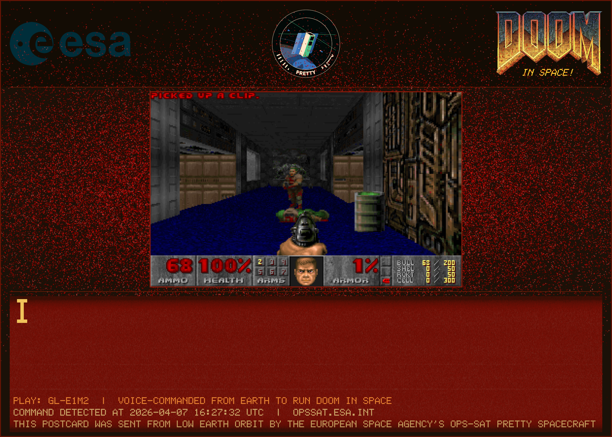

# Changelog: v5 to v6

**PR**: [#99](https://github.com/georgeslabreche/opssat-pretty-doomed/pull/99) (fix postcard I/Q scatter vertical stripes with weak signals)

## Postcard I/Q Scatter Fix

**Observation**: The postcard blood splatter overlay (`render_iq_scatter` in `postcard_sc16.h`) showed vertical stripes instead of a smooth scatter pattern when processing weak signals. On the v5 EM run, all captures received noise-floor RF (-53 dBFS, `max_abs=78` in int16). Two issues caused the stripes:

1. **Quantization grid**: With only ~157 distinct int16 I values (`max_abs=78`), each value mapped to a specific pixel column, creating a regular grid of vertical dotted lines. Strong signals (thousands of distinct values) do not exhibit this because the grid spacing is sub-pixel.

2. **Range factor too aggressive**: The original `range = max_abs * 0.35f` zoomed into the inner 35% of peak amplitude. For strong signals this creates a wide blood splatter effect (points spread across the frame). For weak signals it clipped ~65% of samples to the plot edges, concentrating them into dense vertical stripes at the left and right borders.

The standalone `constellation.bmp` (using `range = max_abs * 1.1f`) rendered correctly for the same data.

**Fix**: Three changes to `render_iq_scatter()`:

- **Adaptive range**: Use `max_abs * 0.35f` (aggressive spread) for strong signals (`max_abs >= 200`) and `max_abs * 1.1f` (10% margin, no clipping) for weak signals (`max_abs < 200`). The threshold of 200 (~-44 dBFS) separates noise-floor captures from signals with enough distinct values for the aggressive spread to work.

- **Dithering**: Add +/-0.5 LSB random jitter to each I/Q sample before pixel mapping. This breaks up the quantization grid for weak signals where few distinct int16 values would otherwise map to a sparse set of pixel columns. For strong signals the dither is negligible relative to the signal amplitude.

- **Alpha boost**: Scale blend alpha up to 2x for weak signals (`max_abs < 250`). Uniform noise distributes points evenly across the plot with no clustering, so per-pixel density is low. Strong signals naturally cluster on constellation points, building up intensity through overlap.

## Flight Run Script

**Change**: For the v6 EM validation, the run script was temporarily split into two runs with per-run config overrides (listen-only + DOOM force-triggered) to test both execution paths. For flight, this was reverted back to a single run using `config.cfg` directly with no overrides, matching the v5 layout. All operational parameters (6x20s captures, background mode, hardware FIR, `doom_force_trigger=false`) are set in `config.cfg`.

## File Input sc16 Support

**Change**: Added `-q <sc16_file>` CLI flag to provide an sc16 file in file input mode (`-i`). Previously, postcard I/Q scatter and spectrogram rendering were only available in SDR capture mode. This enables testing postcard rendering with specific sc16 files without running the SDR pipeline.

## Standalone Postcard Scatter Test

**Change**: Added `tests/test_postcard_scatter.cpp`, a standalone test program for postcard I/Q scatter rendering. Generates a postcard from an sc16 file and a DOOM frame without requiring STT, DSP, or SDR dependencies.

```bash
./build/local/test_postcard_scatter <sc16_file> <frame_jpg> <output_png> [scale]
```

## v6 Results

### Local Emulator

Tested with v5 EM sc16 data (`max_abs=78`, noise-floor signal).

**Before** (v5, EM Run 1 Capture 2): vertical stripes from quantization grid and edge clipping.



**After** (v6, same sc16 data): smooth scatter with dithering, adaptive range, and alpha boost.



### Engineering Model (EM)

Data from SMILE artifact [`pack-4023_1775579267`](data/em-v6/pack-4023_1775579267/). Two runs on the OPS-SAT EM (ARM32 dual-core SEPP) to validate the scatter fix and both execution paths:

1. **Run 1**: 3 x 20s captures, background, `doom_force_trigger=false` (listen-only)
2. **Run 2**: 3 x 20s captures, background, `doom_force_trigger=true`

Both runs: hardware FIR at 600 kSPS, once-per-run SDR init, two-stage processing pipeline, `sdr_keep_sc16=false`.

**Run 1: 3 captures, listen-only**



SDR Config (4.4s, once) then 3 captures back-to-back (20-21s each). No command detected on any capture (expected -- noise floor only). STT inference: 44.5s, 36.1s, 36.0s. SC16 files deleted after diagnostics. Total: 147.3s.

PSD comparison (3 captures):



**Run 2: 3 captures, DOOM force-triggered**



SDR Config (4.3s, once) then 3 captures (21-22s each). Force trigger activated on all 3 captures. Demo cycling: gl-e1m2b (20.5s), e1m7-607 (13.3s), gl-e1m2 (5.0s). Postcard generation: 10.6s, 9.6s, 9.4s per capture. Two-stage pipeline overlap confirmed: DOOM+Postcard for capture N runs concurrently with STT for capture N+1. Total: 164.9s.

PSD comparison (3 captures):



**Postcard scatter rendering confirmed**: all 3 postcards render smooth I/Q scatter with no artifacts. Peak values across captures ranged from 416 to 474 (`max_abs >= 200`), so the scatter used the 0.35 range (strong signal path). The weak signal path (1.1 range, dithering, alpha boost) was not exercised in this EM run because the signal was above the 200 threshold. This is fine -- the weak signal fix was already validated in the [local emulator](#local-emulator) test using v5 EM sc16 data (`max_abs=78`).

Postcard from Run 2 Capture 3 (gl-e1m2):



I/Q metrics consistent across all 6 captures: RMS ~85 (-39.7 dBFS), zero fraction ~0.47%, negligible I/Q imbalance (0.01 dB).

Source data: [data/em-v6/](data/em-v6/).
