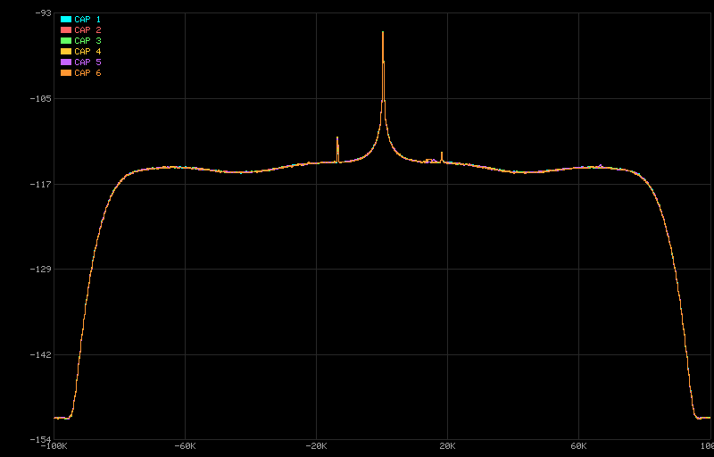
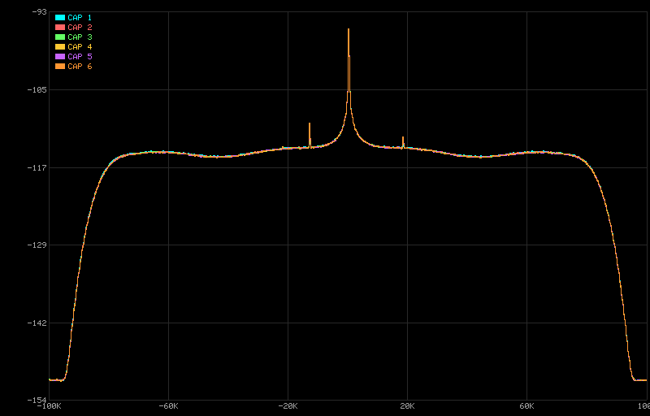
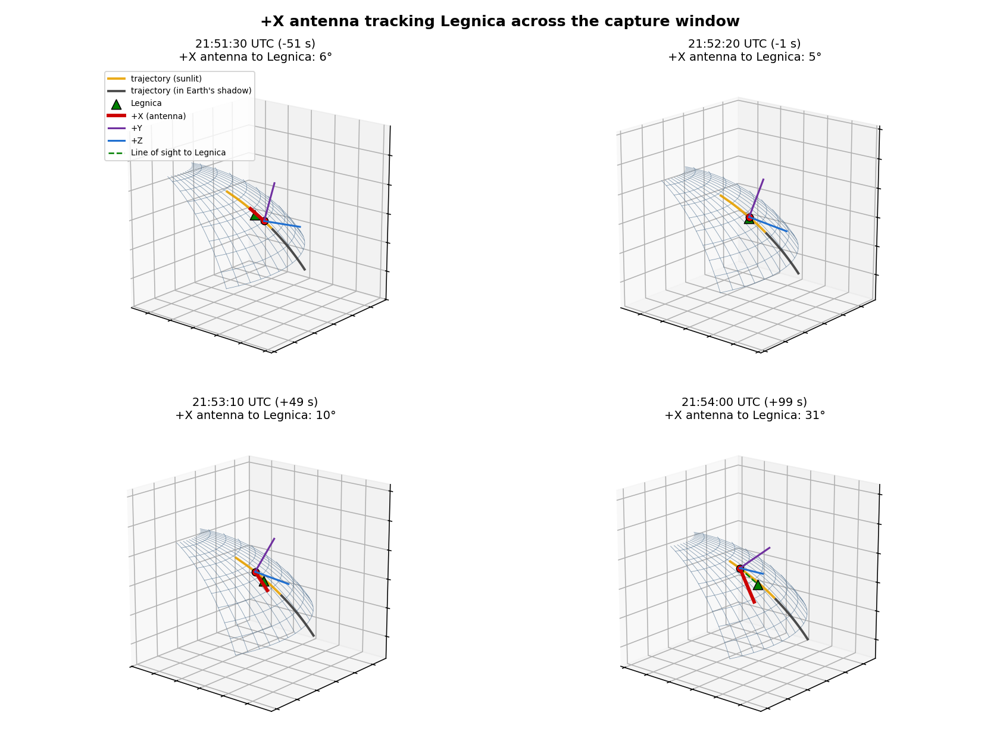
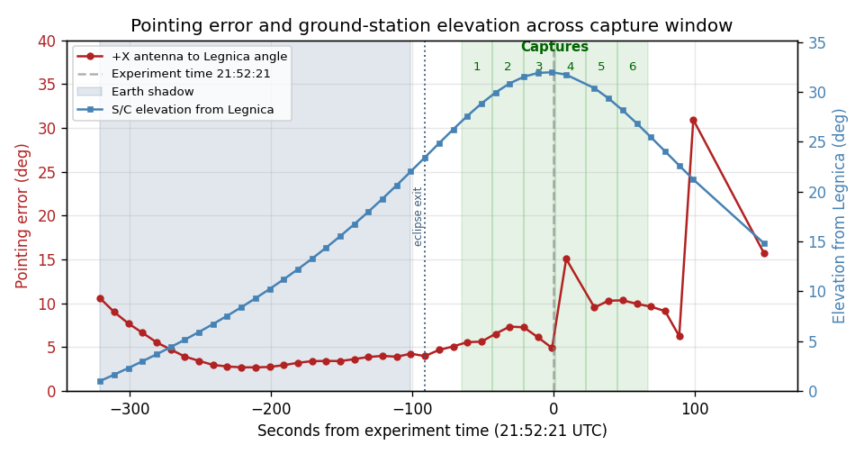

# Flight analysis debriefing: First Flight Runs

**Flight (Run 2):** 2026-05-22
**Debriefing written:** 2026-05-26
**Subject:** What we saw and what it means, updated with operator follow-up and verified pointing.

## The two runs so far

|                | Run 1                                | Run 2                                    |
|----------------|--------------------------------------|------------------------------------------|
| Date (UTC)     | 2026-04-21                           | 2026-05-22                               |
| Attitude       | **Bad pointing** (confirmed)         | **Good pointing** (verified)             |
| Broadcast      | Confirmed transmitted                | **Did not happen** (confirmed)           |
| Detection      | None                                 | None                                     |

- Operational config: 6 × 20 s captures, voice-command detection.
- Both runs completed end-to-end, no errors.
- **Run 1 is the negative control:** known broadcast, antenna missed due to attitude.
- **Run 2 result:** pointing was correct but the ground side could not transmit at the scheduled time.

## The pipeline works

|                       | Run 1     | Run 2     | EM        |
|-----------------------|-----------|-----------|-----------|
| AD9361 config         | 6.1 s     | 5.8 s     | 4.4 s     |
| STT model load        | 21 s      | 21 s      | 20 s      |
| Capture wall time     | 20-21 s   | 21-22 s   | 20-21 s   |
| STT inference         | 36-47 s   | 36-51 s   | 36-47 s   |
| Total run time        | 271 s     | 283 s     | 270 s     |

- Within ~5% of engineering-model baseline.
- All diagnostics produced, raw I/Q cleaned up, clean shutdown.
- Speech-to-text ran on real flight hardware for the first time.

## Flight noise floor is −13 dB below EM

Stable metrics shown as means, variable metrics as min-max ranges. Flight aggregates Run 1 and Run 2; EM is the operational full-package verification run.

| Metric             | Flight (12 caps) | EM (6 caps) | Delta            |
|--------------------|------------------|-------------|------------------|
| I/Q RMS (dBFS)     | ~−52.5           | ~−39.7      | **−12.8 dB**     |
| Peak I/Q (range)   | 370-1358         | 409-505     | wider in flight  |
| PAPR (range)       | 26-37 dB         | 14-15 dB    | +12 to +22 dB    |
| Zero fraction      | ~2.1%            | ~0.5%       | ×4.4             |

- RMS is highly stable, within 0.1 dB across all 12 flight captures, but peaks vary widely capture-to-capture: high-PAPR noise character.
- The cause of the EM-vs-flight gap is not yet characterised: in-orbit RF environment, EM RF coupling path, and EM-vs-flight hardware differences could all contribute.
- **Operationally good for SNR margin** when a real signal arrives.

## The Power Spectral Density shows three things (Run 2)

- **Big DC spike** at centre: residual DC bias in the receive chain, measured at ~−4 in both I and Q. Constant offsets at I/Q baseband do not propagate to audio DC through the FM demodulator, and any residual is removed by the 300 Hz high-pass of the audio bandpass. Harmless to speech recognition.
- **Two narrow spurs at ±20 kHz:** single-bin wide, very small at ~−110 dBFS, only ~3-5 dB above the noise floor.
- **Flat noise floor** elsewhere, no FM voice bump anywhere in the 85 kHz pre-demod passband.

## The ±20 kHz spurs are present in both flight runs

| Run 1 (bad attitude) | Run 2 (good attitude) |
|---|---|
|  |  |

- Symmetric ±20 kHz spurs at ~−110 dBFS, identical in both runs.
- Symmetry about DC is characteristic of an internal-receiver origin; specific mechanism not investigated here, and an external source cannot be fully excluded.
- The EM PSD from the v6 full-package verification run shows different, larger spur patterns; flight spurs at −110 dBFS would have been below the EM noise floor of ~−100 dBFS.
- Well outside the FM voice modulation bandwidth, ±8.4 kHz by Carson's rule for 5 kHz deviation and 3.4 kHz audio, and ultimately filtered out by the 300-3400 Hz audio bandpass after FM demod.

## Run 1 is our negative control

> Run 1 had a confirmed broadcast and confirmed bad pointing. It is a ground-truth example of "a broadcast happened but no signal showed up at the receiver".

Run 2 reproduces Run 1 closely:

- RMS within 0.1 dB across all 12 captures, both runs combined.
- PSD shape visually indistinguishable between runs.
- ±20 kHz spur locations match; amplitudes match to within plot readability.
- Degenerate language-model transcriptions in both runs. Run 1: six "I"s. Run 2: five "I"s and one "AND I". No wake-word or command match in either.

**Implication:** from the receiver's perspective, Run 2 looks the same as a known case where no signal reached the ADC.

## Why Run 2 captured nothing: four hypotheses, now resolved

| Hypothesis for Run 2 (no signal captured) | Status (2026-05-26)            |
|-------------------------------------------|--------------------------------|
| 1. No broadcast happened.                 | **CONFIRMED**                  |
| 2. Broadcast happened, antenna pointed elsewhere. | Ruled out, good pointing |
| 3. Broadcast received *above* noise floor, lost in processing. | **Rejected**       |
| 4. Broadcast arrived but *below* the receiver noise floor. | Moot, no broadcast    |

- **The ground station operator confirmed** they could not get their station running at the specified time; no transmission occurred.
- **The spacecraft operator confirmed**, and our **pointing analysis confirms**, that the +X antenna was ~5° off Legnica at the scheduled moment, so the spacecraft was correctly pointed.
- **Run 2 is operationally equivalent to Run 1 in outcome:** a planned attempt that did not reach the receiver, this time for an upstream ground-side reason rather than an upstream attitude reason.

## Pointing verification for Run 2

Body+X antenna, confirmed by the spacecraft operator. Quaternion ECI body-to-inertial, scalar last. +X antenna 4.9° off Legnica at 21:52:20 with 2.7° minimum, within ~15° across all six captures; 32° elevation, 873 km slant range.

## Antenna face and pointing convention

The antenna face is the **X-face** (Body+X), confirmed by the spacecraft operator and by the PRETTY mission paper.

> Dielacher, Fragner, Koudelka (2022), "PRETTY: passive GNSS-Reflectometry for CubeSats", Elektrotechnik und Informationstechnik 139, 25-32:
>
> *"two custom designed antenna patches are mounted on the satellite X-face."*

- Attitude convention: the UKF quaternion is ECI, body-to-inertial, scalar last (xyzk).
- Under this convention the **+X antenna** is ~5° off Legnica at the scheduled moment, holding within ~15° across the six captures.
- This is the reference convention for interpreting future attitude telemetry.

## Pointing error across the capture window

- +X antenna error is ~5° at the scheduled moment with 2.7° minimum, and stays within ~15° across all six captures, then rises to ~31° about 100 s later, after the experiment window.
- Implication: the antenna held on Legnica throughout the capture window, with comfortable timing margin.

## RF frontend initialisation

> **Latest from the spacecraft operator:** a missing hardware initialisation step on the RF frontend, which cannot be influenced from the experimenter side.

Our experiment log shows a clean init sequence:

- AD9361 LO and gain written successfully.
- Hardware FIR configured and readback enabled, 128 taps, 4× decimation.
- LO readback 1296 MHz, sample rate 599999 Hz within tolerance, bandwidth 350 kHz, gain 50 dB, RSSI 105.75 dB.
- No error or warning lines anywhere in the experiment log.

The issue is upstream at the platform level, not in our experiment script. **Benign on our end.**

## Bonus: a clean orbital baseline

Two flight runs, six 20-second captures each, ~1 month apart.

- RMS reproducible within 0.1 dB across all 12 captures.
- PSD shape and spur locations visually indistinguishable between runs.
- DC offset ~−4 and I/Q imbalance ~0.1-0.14 dB consistent across both runs.

**Any future capture that diverges from this baseline is, by construction, an indication of received external energy above the noise floor.**

## What was confirmed in flight so far

- **The pipeline works in flight.** End-to-end, no errors, timing within 5% of EM.
- **Flight noise floor is −13 dB vs EM.** Helpful for SNR margin.
- **The "signal arrived but was lost in processing" hypothesis is ruled out.** No above-noise-floor external energy reached the ADC during either flight run.
- **Run 2 outcome explained.** No broadcast occurred; pointing was correct, with the +X antenna ~5° on target. The receive chain is exonerated for the second time.
- **Two clean flight baselines now available.** Both with one of {attitude, broadcast} verified and the other failing.

## Cadence is too slow

> **Hard fact:** Run 1 was 2026-04-21. Run 2 was 2026-05-22. **More than a month between attempts.**

- Two attempts so far, neither with both broadcast and pointing simultaneously correct. At this rate we are looking at many months before a successful voice capture.
- Each cycle is constrained upstream: coordinating with a ground operator, getting an attitude slot, and getting the pass scheduled.
- Pointing held within ~15° across the whole capture window with a best of ~5°, so the attitude track gives reasonable timing margin; the binding constraint is ground-side coordination.
- **We need a faster feedback loop to make progress.**

## Next steps

**Before next attempt:**

1. **[Ground side]** Confirm reliable transmission at the scheduled moment. Capture intended frequency, deviation, and on-air timing in advance.

**Operational (urgent):**

2. **[All]** **Meet to raise the attempt cadence.** Need more frequent attempts and tighter coordination between mission planning, scheduling, and the radio amateur community, without exhausting them.
