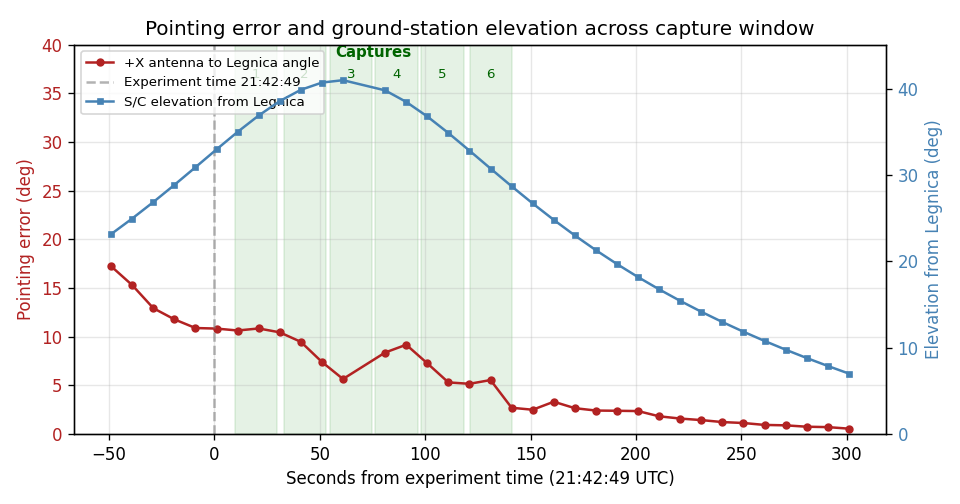
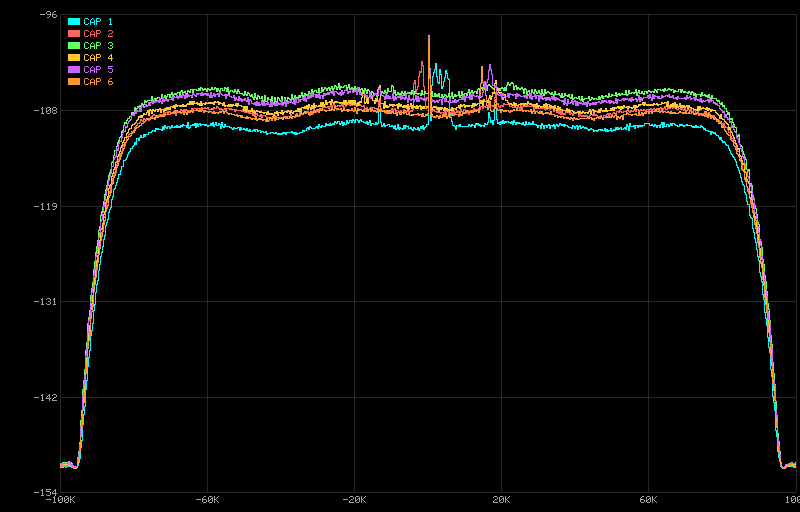
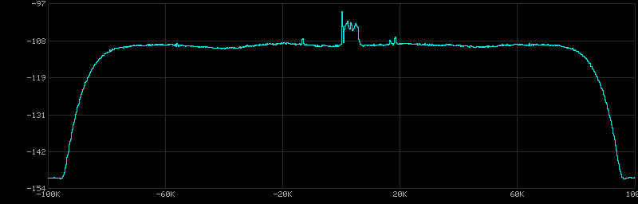
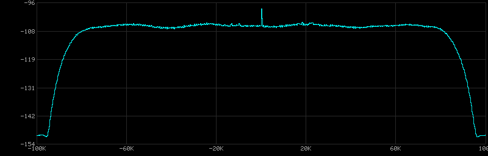
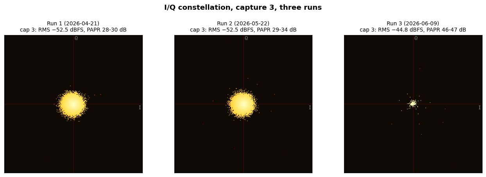
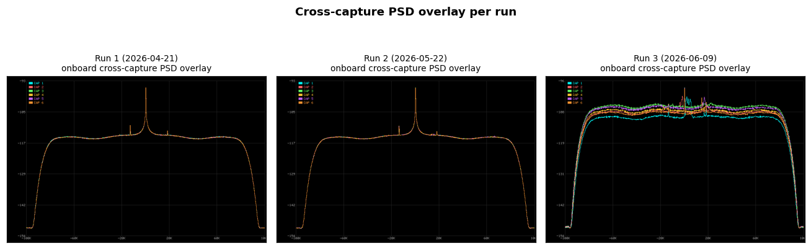
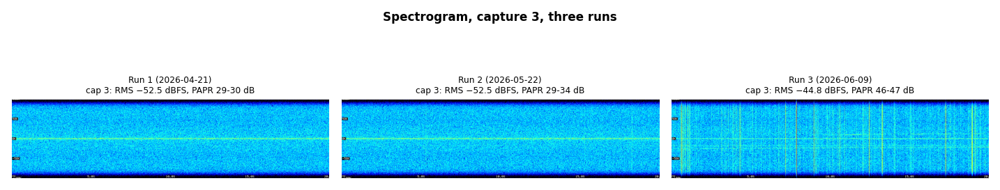
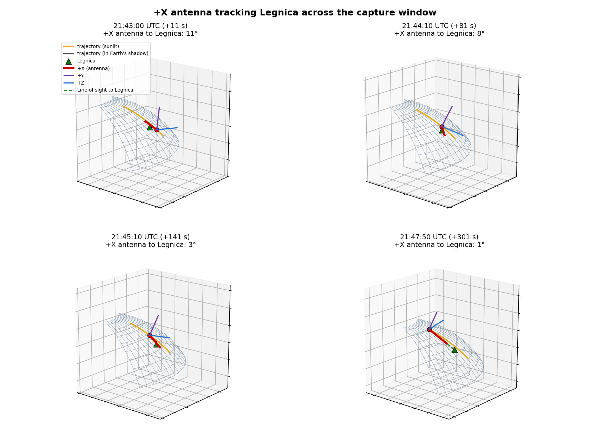

# Flight analysis debriefing: Run 3

**Flight (Run 3):** 2026-06-09
**Debriefing written:** 2026-06-10
**Main Takeaway:** A confirmed broadcast met near-target pointing for the first time, and the captures sit above the noise baseline with an impulsive character that FM voice cannot produce.

## The three runs so far

|                | Run 1                  | Run 2                  | Run 3                              |
|----------------|------------------------|------------------------|------------------------------------|
| Date (UTC)     | 2026-04-21             | 2026-05-22             | 2026-06-09                         |
| Attitude       | **Bad pointing**       | **Good pointing** (5 deg) | **Near-target** (3-11 deg in captures) |
| Broadcast      | Confirmed transmitted  | **Did not happen**     | **Confirmed transmitted**          |
| Audio          | Noise                  | Noise                  | Noise                              |
| Detection      | None                   | None                   | None                               |
| RMS dBFS       | ~-52.5                 | ~-52.5                 | **-45 to -48**                     |
| RMS variation  | 0.1 dB                 | 0.1 dB                 | **3+ dB**                          |

## What happened

The third attempt is the first one with both a confirmed broadcast and an antenna near the target. It is also the first attempt whose receiver-side captures diverge from the established noise-floor baseline.

The scheduled time we were given is the application start time. The log starts 4 s later, which is just startup latency; the first ten seconds go to radio configuration, and the six 20 s captures then run back-to-back from +10 s to +141 s after the scheduled time (the speech-to-text model loads in parallel with the first capture). The attitude track runs on a separate schedule: pointing is initiated before AOS and is not tied to app start. Note that the timestamp we worked from for Run 2 evidently referred to a target moment rather than the app start: Run 2's app started 70 s before its timestamp, so the captures straddled it. The two runs were specified against different references, which is the inconsistency this debriefing flagged; the semantics have since been clarified as app start going forward.

During the captures the +X antenna was 3 to 11 deg off Legnica: about 11 deg in capture 1, dipping to 5-6 deg in captures 3 and 5, and closing to 2.7 deg at the end of capture 6. The track did not converge monotonically, it oscillated between 3 and 11 deg across the captures and was still moving at the last telemetry sample, 0.56 deg at +301 s. That non-monotonic profile is consistent with the mid-pass attitude correction the operations team described: when the sun comes into view during the pass, the sun sensors trigger a correction, so the planned boresight-on-target second is not simply later in the pass but is shifted by that correction.

The +X-to-Legnica curve drops from ~17 deg at -50 s through ~11 deg at the start of the captures, oscillates between 11 and 3 deg across the capture window (shaded green), and continues down to 0.56 deg at the last telemetry sample. The elevation curve peaks at 41 deg around +61 s, inside the capture window, so the captures were taken near the highest point of the pass.

## What the receiver saw

The per-capture PSD CSVs put the Run 1 + 2 baseline floor at about -115 dBFS away from the DC spike (-113 dBFS within ±10 kHz of DC). The Run 3 captures sit at -106 to -110 dBFS in both bands, a broadband lift of roughly 4-9 dB with no concentration around the FM voice bandwidth: in every capture the median within ±10 kHz of DC matches the 20-70 kHz median to within 0.2 dB, so the Run 3 spectrum is flat and there is no bump at the voice bandwidth.

The narrowband picture changed too. Runs 1 and 2 show the same stable set of internal receiver features in every capture: a spur at -13 to -14 kHz about 4-5 dB above the floor, and weaker lines at ±5.1 kHz and +18 kHz about 2 dB up. In Run 3 the +18.0 kHz line is still present at its fixed frequency (2-4 dB above the lifted floor), the -14 kHz spur is largely buried, and new narrowband features appear that change from capture to capture: a one-sided line at +5.1 kHz in capture 1 (5.8 dB above the lifted floor, where the baseline shows only a weak symmetric ±5.1 kHz pair), +16.4 kHz in capture 5 (4.1 dB), and +14.3 / +15.2 kHz in capture 6 (5.7 / 2.8 dB). None of these are the operator's uplink: a 1296.000 MHz carrier transmitted from Legnica would be Doppler-shifted from +14.6 kHz at the start of capture 1, through zero near the elevation peak during capture 3, to -20 kHz by the end of capture 6, and no feature following that track is visible in any capture.

Capture 1 (cyan, the most off-axis at ~11 deg mean) sits at the bottom of the band, captures 3 and 5 (the closest after capture 6) sit at the top. Individual captures show the same shape:

| Capture 1 (10.7 deg mean off, RMS -48 dBFS) | Capture 3 (6.0 deg mean off, RMS -45 dBFS) |
|---|---|
|  |  |

The post-DSP audio is noise on listening. There is no audible voice content in any of the six captures, and the on-board speech-to-text produced the same degenerate "I" / "AND I" transcription as in Runs 1 and 2.

## What we can and cannot conclude

We can say:

- The pipeline ran cleanly end-to-end: AD9361 config 5.7 s, STT model load 23 s, inference 37-52 s per capture, total 282.3 s, no errors.
- The broadcast happened, but the exact on-air window was not logged.
- The +X antenna was 3-11 deg off the operator during all six captures, closing to 2.7 deg at the end of capture 6. For an RHCP patch antenna with a typical 70-90 deg main beam, that is essentially on-axis throughout.
- The receiver noise floor was 4-9 dB above the previously established baseline, lifted broadband, with 3+ dB variation across captures.
- The captures are strongly impulsive: PAPR 45-48 dB versus the 26-37 dB baseline, a halo of high-amplitude outliers in the I/Q constellation, and broadband vertical streaks in the spectrograms that Runs 1 and 2 lack.
- Narrowband features that change from capture to capture appear in Run 3 (+5.1 kHz in capture 1, +16.4 kHz in capture 5, +14.3 kHz in capture 6), on top of the stable internal spurs the baseline runs show. None follow the Doppler track a Legnica transmitter would have, so they are not the operator.
- No voice content was recovered.

We cannot, from these data alone, say:

- Whether the broadcast was on the air during the captures at all. The captures ran +10 to +141 s after the scheduled time, and the operator's on-air window is not logged.
- Whether the elevated floor contains the broadcast at low SNR, or is unrelated interference encountered during this pass, or both.

Run 3 is therefore the strongest end-to-end test so far, and it still produced no detection. The dominant energy at the ADC has an impulsive character that constant-envelope FM voice cannot produce, which points away from the broadcast being what lifted the floor.

## A note on the constellation plots

The on-board I/Q scatter plots look very different from those in Runs 1 and 2: a small bright cluster in the centre with a spray of outlier dots, rather than the dense round cluster filling the frame. The visual scale difference is partly an artefact, the on-board constellation generator uses an adaptive plot range tied to the peak amplitude (`generate_constellation()` sets `range = max_abs * 1.1 / 32768`). Run 3 peaks are roughly an order of magnitude larger than in Runs 1 and 2 (6217-10110 vs 370-1358), so the plot range expands by the same factor and the bulk cluster shrinks in the frame.

The outlier dots themselves are real and physically meaningful. The Run 3 plot is not just a zoomed-out version of Run 2; it shows a Gaussian core (like Runs 1 and 2) **plus** a halo of isolated high-amplitude samples far from the centre. That halo, combined with the PAPR jumping from 26-37 dB to 45-48 dB, says the signal has impulsive or bursty events on top of the usual thermal noise. For reference, pure Gaussian noise over a 4M-sample capture has a PAPR of roughly 13-15 dB, so even the baseline runs carry some impulsive content; Run 3 is far beyond both. FM voice would not produce that: FM is constant envelope, with PAPR near 0 dB.

So the constellation is not evidence that we received the broadcast; it is evidence of impulsive energy at the ADC, which points toward hypothesis B and away from the broadcast being the dominant signal.

## Hypotheses for the PSD and spectrogram differences

The PSD shows a 4-9 dB broadband lift across the full ±80 kHz passband, with 3+ dB capture-to-capture variation. The DC spike is unchanged; the narrowband structure is not: the baseline's -14 kHz spur is largely buried, and the per-capture features at +5.1, +16.4, and +14.3 kHz described above appear. The spectrogram adds an independent signature: the Run 3 spectrograms show broadband vertical streaks, columns where the whole passband lights up at once, that Runs 1 and 2 lack. Counting time columns more than 5 median-absolute-deviations above the median column energy, the six Run 3 captures flag 59 to 88 of 1024 columns each (capture 3: 77) versus 2 to 14 of 1024 across all twelve Run 1 and Run 2 captures. Broadband vertical streaks are the time-frequency signature of impulsive events, consistent with the PAPR and constellation observations.

Two candidate causes, each with the signature it would produce and the evidence for and against:

| # | Hypothesis | Predicted signature | For | Against |
|---|---|---|---|---|
| A | **The broadcast, received at low SNR.** With the antenna 3-11 deg off boresight, well inside the main beam of a typical patch, pointing loss would be small. FM spreads voice over ~±10 kHz, centred at the Doppler offset | Lift concentrated near the predicted Doppler offset; RMS tracking pointing; faint voice in audio; **PAPR near 0 dB** (FM is constant envelope) | Broadcast confirmed; RMS loosely tracks pointing: the most off-axis capture (1) is the quietest and two of the closest (3, 5) are the loudest, r about -0.6 | Lift is broadband across ±80 kHz, the inner ±10 kHz band lifts no more than the outer band; **no feature follows the predicted Doppler track of a Legnica uplink** (+14.6 kHz at the start of capture 1, through zero during capture 3, -20 kHz by the end of capture 6); **PAPR is 45-48 dB, incompatible with constant-envelope FM**; spectrogram streaks are impulsive, not voice-like; audio is noise; the on-air window is not logged, so the broadcast may not even overlap the captures |
| B | **Pulsed ground RFI along the Run 3 track.** 23 cm is shared with radar, telecom, and satellite services. A different ground track sees a different RF environment, and pulsed sources produce impulsive bursts | Broadband lift; **high PAPR** from impulsive bursts; isolated outliers in the I/Q constellation; broadband streaks in the spectrogram; possible variation along the track as the spacecraft moves | Broadband lift fits; **PAPR jumped from 26-37 dB to 45-48 dB**, exactly the signature of pulsed events; the I/Q constellation shows a halo of high-amplitude outliers around a Gaussian core; the spectrogram streak count jumped from 2-14 of 1024 columns to 59-88 of 1024; narrowband features that change from capture to capture (+5.1, +16.4, +14.3 kHz) show the RF environment on this pass genuinely differed from Runs 1 and 2; the 3+ dB variation could reflect different ground emitters under the spacecraft | Cannot verify without external EM survey data or a deliberate negative-control pass |

Note that the RMS-vs-pointing trend does not discriminate between A and B: pointing the antenna closer to Legnica also points it at the same patch of ground, so near-target RFI would produce the same loose correlation.

### What would discriminate

- First, **the operator's on-air log**. The captures ran +10 to +141 s after the scheduled time; whether the broadcast overlapped them at all is currently unknown, and an exact on-air window (start and stop, UTC) settles it. If the broadcast did not overlap the captures, A is excluded as a cause of the lift.
- For **A**: cross-correlate the captured I/Q against the operator's own recording of the broadcast. Voice content hidden below the audio threshold would still show up as a clean correlation peak, and would calibrate the link budget. This is the denoising / cross-correlation use case described in the radio amateur brief.
- For **B**: Runs 1 and 2 already provide partial negative controls. Run 1 had a confirmed broadcast with bad pointing and showed no floor lift; Run 2 had no broadcast with good pointing and showed no floor lift. Only Run 3 (broadcast confirmed, antenna near the target) shows the lift. That is consistent with either A or B. To isolate B further, the next deliberate test would be a future pass with the same ground track but no broadcast.

**Best current fit.** B is the most likely dominant cause: the high PAPR (45-48 dB), the impulsive constellation outliers, the spectrogram streaks, and the broadband PSD lift all match pulsed RFI and do not match constant-envelope FM voice. A may still contribute a component underneath, but it cannot be the dominant signal, and its contribution cannot be assessed until the on-air window is known.

## Pointing detail

Four-panel scene at +11 s, +81 s, +141 s, and +301 s relative to the scheduled time (the telemetry samples nearest the start of capture 1, mid-window, the end of capture 6, and the final sample). The body triad shows the +X antenna (red) converging on the line of sight to Legnica (dashed green) through the captures and reaching 0.56 deg at the final sample.

A frame-by-frame animation of the same scene with the capture-window banner and the sunlit / Earth-shadow trajectory can be generated with `scripts/attitude/animate_pointing.py` from the telemetry in [`../../data/run-03-2026-06-09/`](../../data/run-03-2026-06-09/) (see [`scripts/attitude/README.md`](../../../../scripts/attitude/README.md)).

### Per-capture pointing angle

The +X-to-Legnica angle interpolated to 1 s within each capture window (seconds relative to the scheduled time, windows from the run log):

| Cap | Window (s)        | Start | End   | Min   | Mean  | RMS (dBFS) |
|----:|------------------:|------:|------:|------:|------:|-----------:|
| 1   |  +9.8 to  +29.8   | 10.6° | 10.5° | 10.5° | 10.7° | -48.2 |
| 2   | +32.8 to  +52.8   | 10.3° |  7.1° |  7.1° |  8.9° | -46.2 |
| 3   | +54.8 to  +74.8   |  6.7° |  6.8° |  5.6° |  6.0° | -44.8 |
| 4   | +76.4 to  +96.4   |  7.1° |  8.1° |  7.1° |  8.4° | -46.0 |
| 5   | +98.1 to +118.1   |  7.8° |  5.1° |  5.1° |  6.0° | -45.1 |
| 6   | +121.1 to +141.1  |  5.2° |  2.7° |  2.7° |  4.6° | -46.6 |

Windows are the SDR stream start times from the run log plus the exact 20.0 s capture span; angles use quaternion interpolation between the 10 s telemetry samples, so individual values carry roughly ±0.3 deg of method uncertainty.

The angle does not close monotonically; it oscillates between 3 and 11 deg as the track converges, with local dips in captures 3, 5, and 6. **Capture 6 is the closest of the six**, ending 2.7 deg off Legnica. For an RHCP patch antenna with a typical main beam ~70-90 deg wide at the -3 dB points, every value in this table is essentially on-axis.

RMS loosely tracks pointing: the most off-axis capture (1) is the quietest, and captures 3 and 5 (the next closest after capture 6, tied at 6.0 deg mean) are the loudest, a moderate negative correlation of about r = -0.6 between mean angle and RMS. Capture 6, the closest, is only middle in RMS. As noted above, this trend is consistent with both hypotheses, since aiming closer at Legnica also aims at the same ground region. What argues against the broadcast dominating is the character of the energy: even at 2.7 deg off boresight the audio is noise, the PAPR is 45-48 dB, and the lift is broadband.

## Next steps

**Before the next attempt:**

1. **[Mission planning]** Align the broadcast window to the predicted boresight-on-target time, not to the app start. The scheduled time is the application start time; the 4 s offset between it and the log start is just startup latency. Pointing is initiated before AOS and runs on its own schedule, decoupled from app start, so the captures land after app start by construction while the attitude track is still converging. The track was still moving at the last telemetry sample (+301 s), and the operations team has described a mid-pass attitude correction that perturbs it: when the sun comes into view during the pass, the sun sensors trigger a correction, which fits the non-monotonic +X-to-Legnica profile we saw across the captures. The action is therefore to obtain the ADCS-predicted boresight-on-target second for each pass, accounting for the sun-visibility correction, and schedule the broadcast and captures around that second rather than around app start.
2. **[Ground side]** Ask the operator to log the exact on-air window (start and stop, UTC) for every attempt, and publish the predicted capture window to the operator in advance. For Run 3 the on-air window is the single most useful missing datum: it determines whether the broadcast overlapped the captures at all.
3. **[Ground side]** Increase the ground EIRP for the next attempt. Pointing and timing are now close enough that the remaining shortfall could be link margin, so the next lever to try is more power on the uplink: the maximum legal amateur transmit power and a higher-gain directional antenna tracking the pass. This is a brute-force experiment, not a fix. We do not yet know the link is margin-limited, the dominant energy in Run 3 is impulsive and broadband and may not be the broadcast at all, so this tests the link-margin hypothesis rather than correcting a known cause. It is the cheapest variable to change before the next run.

**Investigation (lower priority, do not block next attempt):**

4. If there is operator-side audio for Run 3, run a cross-correlation against the captured I/Q to test for voice signal hiding under the noise. This calibrates how much, if any, of the lift is hypothesis A. This is the cross-correlation / denoising-baseline use case described in the radio amateur brief.
5. Use the cross-run comparison as a partial test of hypothesis B before scheduling new passes. Runs 1 and 2 showed no floor lift (Run 1: broadcast confirmed, bad pointing; Run 2: no broadcast, good pointing). Only Run 3 lifted. If a future Legnica pass without a broadcast also lifts, B dominates; if it does not, A gains weight despite the PAPR.
