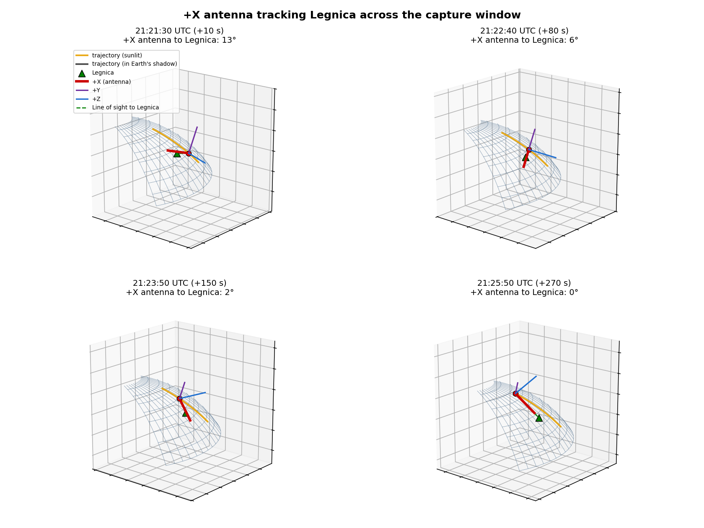
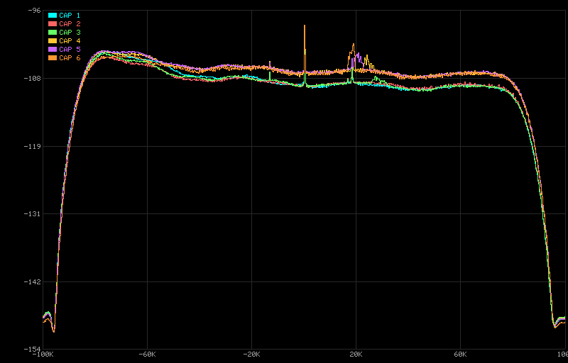
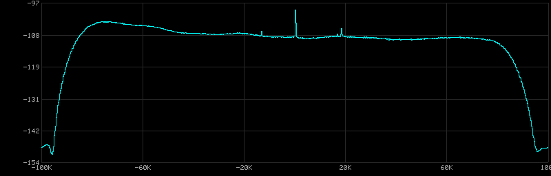
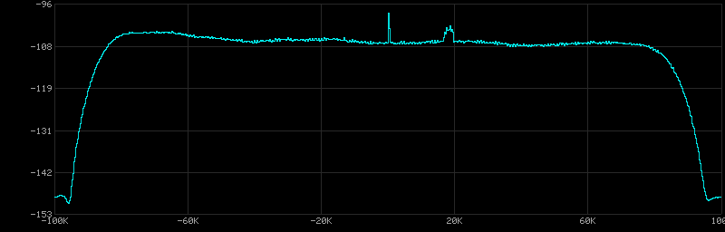
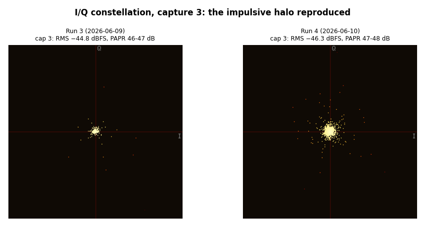
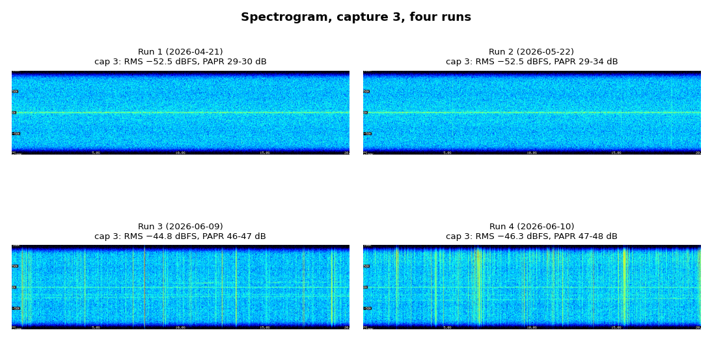
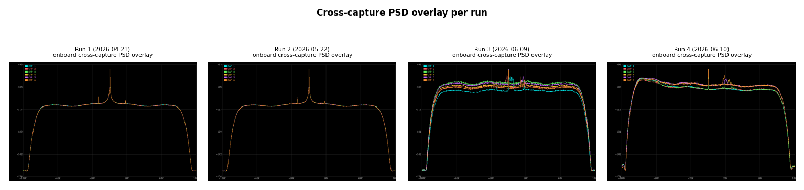

# Flight analysis debriefing: Run 4

**Flight (Run 4):** 2026-06-10
**Debriefing written:** 2026-06-11
**Main Takeaway:** The lifted, impulsive noise floor reproduced on a pass where the ground antenna most likely could not point at the spacecraft, though we cannot confirm whether the beam reached it. The signature is the same as Run 3 and is incompatible with the FM voice broadcast, which strengthens the case that the lift is local interference. The new ground constraint is the antenna mount: it cannot track high-elevation passes.

## The four runs so far

|                | Run 1                 | Run 2                     | Run 3                          | Run 4                          |
|----------------|-----------------------|---------------------------|--------------------------------|--------------------------------|
| Date (UTC)     | 2026-04-21            | 2026-05-22                | 2026-06-09                     | 2026-06-10                     |
| Attitude       | **Bad pointing**      | **Good pointing** (5 deg) | **Near-target** (3-11 deg)     | **Near-target** (2-14 deg)     |
| Broadcast      | Confirmed transmitted | **Did not happen**        | **Confirmed transmitted**      | **Attempted, could not track** |
| Audio          | Noise                 | Noise                     | Noise                          | Noise                          |
| Detection      | None                  | None                      | None                           | None                           |
| RMS dBFS       | ~-52.5                | ~-52.5                    | **-45 to -48**                 | **-44 to -46**                 |
| RMS variation  | 0.1 dB                | 0.1 dB                    | **3+ dB**                      | **~2 dB**                      |

## What happened

The run itself was clean and well scheduled. The app started at 21:21:23.4 UTC, 3.4 s after the scheduled time, consistent with the app-start semantics clarified after Run 3. The six captures ran +10 to +146 s after the scheduled time and bracketed the best part of the pass: this was a high-elevation pass with the elevation from Legnica peaking at 73 deg at +62 s, during capture 3, at a minimum slant range of 521 km. Compare Run 3's 41 deg and 730 km. Total run time 278.8 s, no errors, no detection; transcriptions are the degenerate "I" / "OH" pattern.

The ground side is where this attempt ran into trouble, and in an informative way. The operator ran upgraded hardware for the first time: 100 W of transmit power into a directional antenna with a beamwidth of roughly 10 deg. But the antenna mount could not tilt far enough to track a pass this high, so the beam probably could not stay on the spacecraft during the captures. The operator's own read is that they "couldn't get the right elevation to reach the satellite" and suspects there will be nothing in the recording. We cannot confirm from the receiver side whether the beam reached the spacecraft at all, only that no detection resulted, as in every run so far. The upgraded station traded beamwidth for gain, and a 10 deg beam only works if the mount can keep it on the spacecraft; this pass exceeded the mount's elevation envelope.

The UKF attitude telemetry confirms the spacecraft side worked. The +X antenna tracked Legnica well throughout the captures, from about 13 deg off in capture 1 down to 1.8 deg by the end of capture 6, essentially on-axis for the patch antenna the whole time, the same quality of track as Run 3. So the failure to close the link was entirely on the ground: the spacecraft was pointing at Legnica while the ground station could not point back. Pass geometry per capture, from the TLE (epoch about 9.7 h before the run):

| Cap | Window (s)        | Elevation     | Slant range     | Legnica Doppler at 1296 MHz |
|----:|------------------:|--------------:|----------------:|----------------------------:|
| 1   |  +9.9 to  +29.9   | 49 -> 60 deg  | 650 -> 574 km   | +19.1 -> +13.4 kHz |
| 2   | +33.0 to  +53.0   | 61 -> 72 deg  | 565 -> 526 km   | +12.3 ->  +4.2 kHz |
| 3   | +55.8 to  +75.8   | 72 -> 70 deg  | 523 -> 530 km   |  +3.0 ->  -5.9 kHz |
| 4   | +79.4 to  +99.4   | 68 -> 57 deg  | 536 -> 589 km   |  -7.5 -> -14.9 kHz |
| 5   | +102.4 to +122.4  | 55 -> 45 deg  | 599 -> 684 km   | -15.8 -> -20.7 kHz |
| 6   | +126.0 to +146.0  | 43 -> 35 deg  | 702 -> 808 km   | -21.4 -> -24.4 kHz |

The Doppler column is what a 1296.000 MHz carrier transmitted from Legnica would have shown at the receiver, for reference against the observed spectrum below.

## Pointing detail

Four-panel scene at +10 s, +80 s, +150 s, and +270 s relative to the scheduled time (the telemetry samples nearest the start of capture 1, mid-window, near the end of capture 6, and the last sample). The body triad shows the +X antenna (red) converging on the line of sight to Legnica (dashed green), from 13 deg off down to about 0.4 deg by the end of the telemetry.

A frame-by-frame animation of the same scene with the capture-window banner and the sunlit / Earth-shadow trajectory can be generated with `scripts/attitude/animate_pointing.py` from the telemetry in [`../../data/run-04-2026-06-10/`](../../data/run-04-2026-06-10/) (see [`scripts/attitude/README.md`](../../../../scripts/attitude/README.md)).

### Per-capture pointing angle

The +X-to-Legnica angle interpolated to 1 s within each capture window (seconds relative to the scheduled time, windows from the run log):

| Cap | Window (s)        | Start | End   | Min   | Mean  | RMS (dBFS) |
|----:|------------------:|------:|------:|------:|------:|-----------:|
| 1   |  +9.9 to  +29.9   | 12.5° | 12.6° | 12.5° | 13.1° | -46.0 |
| 2   | +33.0 to  +53.0   | 12.1° |  8.0° |  8.0° | 10.1° | -46.4 |
| 3   | +55.8 to  +75.8   |  7.5° |  5.4° |  5.0° |  5.9° | -46.3 |
| 4   | +79.4 to  +99.4   |  5.9° |  8.6° |  5.9° |  7.2° | -44.6 |
| 5   | +102.4 to +122.4  |  8.8° |  5.2° |  5.2° |  7.9° | -44.4 |
| 6   | +126.0 to +146.0  |  4.3° |  1.8° |  1.8° |  2.7° | -45.1 |

Every value is well inside the patch antenna's main beam, so the spacecraft was on-axis to Legnica throughout. The track keeps converging after the captures, reaching about 0.4 deg at the last telemetry sample (+268 s). The RMS-vs-pointing correlation is weak this run (r about -0.4): the two loudest captures (4 and 5) are mid-track, not the closest, and the closest capture (6) is mid-RMS. As in Run 3, the received energy does not track how close the antenna is to Legnica.

## What the receiver saw

The Run 3 anomaly reproduced in full. RMS -44.4 to -46.4 dBFS against the -52.5 dBFS baseline (a 6-8 dB RMS lift), peaks near 10000, PAPR 45-48 dB versus the 26-37 dB baseline, and spectrogram streak columns at 28-40 of 1024 versus the 2-14 baseline (Run 3: 59-88). The per-capture PSD CSVs put the floor at -106 to -109 dBFS in both the inner ±10 kHz and 20-70 kHz bands, a broadband lift of 4-9 dB.

New in this run: the spectrum is asymmetric. A broad hump spans roughly -52 to -78 kHz, sitting 3-5 dB above the corresponding positive side of the band in every capture; Run 3's spectrum was symmetric to within 0.2 dB. The hump is strongest in captures 1-3 and fades through captures 4-6, and it stays at a fixed frequency across the run. That rules out a Doppler-shifted carrier: anything transmitted from the ground near Legnica would have swept from +19 kHz to -24 kHz across the captures (see the table above), and nothing in the spectrum follows that track. A fixed-frequency, band-limited, time-varying hump on top of an impulsive floor reads as one or more wideband emitters offset about 50-80 kHz below 1296 MHz, picked up at different strengths along the ground track.

| Capture 1 (hump strong, RMS -46.0 dBFS) | Capture 6 (hump faded, RMS -45.1 dBFS) |
|---|---|
|  |  |

The constellation shows the same impulsive halo as Run 3, and the spectrograms show the same broadband vertical streaks:

## What this run tells us

Run 4 was meant to be a strong end-to-end attempt and instead became a near-negative-control, with one caveat: we cannot confirm whether the broadcast reached the spacecraft. The operator believes the mount could not keep the beam on a pass this high, but that is an expectation, not a measurement, and the receiver side cannot settle it either way. So Run 4 does not by itself prove the lifted floor is independent of the broadcast.

What it does do is reproduce Run 3's anomaly on a second June pass, and the case that the lift is local interference rather than the broadcast rests on signature and timing, not on assuming the beam missed:

- **The signature is incompatible with the FM voice broadcast.** As in Run 3, the lift is broadband and strongly impulsive (PAPR 45-48 dB, constellation halo, spectrogram streaks), and constant-envelope FM voice cannot produce that. This holds whether or not the beam reached the spacecraft.
- **Nothing follows the Doppler track.** No spectral feature follows the +19 to -24 kHz sweep a 1296 MHz Legnica transmitter would have produced across the captures. If the broadcast had reached the receiver, this is where it would appear; it does not. The new -52 to -78 kHz hump sits at a fixed frequency and does not sweep, so it is not the uplink either.
- **The change tracks the epoch, not the link.** Runs 1 and 2 (April 21, May 22) showed a flat baseline floor; Runs 3 and 4 (June 9, 10) both lifted. Across those four passes the lift does not follow the broadcast (confirmed in Run 1, absent in Run 2, present in Run 3, uncertain in Run 4) or the pointing. The common factor is the date: something in the RF environment along these passes changed between late May and early June.
- **The energy is not centred on Legnica.** Captures 4-6 are the loudest while capture 3, taken at the pass peak 523 km over the target, is among the quietest. RMS does not track slant range to the target.

Taken together this is strong support for hypothesis B, pulsed ground RFI, as the dominant cause of the lifted floor in both June runs. It is not the airtight negative control a confirmed beam-miss would have given us. Whether Run 3's confirmed broadcast contributed anything underneath the interference still needs the Run 3 on-air window and operator-side audio.

## Next steps

1. **[Ground side]** Establish the antenna mount's maximum trackable elevation and schedule passes whose peak elevation stays inside it. With 100 W and a ~10 deg beam, a moderate pass is preferable to an overhead one: a pass peaking at 45-55 deg costs only a few dB of extra path loss (521 to ~900 km of slant range is about 5 dB), which the upgraded power more than covers, and the mount can actually track it.
2. **[Ground side]** Keep logging the planned and actual on-air window for every attempt, including aborted ones like this.
