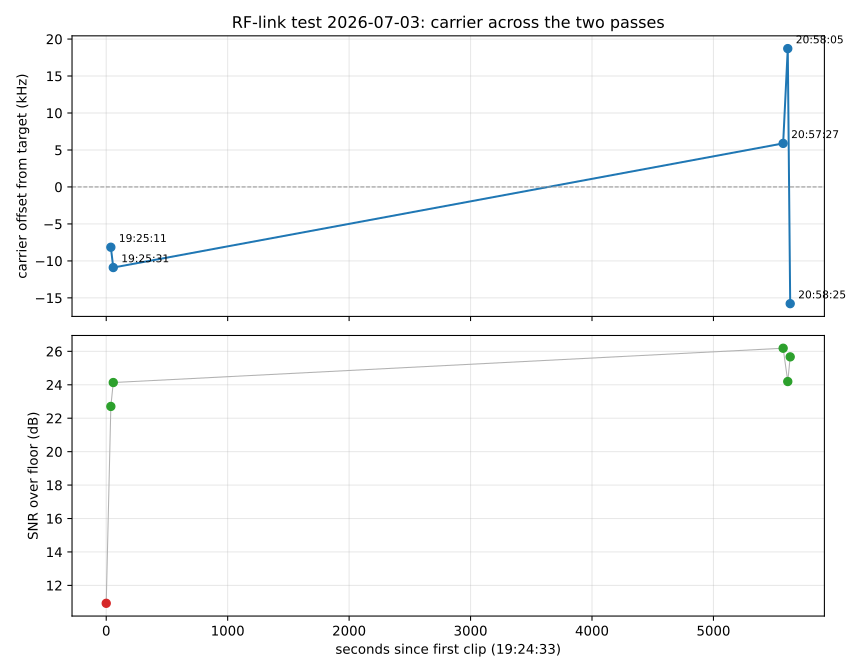
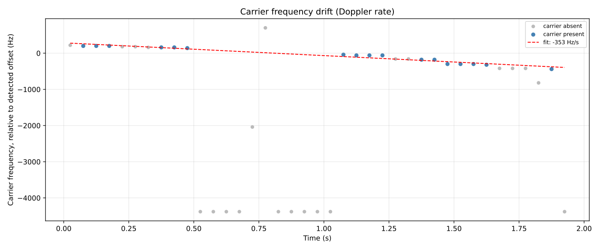
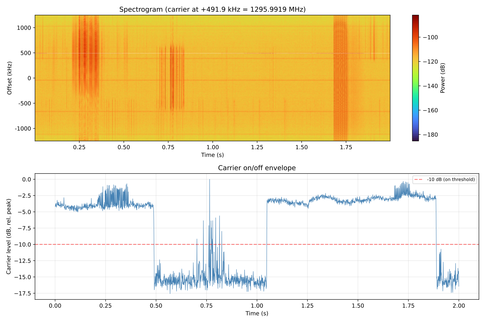
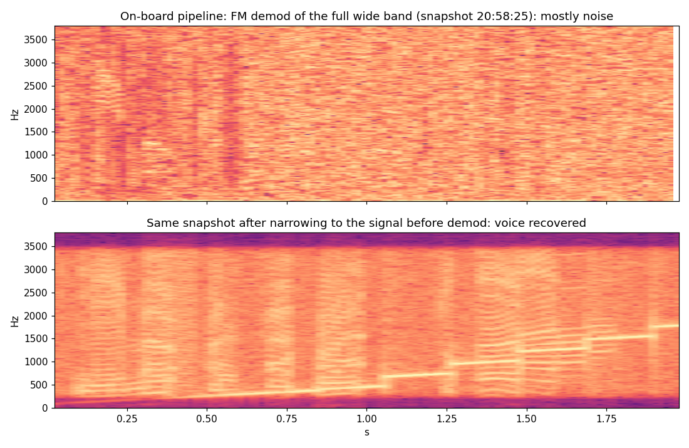
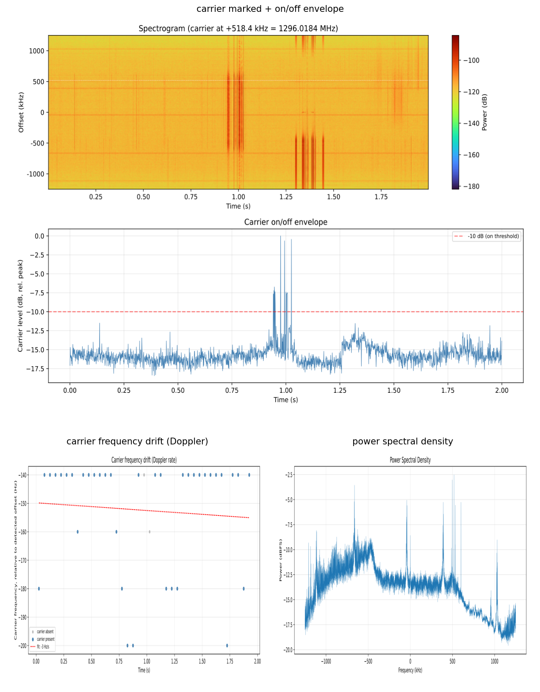
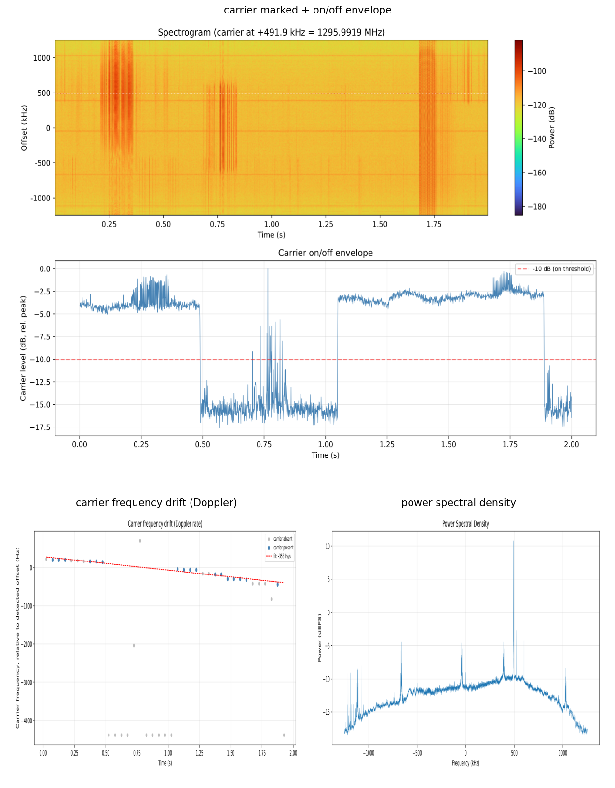
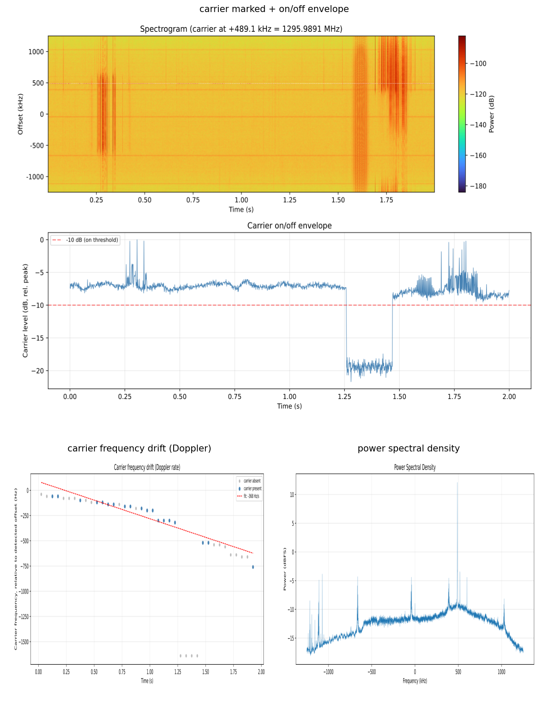
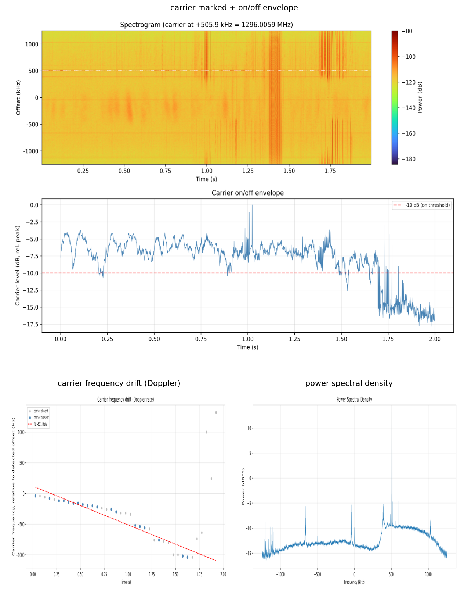
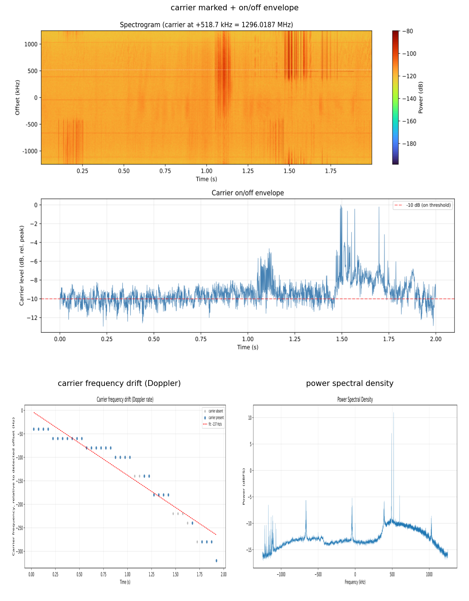
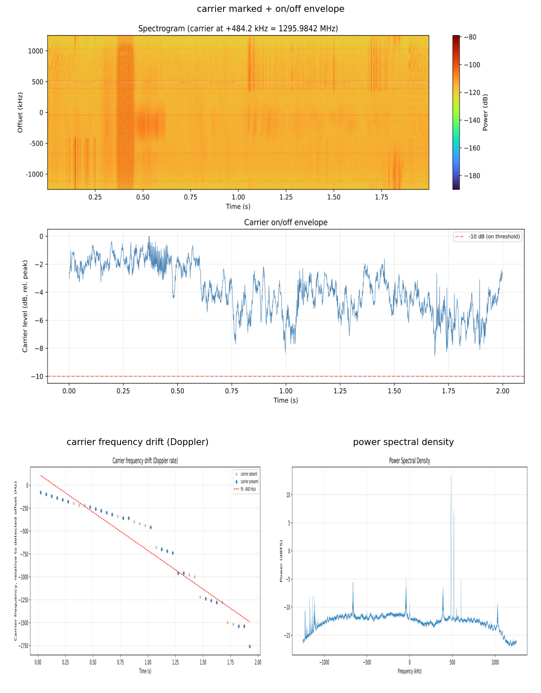

# Flight analysis debriefing: Run 5 (RF-link test)

**Flight (Run 5):** 2026-07-03

**Main Takeaway:** The uplink is received at the spacecraft, and the transmission carries voice (recoverable on the ground, though hard to make out; the words cannot be identified with confidence). Across six wideband snapshots from two passes, a narrowband signal near 1296 MHz stands 23 to 26 dB over the noise floor, goes on and off with gaps consistent with the operators' report of pausing to rotate the antenna, and drifts smoothly at a rate whose sign and order of magnitude match the Doppler expected for the pass. The on/off timing and Doppler-rate drift rule out a static internal spur and strongly support an externally received signal. The operators have confirmed the transmission was FM voice, sent wide on this pass. The voice is recoverable on the ground but hard to make out.

**Implications for the DOOM experiment:** The demodulator is right, the bandwidth is not. The transmission is FM, so the pipeline's FM discriminator is the correct demod, but the pipeline feeds it the full wide band, about 170 kHz of noise, far more than the signal occupies, which pushes it below FM threshold and turns the voice into static. Run through the pipeline the speech-to-text gets only noise fragments, not intelligible words, even though a command was transmitted. The link and the voice are both real; the gap is bandwidth, and it is fixable in the processing we control.

**Suggested next steps:** On our side, add a narrowing stage to the post-capture processing: find the carrier within about +/-100 kHz of 1296.0, shift it to 0 Hz, and low-pass to roughly +/-10 kHz before the FM discriminator. That is estimated to recover on the order of 9 to 11 dB of noise bandwidth, and narrowing does bring the voice back (both our own narrowed demods and the operators' processing show this); its effect end to end through the speech-to-text is the immediate next test, and it needs no change to the ESA capture. On the ground-station side, the operators can transmit FM-narrow next time (they used the wide FIL1 filter on this pass; FIL3 is FM-narrow) and drive the voice keyer harder (their radio's manual recommends about 80 percent). A clean command may be recognizable: the operators' own text-to-speech reference decoded as "play doom" in their sherpa-onnx run, so cleaner, louder, narrower transmission plus the narrowing stage is the path. Heavy on-board denoising is not the fix; it is complex and does not recover intelligibility on its own.

## The five runs so far

|                | Run 1                 | Run 2                     | Run 3                     | Run 4                          | Run 5 (RF test)              |
|----------------|-----------------------|---------------------------|---------------------------|--------------------------------|------------------------------|
| Date (UTC)     | 2026-04-21            | 2026-05-22                | 2026-06-09                | 2026-06-10                     | 2026-07-03                   |
| Test type      | Doom pipeline         | Doom pipeline             | Doom pipeline             | Doom pipeline                  | **RF-link test**             |
| Broadcast      | Confirmed transmitted | Did not happen            | Confirmed transmitted     | Attempted, could not track     | **Confirmed transmitted**    |
| Detection      | None                  | None                      | None                      | None                           | **Carrier detected (5 of 6)**|
| Signal at RX   | Noise floor only      | Noise floor only          | Lifted floor, no carrier  | Lifted floor, no carrier       | **Carrier +23 to +26 dB**    |

Runs 1 to 4 ran the operational doom pipeline (200 kHz effective bandwidth, FM demod, speech-to-text). Run 5 is a simplified RF-link test: the transmission was recorded as wideband raw IQ, so the link can be judged directly in the spectrum, independent of demodulation. The receiver-level numbers are not directly comparable across the two because the capture configuration differs.

## What happened

This was the simplified test proposed by ESOC / TU Graz: instead of an FM voice broadcast through the on-board speech-to-text chain, the operators would transmit so the link could be judged directly in the spectrum, and the spacecraft recorded a wide band of raw IQ. This time the transmitting side was a radio-amateur team based in Oslo. Two deliberate changes to the recording made it interpretable:

- The SDR was tuned to a center of **1295.5 MHz**, so a 1296.0 MHz uplink lands at **+500 kHz** in the baseband, well clear of the AD9361 DC spike.
- A wideband raw IQ recording was downlinked (2.5 MSPS, 2.3 MHz analog bandwidth, manual gain 65 dB), rather than the operational 200 kHz effective baseband.

Six 2-second snapshots were downlinked, three from a first pass around 19:25 UTC (transmitting without an amplifier, which the operators flagged as the worse case) and three from a second pass around 20:58 UTC (with an amplifier). Each snapshot is short because wideband raw IQ is about 10 MB/s, so the on-board scheme stores only brief windows.

## The detection across the pass

A narrowband signal near 1296 MHz is present in five of the six snapshots. The one exception is the very first snapshot: the strongest peak there is wide and only 11 dB over the floor, that is, the noise background rather than a carrier. Why the transmission was not received in that 2 s window is not established.

| Time (UTC) | Pass | Detected | Abs freq (MHz) | SNR (dB) | -3 dB width (Hz) | On % | Drift (Hz/s) |
|---|---|---|---|---|---|---|---|
| 19:24:33 | 1 (no amp) | no  | 1296.018 | 10.9 | 21060 | 1   | -3   |
| 19:25:11 | 1 (no amp) | yes | 1295.992 | 22.7 | 610   | 67  | -353 |
| 19:25:31 | 1 (no amp) | yes | 1295.989 | 24.1 | 305   | 90  | -368 |
| 20:57:27 | 2 (amp)    | yes | 1296.006 | 26.2 | 305   | 83  | -631 |
| 20:58:05 | 2 (amp)    | yes | 1296.019 | 24.2 | 305   | 68  | -137 |
| 20:58:25 | 2 (amp)    | yes | 1295.984 | 25.7 | 305   | 100 | -840 |

Three points hold up well:

- **The signal keys on and off**, with gaps consistent with the operators' report of pausing to rotate the antenna, and the amplified second pass is at least as strong (24 to 26 dB) as the no-amplifier first pass (23 to 24 dB).
- **Every detected snapshot drifts negative** (-137 to -840 Hz/s). The sign is the same in all of them and the magnitude is order 0.5 kHz/s, the descending Doppler rate expected for a 1296 MHz pass. Consistent negative drift across independent snapshots is the strongest single argument against a static internal spur, which would not drift.
- The clip-to-clip absolute frequency is **not** a single clean Doppler curve (it scatters from about -16 to +19 kHz around 1296.0). Within each 2 s clip the drift is smooth and negative; between clips the offset scatters, consistent with snapshots taken seconds to about an hour and a half apart and possible retuning between them (not confirmed with the operators). The per-clip drift is the reliable Doppler evidence, not the clip-to-clip offsets.

For the zenith snapshot (19:25:11), tracked in detail: carrier at **1295.992 MHz** (-8.1 kHz from 1296.000), +22.7 dB over the floor, -3 dB width 0.61 kHz, drifting -353 Hz/s (-636 Hz across carrier-present windows). These come straight from `carrier.txt` / `carrier.json` in the data folder, produced by [`detect_carrier.py`](../../../../../tools/src/detect_carrier.py); the cross-snapshot comparison is `carriers_summary.txt` / `.json`, from [`summarize_carriers.py`](../../../../../tools/src/summarize_carriers.py).

## The signal is FM voice

The transmission is FM voice. The operators confirmed this directly, their rig was in FM mode and transmitting wide through the wide FIL1 filter on this pass. An earlier ground measurement of sideband asymmetry had suggested single sideband on the strongest snapshots, but that was an artifact of measuring against a short, Doppler-drifting carrier, and it is superseded by the operators' confirmation.

Once narrowed to the signal bandwidth, the voice is clearly recoverable: demodulating a narrow band around the carrier gives syllabic bursts with stacked harmonic formants, strongest on the amplified second pass (20:58:25 and 20:57:27) and partial on the first. The words are hard to make out and cannot be identified with confidence, but it is speech, not a tone. What matters for the on-board pipeline is not the demod type, which is correct, but the bandwidth fed into it.

## What the on-board pipeline would have done

The operational doom pipeline demodulates FM, then runs speech-to-text. To preview what it would have made of this pass, the raw IQ was run through the exact on-board DSP chain (the same GNU Radio blocks and filter designs as `src/capture.cpp`, driven from the flight `config.cfg`), then through the real flight speech-to-text and keyword matcher in the app's single-file mode. See [`docs/ONBOARD_PREVIEW.md`](../../ONBOARD_PREVIEW.md).

The demodulator is the right one, but it is fed the full wide band, about 170 kHz of noise, far more than the signal occupies, which pushes the discriminator below its FM threshold and turns the voice to static. Narrowing to the signal bandwidth before the discriminator recovers it. The figure shows the current wide FM output (upper), mostly noise, against the same snapshot narrowed before demod (lower), where the voice returns.

What matters is downstream. Run through the flight speech-to-text on all six snapshots, the transcripts are single noise-driven fragments (`A`, `I`, `OF THE`), not intelligible words. The operators did transmit a spoken command on this pass (their call sign and "play doom"), so this is a real miss: a voice signal like this, taken through the FM chain, does not come out as usable text for the speech-to-text.

This holds even for the cleanest audio available. The radio-amateur team also processed these captures with their own numpy/scipy chain, producing the cleanest voice recovery we have, clear enough to follow by ear in places; run through the identical on-board speech-to-text on the ground, that audio still does not transcribe the command. Audio a person can follow is not the same as audio the on-board recognizer can read.

## What it means and next steps

1. **The link is confirmed and the voice is recoverable.** For the first time the receiver sees a signal near 1296 MHz, in five of six snapshots and both passes. Its on/off timing and Doppler-rate drift rule out a static internal spur and strongly support an externally received signal. This strengthens the case that the earlier non-detections were ground-side (pointing, geometry, transmit reliability) rather than a receiver problem.
2. **The gap is bandwidth, not the demod.** The transmission is FM, so the pipeline's FM discriminator is the correct demodulator; the problem is that it is fed about 170 kHz of noise, far more than the signal occupies. Narrowing to roughly ±10 kHz around the carrier before the discriminator is estimated to recover on the order of 9 to 11 dB and brings the voice back; validating that end to end through the speech-to-text is the immediate next test. It is entirely post-capture, so we can add it without changing the ESA capture. On the ground side the operators can transmit FM-narrow next time (FIL3) and drive the voice keyer harder. This is independent of the link budget, which these clips show is adequate.
3. **Adopt the offset tuning operationally.** Tuning the SDR center off the uplink so the carrier lands away from the DC spike made the detection clean. In the operational 1296.0-centered config the carrier would sit only about 8 kHz from DC, close to the spike.
4. **Still open:** identifying the broadband impulsive bursts seen across the full 2.5 MHz in some snapshots (transmit-side splatter, or the impulsive platform noise seen in Runs 3 and 4).

Analysis produced on the ground from the raw IQ with [`detect_carrier.py`](../../../../../tools/src/detect_carrier.py), [`summarize_carriers.py`](../../../../../tools/src/summarize_carriers.py), and [`demod_audio.py`](../../../../../tools/src/demod_audio.py), and the on-board preview with `preview_onboard` (see [`docs/ONBOARD_PREVIEW.md`](../../ONBOARD_PREVIEW.md)). Data folder: [`../../data/run-05-2026-07-03/`](../../data/run-05-2026-07-03/). Audio for all six snapshots, demodulated several ways with per-folder notes, is in [`rf_test.zip`](../../data/run-05-2026-07-03/rf_test.zip) there.

## Appendix: per-recording plots

All six snapshots, in time order. For each: the spectrogram with the detected carrier marked and its on/off envelope, the carrier frequency drift (Doppler), and the power spectral density. The first snapshot (19:24:33) has no carrier; the detector locks onto the noise background, which is why its plots look featureless.

### 19:24:33 UTC, pass 1 (no amplifier), no carrier detected

### 19:25:11 UTC, pass 1 (no amplifier), zenith

### 19:25:31 UTC, pass 1 (no amplifier)

### 20:57:27 UTC, pass 2 (with amplifier)

### 20:58:05 UTC, pass 2 (with amplifier)

### 20:58:25 UTC, pass 2 (with amplifier)

