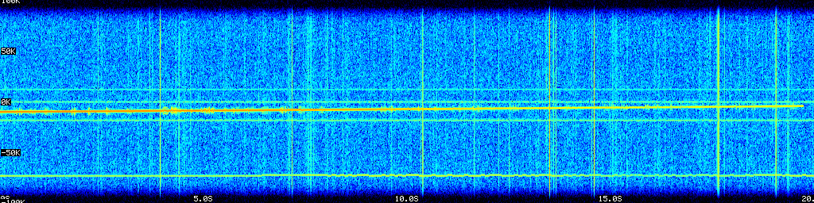
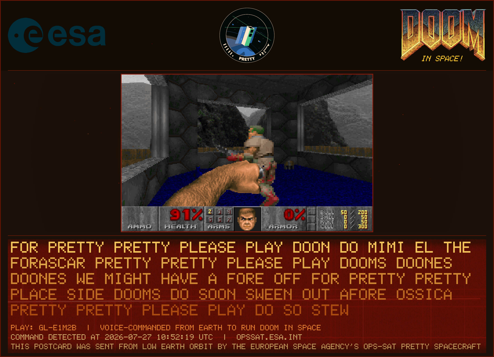
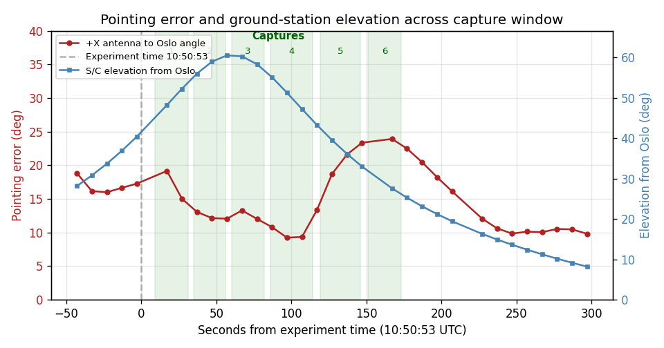
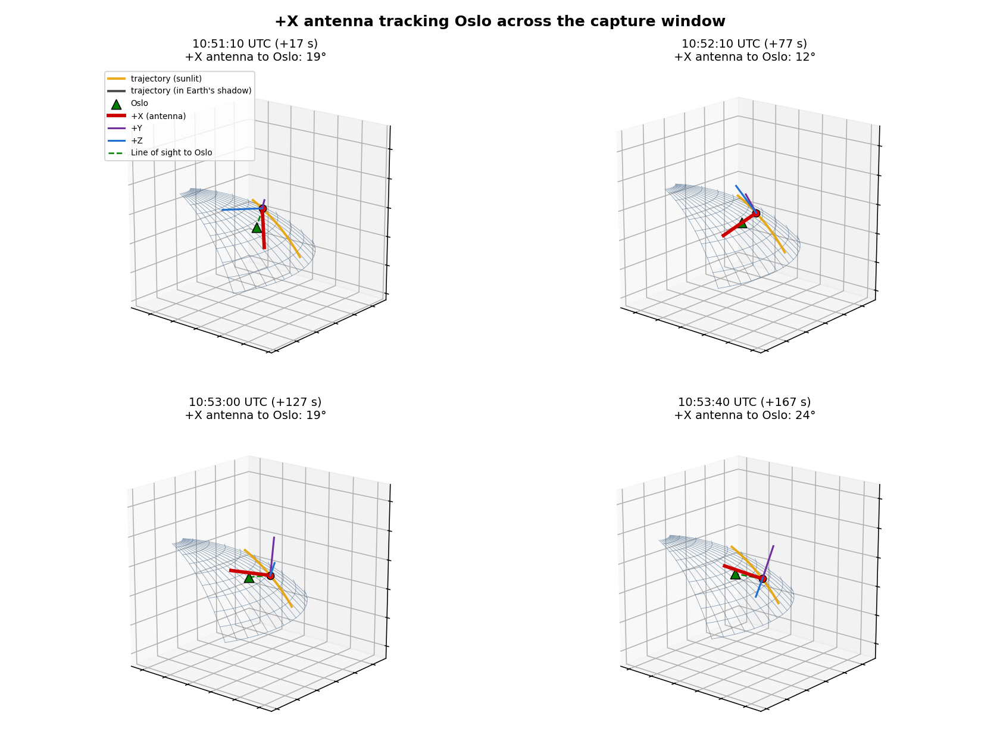
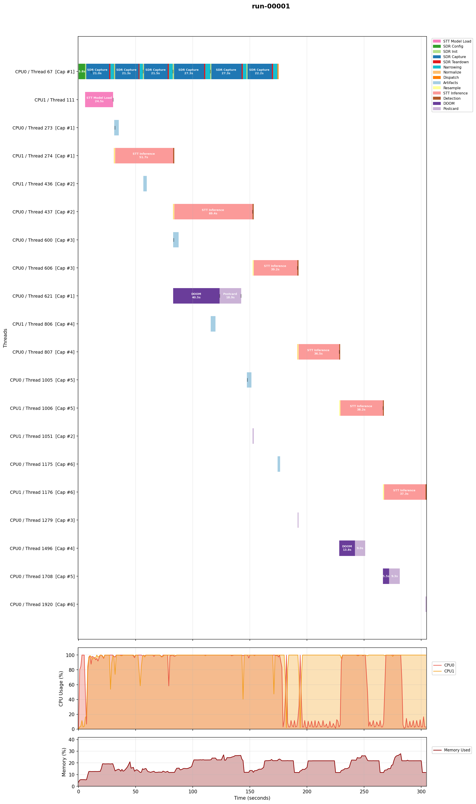

# Flight analysis debriefing: Run 6 (first on-orbit DOOM launch)

Run 6 is the first on-orbit detection of the voice command in the flight record (Runs 1-4 returned no detection, Run 5 was a capture-only RF-link test) and the first DOOM launch triggered by it. On the morning pass of 2026-07-27, with the spacecraft running v7 and commanded to track the Oslo ground station, the radio-amateur team transmitted the keyer message, the pipeline (with the narrowing stage active) produced intelligible voice from a signal at the wideband noise floor, and three of the six captures detected the command and launched DOOM. Run 7 that evening ([companion debriefing](../run-07-2026-07-27/)) repeated the detection with a live human voice, on a pass where the ADCS was reset and the attitude is unknown.

## The six runs so far

Runs 1-4 returned no detection (Runs 1-2 a quiet noise floor, Runs 3-4 a lifted floor with the ground station unable to point back). Run 5 was the ESA RF-link test that recorded the uplink as raw IQ and proved it was FM voice, buried under the wideband noise the v6 chain would have fed to the discriminator. That test drove the v7 changes: a narrowing stage that finds the uplink, shifts it to DC, and band-limits to +/-10 kHz before demodulation, plus removal of a redundant audio filter ahead of speech-to-text. Run 6 is the first flight of v7 against a live transmission.

## What happened

The app started at 2026-07-27T10:50:53Z and ran six 20 s captures back to back, finishing in 304.1 s with a clean shutdown. The spacecraft was commanded to track Oslo (ECEF target from operations, 59.9139 N, 10.7522 E). The Oslo team transmitted the looping keyer message ("[call sign], PRETTY PRETTY, PLEASE PLAY DOOM DOOM DOOM"). `doom_force_trigger` was false, so every detection below is a genuine recognition of the transmitted command.

Three captures detected and launched DOOM:

| Capture | Window (past 10:50:53) | RMS I (dBFS) | Boresight error | Result | Demo |
|---|---|---|---|---|---|
| 1 | +9 to +31 s | -44.6 | ~16 deg | **DETECTED** | gl-e1m2b |
| 2 | +35 to +56 s | -50.8 | ~14 deg | no | |
| 3 | +60 to +82 s | -53.2 | ~12 deg | no | |
| 4 | +86 to +114 s | -46.6 | ~9 deg (best) | **DETECTED** | e1m7-607 |
| 5 | +119 to +146 s | -48.4 | 13-20 deg | **DETECTED** | gl-e1m2 |
| 6 | +151 to +173 s | -49.6 | ~24 deg (worst) | no | |

## The keyer came through

The transmitted message is legible in the transcripts. Capture 1 in full:

> FOR PRETTY PRETTY PLEASE PLAY DOON DO MIMI EL THE FORASCAR PRETTY PRETTY PLEASE PLAY DOOMS DOONES DOONES WE MIGHT HAVE A FORE OFF FOR PRETTY PRETTY PLACE SIDE DOOMS DO SOON SWEEN OUT AFORE OSSICA PRETTY PRETTY PLEASE PLAY DO SO STEW

The looping structure is unmistakable: "PRETTY PRETTY PLEASE PLAY DOOM(S)" repeats four times, with call-sign fragments (`FORASCAR` = FOUR OSCAR, `OSSICA` = OSCAR, `MIMI EL` near LIMA). The three detections matched the command on the repeated DOOM, at fuzzy distance 1 (`DOON` to `DOOM`); the repetition in the message is what carried it through the noise, as intended.



The DOOM postcard from capture 1, generated on board from the capture I/Q and the game frame:



[`captures-spectrogram.mp4`](captures-spectrogram.mp4) is a scrolling-spectrogram video of all six captures' recovered audio joined end to end (with 2 s of padding at the start and end and no gaps between captures, so it shows the voice content rather than the silent inter-capture intervals). It is generated with `tools/src/audio_spectrogram_video.py --capture-audio ... --concat --trim-pad-s 2`.

## What separated detected from missed captures

Received level was at the noise floor in wideband terms (RMS I -44.6 to -53.2 dBFS across captures, comparable to the empty-floor Runs 1-4). The narrowing stage was active, and the pipeline produced intelligible voice from that signal. The Run 5 ground analysis showed the wide chain yielding static on the same class of signal; that is the basis for expecting narrowing to matter here, though this pass did not run a wide-vs-narrow comparison to confirm it in flight.

Across these six captures the three detections are the three with the highest RMS I and the lowest zero fraction, with a separation around -49 dBFS (detected -44.6 to -48.4, missed -49.6 to -53.2). Detection does not follow the antenna pointing error alone: capture 4 detected at best pointing and capture 6 missed at worst pointing, but capture 3 missed at good pointing (~12 deg) while capture 1 detected at ~16 deg. A plausible reading, not established here on six captures, is that the received level in a given 20 s window depends on both the pointing and where the looping keyer's clean command fell in that window, and that detection follows the received level.

## Pointing

The +X antenna boresight error to Oslo, from the UKF quaternion telemetry, was 15-19 deg through captures 1-3, reached a minimum near 9 deg during capture 4, rose to about 24 deg across captures 5-6, and settled near 10 deg afterward. The rise across captures 5-6 is the post-zenith deviation operations reported (around 10:53:20 +/- 40 s). Spacecraft elevation from Oslo was about 40 deg at app start, at a slant range near 740 km.





[`pointing-animated.mp4`](pointing-animated.mp4) is a real-time animation of the pass (body triad, orbit, and line of sight to Oslo, with the capture-window banner) with each capture's recovered audio played at the moment that capture occurred, generated in one command with [`scripts/attitude/animate_pointing.py`](../../../../scripts/attitude/README.md). It is trimmed to 2 s before the first capture and 2 s after the last (`--trim-to-captures --trim-pad-s 2`) and plays at wall-clock rate (`--realtime`), so it runs about 2.8 minutes with the voice heard as each capture happens, silent in the gaps. Animations are otherwise reference-only (see the debriefings `.gitignore`); this one is a milestone exception. To regenerate, extract the six capture WAVs from the pack, then:

```bash
python3 scripts/attitude/animate_pointing.py \
  --ukf-csv ../../data/run-06-2026-07-27/ukf-attitude.csv \
  --tle1 "1 58023U 23155H   26210.20326273  .00006549  00000+0  27065-3 0  9996" \
  --tle2 "2 58023  97.5686 292.1981 0001075 161.7317 198.3958 15.24338062154751" \
  --target-ecef "3149143.1,598008.8,5495694.5" --target-name Oslo \
  --exp-time 2026-07-27T10:50:53Z \
  --capture-windows "[[9,31],[35,56],[60,82],[86,114],[119,146],[151,173]]" \
  --trim-to-captures --trim-pad-s 2 --realtime --fps 10 \
  --capture-audio "cap1.wav,cap2.wav,cap3.wav,cap4.wav,cap5.wav,cap6.wav" \
  --output pointing-animated.mp4
```

Caveat on the geometry: the TLE used has epoch 2026-07-29, about 2.2 days after the pass, propagated backward. The pointing error is dominated by the measured attitude and is robust; the elevation and slant range to Oslo carry the small along-track error of a two-day propagation. The pointing figures are regenerated with [`scripts/attitude/plot_pointing.py`](../../../../scripts/attitude/README.md) from [`../../data/run-06-2026-07-27/`](../../data/run-06-2026-07-27/).

## Pipeline timing and utilization



The six captures ran back to back on the capture thread, each followed on that same thread by narrowing (the small teal segment, a few seconds). STT inference (36-69 s per capture), DOOM, and the postcard all ran on background threads and did not block the capture loop. DOOM and postcard therefore overlapped later captures rather than delaying them: capture 1's detection launched DOOM mid-run (40.5 s DOOM + 18.9 s postcard, running through captures 4 and 5), while captures 4 and 5's DOOM ran after the capture loop had finished.

Captures 4 and 5 each took 26 s to deliver their 20 s of samples, against 20-21 s for the other four. This is slower SDR sample delivery, not DOOM blocking the loop; it coincided with the heaviest concurrent load (capture 1's DOOM and postcard plus STT inference all running at once), which is a plausible CPU or DMA contention effect but is not established from this run. Both cores stayed near saturation throughout; peak memory stayed under 30 %.

## What it means

v7 ran the full chain in flight: an FM-voice transmission at the wideband noise floor was received, narrowed, demodulated, transcribed, and recognized, and DOOM launched on board, three times in one pass, with the operational configuration and no forced trigger. This is the outcome the Run 5 diagnosis and the v7 changes were aimed at. It is not a controlled comparison against v6 (which was not flown here), so it does not by itself isolate the narrowing stage as the cause; it does show the v7 pipeline detecting a real transmission end to end.

## Next steps

- The command detections rode fuzzy matches (`DOON` to `DOOM`); quantify the false-trigger margin (issue #109) now that real on-orbit transcripts exist.
- Investigate the SDR sample stall seen in Run 7 with operations.
- The audio for capture 1 is at `capture-001-audio.wav`; the full downlinked archive is in [`../../data/run-06-2026-07-27/`](../../data/run-06-2026-07-27/).
