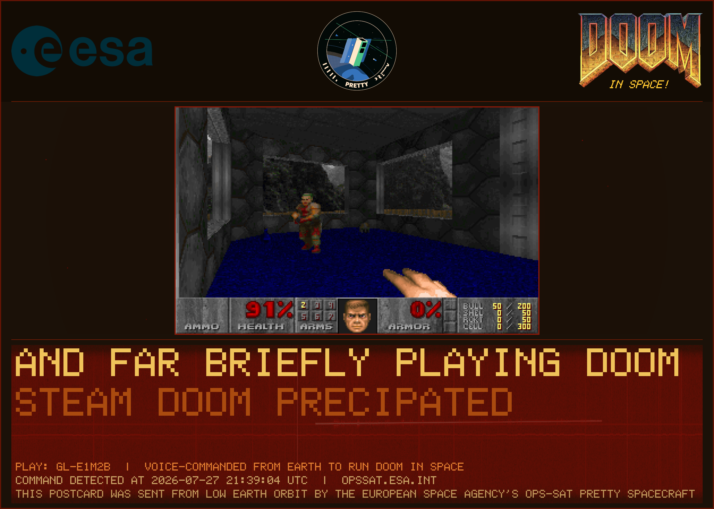
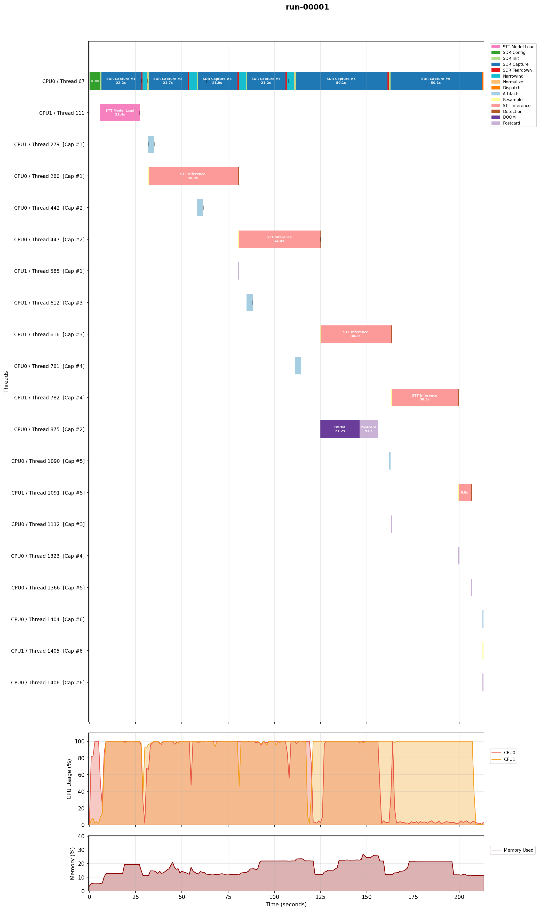

# Flight analysis debriefing: Run 7 (evening pass)

Run 7 is the evening companion to [Run 6](../run-06-2026-07-27/), the same day and the same v7 software. It differs from Run 6 in what was transmitted: the Oslo team sent the command with a live human voice over a microphone, no TTS keyer, following the same message structure as the keyer (the DOOM keyword repeated several times at the end). Three operators were present at the station for the pass. Run 7 detected the command and launched DOOM, so it is the first on-orbit detection of a live human voice command, and it did so under two degraded conditions: the ADCS was reset, so the spacecraft was not commanded to track the ground station and its attitude during the pass is unknown, and the SDR stalled part way through the pass. The shared signal-processing analysis (narrowing, what separated detected from missed captures) is in the [Run 6 debriefing](../run-06-2026-07-27/); this note covers only what is specific to Run 7.

## What happened

The app started at 2026-07-27T21:36:56Z. Six 20 s captures were configured; four completed, one was partial, one was empty, and the run finished in 212.8 s with a clean shutdown. Capture 2 detected the command and launched DOOM (demo gl-e1m2b) on an exact `DOOM, DOOM` match. `doom_force_trigger` was false.

| Capture | RMS I (dBFS) | Result |
|---|---|---|
| 1 | -48.5 | no |
| 2 | -48.3 | **DETECTED** (gl-e1m2b) |
| 3 | -52.4 | no |
| 4 | -49.9 | no |
| 5 | -52.4 | no (partial capture) |
| 6 | -- | no (empty capture) |

Capture 2 transcript: `AND FAR BRIEFLY PLAYING DOOM STEAM DOOM PRECIPATED`. This is a live human voice, not the TTS keyer; the repeated DOOM at the end came through and matched exactly. Received levels are at the noise floor, comparable to Run 6, with the narrowing stage active as in Run 6.

The recovered audio for capture 2, the live human voice, is at `capture-002-audio.wav`. A scrolling-spectrogram video can be generated from it with `tools/src/audio_spectrogram_video.py` if useful, but is not kept here; the WAV is the committed audio record.

## Detection with the ADCS reset (attitude unknown)

Operations reported an ADCS reset during the pass. The spacecraft was therefore not commanded to track Oslo, and no attitude telemetry exists for Run 7, so the actual antenna orientation during the pass is unknown. A detection still occurred. This does not show that pointing is unnecessary: with the attitude unknown, the uncommanded orientation may have happened to favor the link, and it is a single capture at the noise floor. The most that can be said is that a detection occurred on a pass with no commanded pointing; whether that reflects margin or a favorable chance orientation cannot be determined from the available data.

## SDR sample stall

Capture 5 stopped receiving samples at 808,277 of 4,000,000 (about 20 %), held there across the full 50 s timeout, and was logged as "SDR capture partial"; capture 6 returned a header-only empty file. The pipeline degraded gracefully: the partial capture was flagged, speech-to-text was skipped on the too-short audio, artifact generation warned and moved on, and the run shut down cleanly with no crash. This is an SDR streaming stall in the AD9361 sample delivery, distinct from the ADCS reset (a separate subsystem). It cost captures 5 and 6 and is worth raising with operations; it did not affect the detection on capture 2.

The timeline makes the stall visible: captures 1-4 ran at about 21 s wall, while captures 5 and 6 each stretched to 50 s, held at the capture timeout with no samples arriving. Capture 5's speech-to-text ran on only 6.8 s of audio and capture 6 on none.

## What it means

The detection reproduces on a second, independent pass, which rules out Run 6 being a one-off, and it does so on a live human voice rather than the TTS keyer, so the pipeline recognized a real spoken command from orbit. The detection occurred on a pass with no commanded pointing and unknown attitude; that is not evidence about the pointing dependence either way. The SDR stall is the open hardware item to follow up.

The audio for capture 2 is at `capture-002-audio.wav`; the full downlinked archive is in [`../../data/run-07-2026-07-27/`](../../data/run-07-2026-07-27/).
