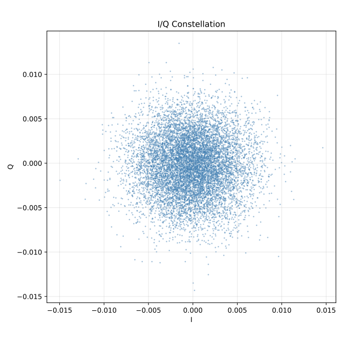
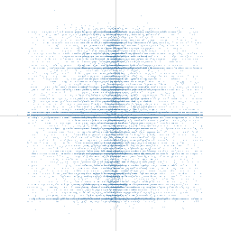
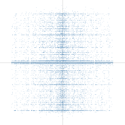
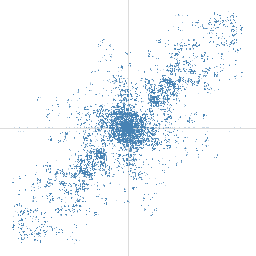

# SDR Loopback Test Results

## Objective

Validate the full AD9361 TX/RX signal chain on the OPS-SAT EM (Engineering Model) using internal digital loopback mode. A known voice audio signal is FM-modulated, transmitted via the AD9361 TX path, looped back internally to RX (bypassing RF), demodulated, and compared against the original input via cross-correlation.

The loopback test is a ground-side diagnostic only. It is not intended to run on the spacecraft.

## Outcome

**The loopback test does not produce usable audio output.** The Q (quadrature) component of the received I/Q signal drops out (~63% zeros) whenever TX and RX stream simultaneously, which causes FM demodulation to produce garbled audio. The Q dropout appears to be caused by contention between the TX and RX data paths (see Root Cause Hypothesis).

The RX path itself is healthy. The sdr-capture experiment (RX only, no TX) produces correct I/Q constellations and clean audio on the same EM hardware. The problem is specific to simultaneous full-duplex TX+RX DMA streaming.

## Timeline

### v4: loopback attribute fix

The initial loopback test failed because the AD9361 `loopback` attribute is a debugfs attribute, not a regular IIO device attribute. Fixed by switching from `iio_device_attr_write()` to `iio_device_debug_attr_write()`.

### v5: trim bug, garbled audio discovered

The loopback setup succeeded but the readback comparison failed due to a string trimming bug: libiio includes a trailing NUL byte in the returned byte count, and our `trim()` function did not strip NUL bytes before whitespace. Fixed in `pretty_log.h`. After the fix, the loopback ran to completion but the output audio was garbled.

### v6: Q channel dropout identified

Analysis of the v5 sc16 I/Q data revealed the root cause of the garbled audio: 59% of Q samples were exactly zero while the I channel was healthy (0.02% zeros). The dropout pattern was not random. Q alternated between live and dead, then died completely for the final 10.9 seconds.

Cross-check with sdr-capture artifacts from the same EM confirmed the problem was loopback-specific. All three sdr-capture runs showed balanced I/Q with 0.37% zeros on both channels.

v6 added automated diagnostic runs (full-chain, rx-only, doubled buffer), per-channel I/Q diagnostics, and configurable IIO buffer size.

EM results (9 runs across 3 iterations):

| Config | Q Zeros | I Zeros | Buffer Size |
|--------|---------|---------|-------------|
| full-chain (TX+RX) | 63-64% | 0.02% | 32K |
| rx-only (no TX) | <0.1% | <0.1% | 32K |
| buf-65536 (TX+RX) | 62-65% | 0.02% | 65K |
| buf-512K (TX+RX) | ~64% | 0.02% | 512K |

Buffer size (32K to 512K) had no effect. Disabling TX eliminated the problem entirely.

### v7: TX execution modes narrow down the issue

Investigated AD9361 BIST loopback modes. The digital loopback (mode 1) is the correct and only mode for TX data validation. It routes TX data directly to RX inside the chip with no analog processing, so Q dropout cannot originate at the AD9361 level.

v7 introduced three TX execution modes:

| Mode | Description | Q Zeros | Result |
|------|-------------|---------|--------|
| default | TX and RX start simultaneously | 64.3% | Q dropout (same as v5/v6) |
| staggered | TX DMA active but sends 5s silence first | 64.5% | Q dropout even during silence |
| cyclic | TX fills one DMA buffer, hardware loops it | 0.28% | Q healthy |

The staggered result suggests that TX signal content is irrelevant. Q dropped out immediately even when TX was transmitting zeros.

The cyclic result suggests that the Q dropout is related to how TX data is pushed to the hardware. In cyclic mode the CPU pushes the buffer once and the hardware loops it autonomously. With no further CPU-initiated TX transfers during streaming, Q remained healthy. However, the exact mechanism is unknown (see Root Cause below).

The MCT independently confirmed the TX/RX contention using `iio_writedev` / `iio_readdev` and measured the TX streaming CPU load at 11% with 32K buffers, ruling out CPU overload as a factor.

### v7.1: large cyclic buffer attempt

Attempted to make cyclic mode produce recognizable audio by increasing the buffer size. The v7 cyclic run used 32768 samples (128 KB), which only looped 13 ms of audio. v7.1 tried 4M samples (16 MB per channel) and 7.2M samples (28.8 MB per channel).

Both runs failed with ENOMEM (error -12) at buffer creation. The combined TX+RX DMA allocation exceeded the SEPP's available contiguous memory.

## Root Cause Hypothesis

The Q dropout appears to be caused by contention between concurrent TX and RX data paths on the OPS-SAT SEPP (Altera Cyclone V SoC). The MCT confirmed the contention independently using `iio_writedev` / `iio_readdev` and noted that it could occur at any point in the chain: the Linux driver, interrupt handling, or the DMA controller. The exact layer has not been determined.

Observations:
- Q drops out (~63% zeros) whenever the CPU continuously pushes TX buffers, regardless of signal content, buffer size (32K to 512K), or startup timing.
- Q is healthy when TX uses cyclic mode (CPU pushes one buffer, hardware loops it autonomously).
- Q is healthy when TX is disabled entirely (RX-only mode).
- CPU load during TX streaming is only 11%, ruling out CPU overload.

The cyclic result is consistent with the hypothesis that CPU-initiated TX transfers interfere with the RX data path, but other explanations have not been ruled out. The maximum usable cyclic buffer on the SEPP (128 KB, 13 ms of audio) is too small to produce recognizable voice output.

## Conclusion

The loopback test is shelved. The investigation produced useful findings:

1. The RX path is validated independently by sdr-capture (clean I/Q on the same EM).
2. The DSP chain (FM mod/demod, resampling, filtering) is validated by the file-based loopback test (no hardware, correlation passes).
3. The Q dropout is likely a hardware/driver-level contention issue on the SEPP, not a bug in our software.
4. The issue does not affect operational scenarios since the satellite experiment uses RX only.

## I/Q Constellation Plots

The constellation plot is the single most diagnostic visualization. It shows each I/Q sample as a point on a 2D scatter plot. A healthy FM signal produces a diffuse cloud; Q dropout collapses samples onto a horizontal line at Q=0.

**sdr-capture baseline (RX only, same EM hardware):**

Healthy I/Q from sdr-capture. Uniform circular scatter with balanced I and Q channels.

**v7 default (TX+RX simultaneous, Q dropout):**

Dense horizontal line at Q=0 from the 64% of samples where Q dropped out, with scattered signal from the 36% where Q was alive. Generated onboard by `pretty_constellation.h`.

**v7 staggered (TX DMA active, sending silence):**

Same horizontal Q=0 line as default. Q dropped out immediately even when TX was sending zeros, suggesting the issue is related to TX DMA activity rather than TX signal content.

**v7 cyclic (TX DMA loops single buffer, no CPU involvement):**

Healthy 2D scatter with signal energy in all four quadrants. Both I and Q channels alive. The asymmetric shape is expected from the cyclic buffer looping a short FM snippet.

## EM Artifacts

Artifacts are not included in the repository.

| Pack ID | Version | Date | Runs | Notes |
|---------|---------|------|------|-------|
| pack-4023_1773040665 | v4 | 2026-03-09 | 1 | Loopback attr type error (device vs debug) |
| pack-4023_1773128111 | v5 | 2026-03-10 | 1 | Trim bug on readback, then garbled audio |
| pack-4023_1773212635 | v5 | 2026-03-11 | 1 | Garbled audio, Q dropout discovered post-hoc |
| pack-4023_1773387612 | v6 | 2026-03-13 | 9 | Diagnostic runs: buffer size has no effect |
| pack-4023_1773670543 | v7 | 2026-03-16 | 3 | TX modes: cyclic fixes Q dropout |
| pack-4023_1773734223 | v7.1 | 2026-03-17 | 2 | Large cyclic buffer: ENOMEM |
