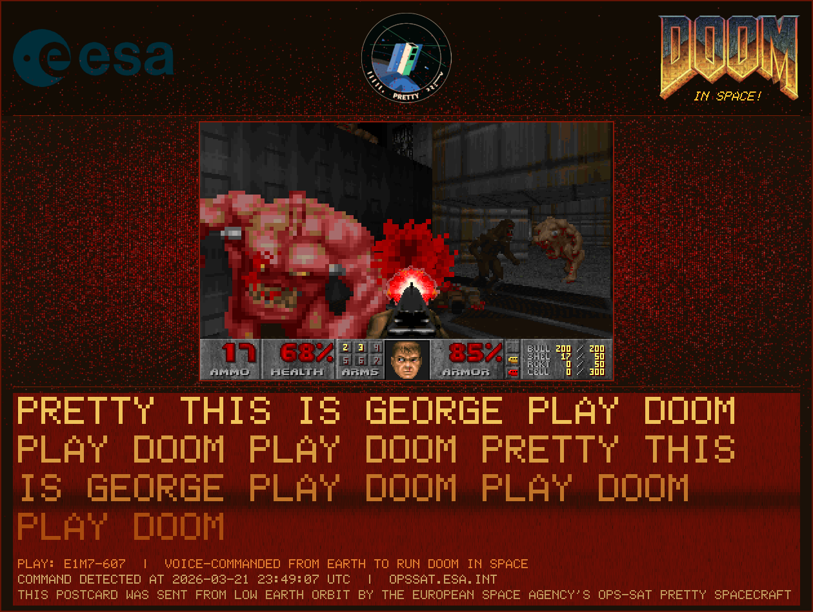

# Postcard Generator

Composites a DOOM frame, I/Q constellation scatter, logos, and run metadata into a single "postcard" image for downlink as a "souvenir" of a successful DOOM run onboard the OPS-SAT PRETTY spacecraft.



## Design Concept

The postcard uses a DOOM-themed visual language throughout, with colors sampled from the [DOOM PLAYPAL palette](https://doomwiki.org/wiki/PLAYPAL).

- **Header**: ESA logo (left), OPS-SAT PRETTY mission patch (centered), DOOM logo with italic "IN SPACE!" subtitle (right)
- **Body**: DOOM gameplay screenshot centered over an I/Q constellation scatter rendered as a blood splatter effect. A dark red vignette frames the scene
- **Text bar**: Voice transcription text with a gold-to-copper gradient over a DFT spectrogram background using the DOOM fire/lava palette (black to deep red). Demo name, command detection timestamp, and attribution
- **Blood splatter**: Raw sc16 I/Q samples plotted as a scatter using PLAYPAL pure reds. Aggressive spread (`0.35x` range) pushes data beyond the frame edges
- **Spectrogram**: DFT-based frequency analysis of the I/Q capture with Hamming window, auto-normalized dB range, rendered with the DOOM fire palette
- **Borders**: Dark red outer border and divider lines

The `--scale` flag renders at higher resolutions (2x, 3x) for print/social media use while keeping the 1x version lightweight for on-board generation.

## Build and Test

```bash
docker-compose build
docker-compose run --rm postcard make all

# Test with JPG frame (generates 1x, 2x, 3x)
docker-compose run --rm postcard make test-jpg

# Test with GIF frame (random frame picked, generates 1x, 2x, 3x)
docker-compose run --rm postcard make test-gif
```

Output goes to `build/postcard.png`, `build/postcard-2x.png`, and `build/postcard-3x.png`.

## Source Structure

- `src/postcard.cpp` - Main composition logic, argument parsing, layout
- `src/doom_palette.h` - DOOM PLAYPAL color tables (blood, fire, background, text)
- `src/image.h` - RGBA image buffer, pixel operations, text rendering, image loading/scaling
- `src/render_sc16.h` - I/Q scatter and DFT spectrogram rendering from raw sc16 data
- `src/bitmap_font.h` - 5x7 bitmap font (A-Z, 0-9, punctuation)
- `src/stb_image.h` - Image decoding (PNG/JPG/BMP/GIF)
- `src/stb_image_write.h` - Image encoding (PNG/JPG)

## Assets

- `assets/logo-esa.png` (400x144, warm-tinted)
- `assets/logo-doom.png` (400x241)
- `assets/logo-opssat-pretty.png` (280x280, warm-tinted)

## Samples

- `samples/jpg-run/` - impfight demo with single frame JPEG
- `samples/gif-run/` - e1m7-607 demo with animated GIF (random frame selected)
- `samples/capture.sc16` - Raw I/Q capture from EM sdr-capture v7 run (healthy circular constellation)

## Dependencies

Uses [stb](https://github.com/nothings/stb) single-header libraries (public domain):
- `stb_image.h` for decoding PNG/JPG/BMP/GIF
- `stb_image_write.h` for encoding PNG/JPG output
